<exercise id="1" title="R Graphics" type="slides">

<slides source="chapter6_01_rgraphics"> </slides>

</exercise>

<exercise id="2" title="Test your knowledge of R Graphics">

Which of the following is a contributed R package?

<choice id=0.709087997442111>

<opt text="ggplot2" correct="true">

That's correct! ggplot2 was developed by Hadley Wickham as part of his
PhD.

</opt>

<opt text="grid" >

No, this is a core package so it's already installed.

</opt>

<opt text="graphics" >

No, this a core package and loads automatically when you launch R.

</opt>

<opt text="grDevices" >

No, this a core package and loads automatically when you launch R.

</opt>

</choice>

Which R package actually renders the graphics in R?

<choice id=0.360101639758795>

<opt text="ggplot2" >

No, that's incorrect.

</opt>

<opt text="grid" >

No, that's incorrect.

</opt>

<opt text="graphics" >

No, that's incorrect.

</opt>

<opt text="grDevices" correct="true">

Yes, that's right!

</opt>

</choice>

Remember that there are two primary graphic models in R: the base and
grid graphics. Which one is ggplot2 using?

<choice id=0.471510825445876>

<opt text="base" >

No, that's incorrect.

</opt>

<opt text="grid" correct="true">

Yes that's right! Well done!

</opt>

</choice>

</exercise>

<exercise id="3" title="Getting started with ggplot2" type="slides">

<slides source="chapter6_02_ggplot2intro"> </slides>

</exercise>

<exercise id="4" title="Plotting two or more variables with ggplot2" type="slides">

<slides source="chapter6_03_ggplot2next"> </slides>

</exercise>

<exercise id="5" title="Make basic plots with ggplot2">

For the following questions we are going to use `BudgetFood` data from
the `Ecdat` package which contains the budget share of food for Spanish
households. You can load the dataset and see the structure of the data
below.

``` r
library(Ecdat)
str(BudgetFood)
```

    ## 'data.frame':    23972 obs. of  6 variables:
    ##  $ wfood : num  0.468 0.313 0.376 0.44 0.404 ...
    ##  $ totexp: num  1290941 1277978 845852 527698 1103220 ...
    ##  $ age   : num  43 40 28 60 37 35 40 68 43 51 ...
    ##  $ size  : num  5 3 3 1 5 4 4 2 9 7 ...
    ##  $ town  : num  2 2 2 2 2 2 2 2 2 2 ...
    ##  $ sex   : Factor w/ 2 levels "man","woman": 1 1 1 2 1 1 1 2 1 1 ...

The meaning of the variables are described below:

-   `wfood`: percentage of total expenditure which the household has
    spent on food
-   `totexp`: total expenditure of the household
-   `age`: age of reference person in the household
-   `size`: size of the household
-   `town`: size of the town where the household is placed categorized
    into 5 groups: 1 for small towns, 5 for big ones
-   `sex`: sex of reference person (man,woman)

Try to recreate the scatter plot below. Is there anything unusual that
you notice about the plot?

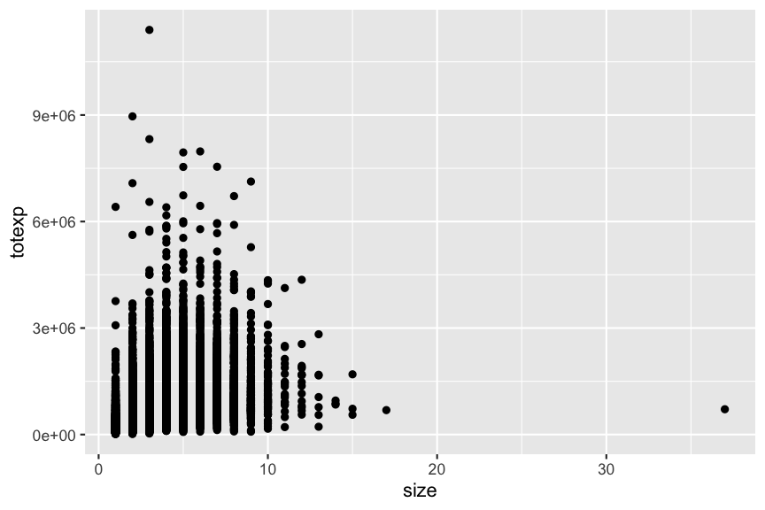

Note: the **submit button doesn't do anything** in this chapter. You
will need to eyeball your output plot is the same as the target plots
for all questions.

<codeblock id="06_04A">

Hint: The scatter plots are created using `geom_point`.

</codeblock>

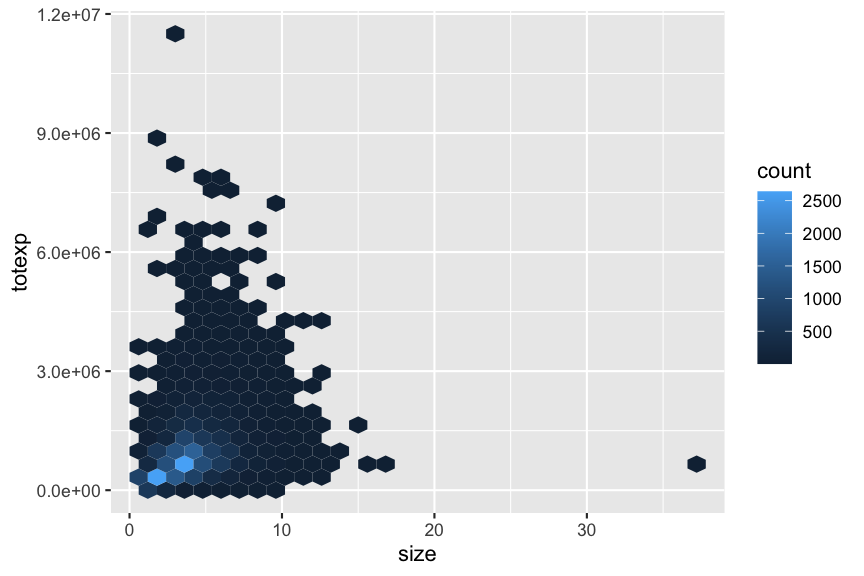

<codeblock id="06_04B">

Hint: The hex plots are created using geom_hex`. `</codeblock>


<codeblock id="06_04C">

Hint: The five number summary is often graphically depicted by a
boxplot. </codeblock>

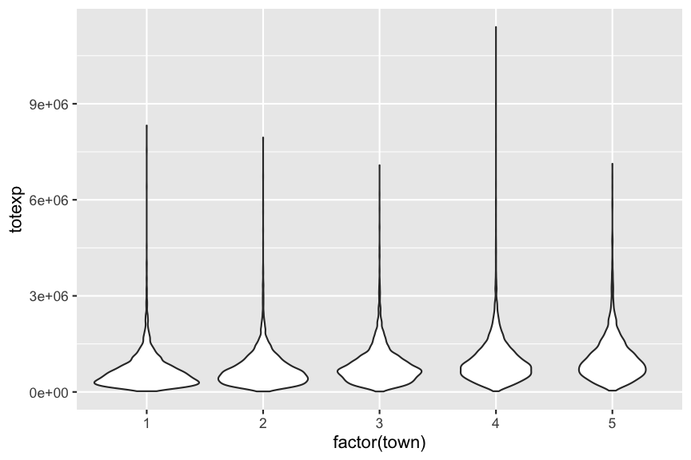

<codeblock id="06_04D">

Hint: what do you notice about the x-axis scale? Do you perhaps need to
convert town`? `</codeblock>

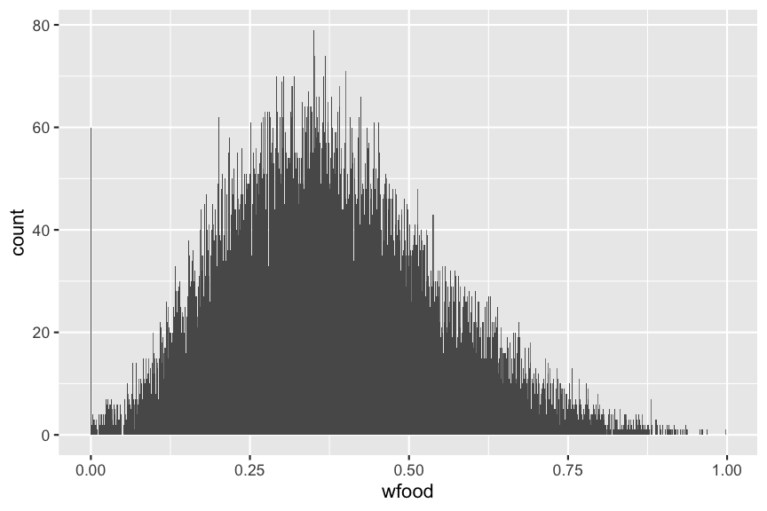
<codeblock id="06_04E">

Hint: this plot is called a histogram.

</codeblock>

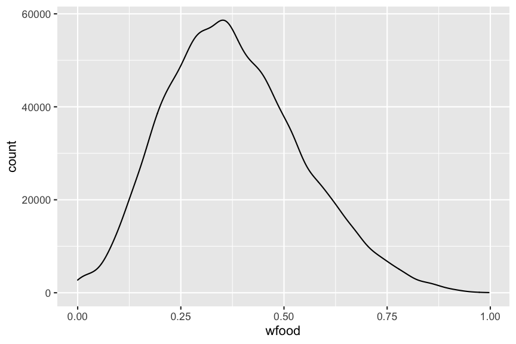
<codeblock id="06_04F">

Hint: this is a density plot but the y-axis is showing counts. What did
`after_stat` function do?

</codeblock>

</exercise>

<exercise id="6" title="Multiple layers in ggplot2"  type="slides">
<slides source="chapter6_04_ggplot2layers"> </slides>
</exercise>

<exercise id="7" title="Practice creating multiple layers">

We are again going to use the `BudgetFood` data from the `Ecdat` package
to make the plots.

Try to recreate the scatter plot below. Is there anything that unusual
that you notice about the plot?

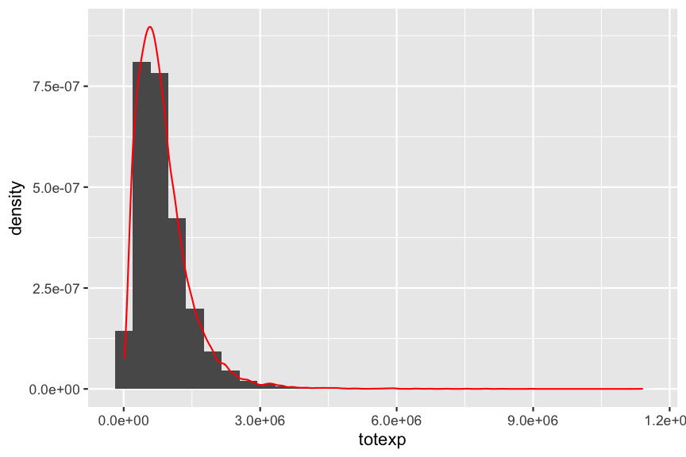
<codeblock id="06_06A">

</codeblock>

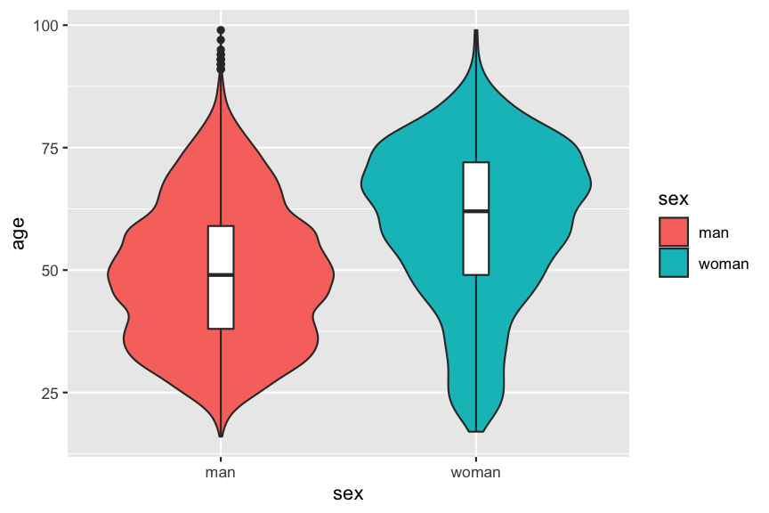
<codeblock id="06_06B">

</codeblock>

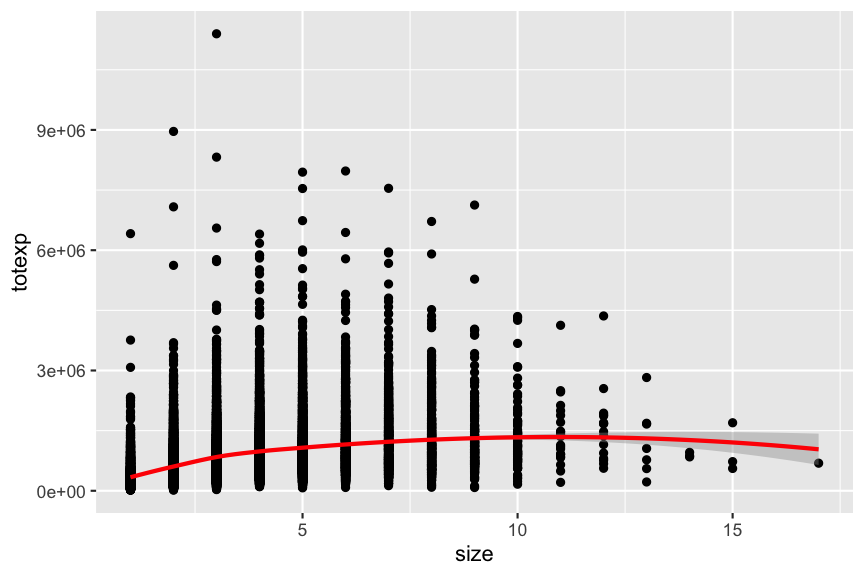
<codeblock id="06_06C">

</codeblock>

<codeblock id="06_06D">

</codeblock>

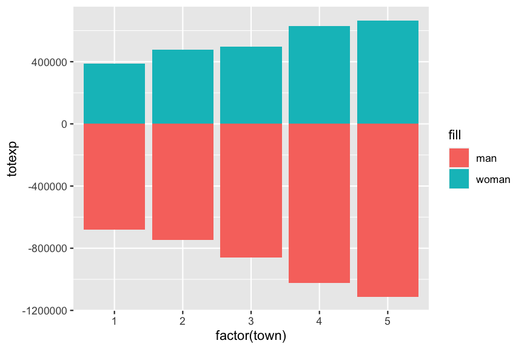
<codeblock id="06_06E">

</codeblock>

</exercise>

<exercise id="8" title="Scales and guides in ggplot2"  type="slides">
<slides source="chapter6_05_ggplot2scales"> </slides>
</exercise>

<exercise id="9" title="Practice changing scales and guides.">

</exercise>

<exercise id="10" title="Multiple plots in one figure"  type="slides">
<slides source="chapter6_06_ggplot2facet"> </slides>
</exercise>

<exercise id="11" title="Practice making multiple subplots.">

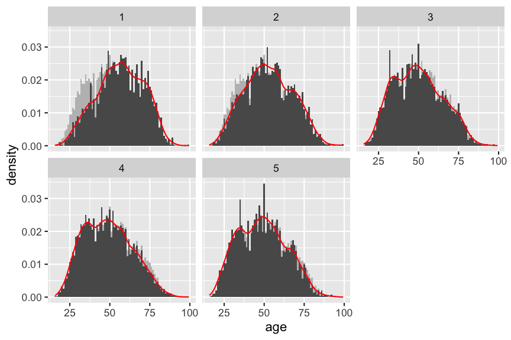
<codeblock id="06_10A">

</codeblock>

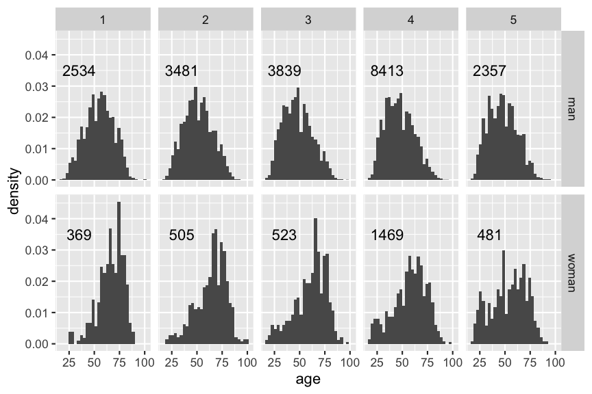
<codeblock id="06_10B">

</codeblock>

<codeblock id="06_10C">

</codeblock>

</exercise>

<exercise id="12" title="Customise the look with themes in ggplot2"  type="slides">
<slides source="chapter6_06_ggplot2theme"> </slides>
</exercise>

<exercise id="13" title="Make pretty plots">


<codeblock id="06">

</codeblock>

</exercise>
