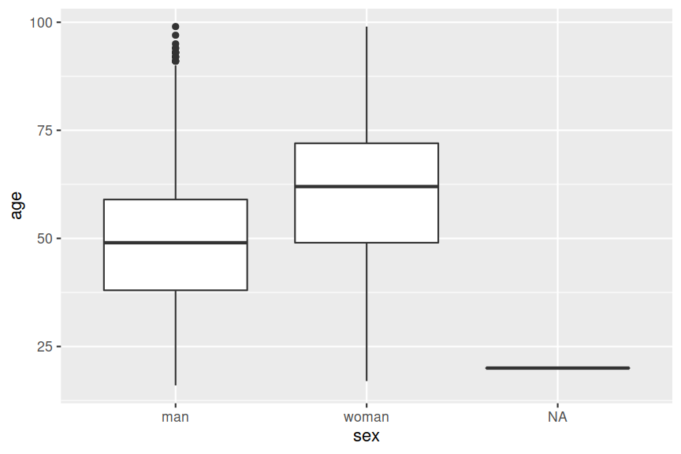
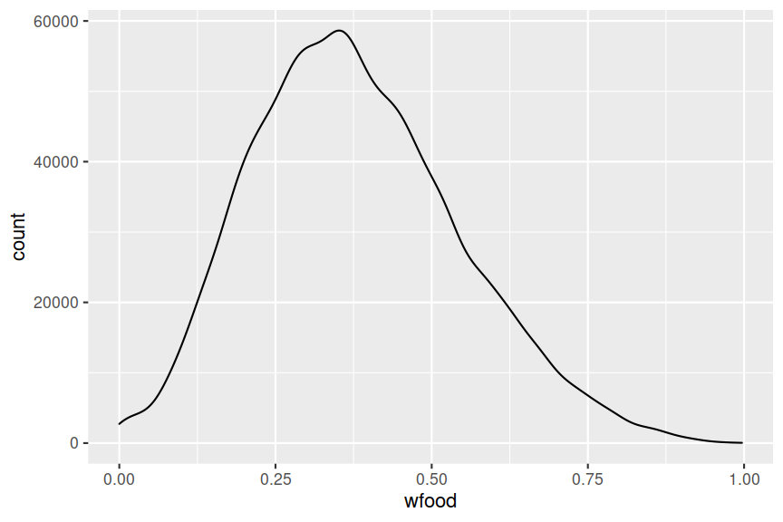

<exercise id="1" title="R Graphics" type="slides">

<slides source="chapter6_01_rgraphics"> </slides>

</exercise>

<exercise id="2" title="Test your knowledge of R Graphics">

Which of the following is a contributed R package?

<choice id=0.30342702451162>

<opt text="ggplot2" correct="true">

That's correct! ggplot2 was developed by Hadley Wickham as part of his
PhD.

</opt>

<opt text="grid" >

No, this is a core package so it's already installed.

</opt>

<opt text="graphics" >

No, this a core package and loads automatically when you launch R.

</opt>

<opt text="grDevices" >

No, this a core package and loads automatically when you launch R.

</opt>

</choice>

Which R package actually renders the graphics in R?

<choice id=0.249133271398023>

<opt text="ggplot2" >

No, that's incorrect.

</opt>

<opt text="grid" >

No, that's incorrect.

</opt>

<opt text="graphics" >

No, that's incorrect.

</opt>

<opt text="grDevices" correct="true">

Yes, that's right!

</opt>

</choice>

Remember that there are two primary graphic models in R: the base and
grid graphics. Which one is ggplot2 using?

<choice id=0.182691867696121>

<opt text="base" >

No, that's incorrect.

</opt>

<opt text="grid" correct="true">

Yes that's right! Well done!

</opt>

</choice>

</exercise>

<exercise id="3" title="Getting started with ggplot2" type="slides">

<slides source="chapter6_02_ggplot2intro"> </slides>

</exercise>

<exercise id="4" title="Plotting two or more variables with ggplot2" type="slides">

<slides source="chapter6_03_ggplot2next"> </slides>

</exercise>

<exercise id="5" title="Make basic plots with ggplot2">

For the following questions we are going to use `BudgetFood` data from
the `Ecdat` package which contains the budget share of food for Spanish
households. You can load the dataset and see the structure of the data
below.

``` r
library(Ecdat)
str(BudgetFood)
```

    ## 'data.frame':    23972 obs. of  6 variables:
    ##  $ wfood : num  0.468 0.313 0.376 0.44 0.404 ...
    ##  $ totexp: num  1290941 1277978 845852 527698 1103220 ...
    ##  $ age   : num  43 40 28 60 37 35 40 68 43 51 ...
    ##  $ size  : num  5 3 3 1 5 4 4 2 9 7 ...
    ##  $ town  : num  2 2 2 2 2 2 2 2 2 2 ...
    ##  $ sex   : Factor w/ 2 levels "man","woman": 1 1 1 2 1 1 1 2 1 1 ...

The meaning of the variables are described below:

-   `wfood`: percentage of total expenditure which the household has
    spent on food
-   `totexp`: total expenditure of the household
-   `age`: age of reference person in the household
-   `size`: size of the household
-   `town`: size of the town where the household is placed categorized
    into 5 groups: 1 for small towns, 5 for big ones
-   `sex`: sex of reference person (man,woman)

Try to recreate the scatter plot below. Is there anything unusual that
you notice about the plot?


Note: the **submit button doesn't check your answer** in this chapter.
You will need to eyeball your output plot is the same as the target
plots for all questions.

<codeblock id="06_05A">

Hint: The scatter plots are created using `geom_point`.

</codeblock>

You may have noticed that there is *overplotting* in the previous plot
for the bottom left region. Let's try to create a **hex plot** like
below this time.


<codeblock id="06_05B">

Hint: The hex plots are created using `geom_hex`.

</codeblock>

This time let's have a look at some other variables in the `BudgetFood`
data. Let's check the distribution of the age by sex using **boxplot**
like below.



<codeblock id="06_05C">

Hint: The five number summary is often graphically depicted by a
boxplot.

</codeblock>

Next study the distribution of the total expenditure of the household by
size of the town using a **violin plot** like below.


<codeblock id="06_05D">

Hint: what do you notice about the x-axis scale? Do you perhaps need to
convert `town`?

</codeblock>

Let's have a look at the distribution of the percentage of total
expenditure which the household has spent on food (`wfood`). We'll
adjust the bin width of the **histogram** to 0.001. Do you notice the
peak at 0?


<codeblock id="06_05E">

Hint: this plot is called a histogram.

</codeblock>

Finally, let's also draw a density plot but display the y-axis as counts
instead of density.



<codeblock id="06_05F">

Hint: this is a density plot but the y-axis is showing counts. What did
`after_stat` function do?

</codeblock>

</exercise>

<exercise id="6" title="Multiple layers and attributes in ggplot2"  type="slides">
<slides source="chapter6_04_ggplot2layers"> </slides>
</exercise>

<exercise id="7" title="Practice creating multiple layers">

We are again going to use the `BudgetFood` data from the `Ecdat` package
to make the plots.

The plot below shows the histogram with the density plot overlaid on top
of it. Try to recreate this figure.


<codeblock id="06_07A">

Hint: this is a density plot but the y-axis is showing counts. What did
`after_stat` function do?

</codeblock>

In the next target plot, we are going to look at the distribution of the
`age` by `sex`. There are not that many observations where sex
information is missing so let's focus on `sex` levels for "man" and
"woman".


<codeblock id="06_07B">

</codeblock>

In the next target plot, we want to draw a scatter plot between the size
of the household and the total expenditure of the household. Then we
want to overlay this with a loess curve in red color. You may not have
seen how to fit a curve on `ggplot` yet so check out the hint if you
don't know.


<codeblock id="06_07C">

Hint: `geom_smooth` can draw curves from a fitted model.

</codeblock>

In the next plot, try drawing a **barplot** by the different sexes with
the total count written on top of the bar.


<codeblock id="06_07D">

</codeblock>

The next one might be tricky. You want to draw a bar plot showing the
average total expenditure of by sex and town but the top blue bars show
the average for women, while the bottome red bars show the average for
men.


<codeblock id="06_07E">

Hint: The legend shows the `fill` with a label "woman" and "man". In
this case should `fill` be an attribute or aesthetic?

</codeblock>

</exercise>

<exercise id="8" title="Scales and guides in ggplot2"  type="slides">
<slides source="chapter6_05_ggplot2scales"> </slides>
</exercise>

<exercise id="9" title="Practice changing scales">

In the plot below, we show the age distribution by man and woman. Change
the color so the violin plot for the man colored as "violet" and woman
as "royalblue".


<codeblock id="06_09A">

Hint: Recall that scales are controlled by functions beginning with
`scale_`. The second "word" in the scale function is the aesthetic.

</codeblock>

In the next plot, let's have a look at the distribution of the total
household expenditure by sex using histograms. Since hte total household
expenditure skewed to the right, take a log with base 10 transformation
for the scale and change the colors like the target plot below.


<codeblock id="06_09B">

Hint: Recall that scales are controlled by functions beginning with
`scale_`. The second "word" in the scale function is the aesthetic.

</codeblock>

</exercise>

<exercise id="10" title="Multiple plots in one figure"  type="slides">
<slides source="chapter6_06_ggplot2facet"> </slides>
</exercise>

<exercise id="11" title="Practice making multiple subplots">

In the following section, we won't give you much hints! Try to reach the
target plots by seeing what's drawn in the target plot and complete the
code needed to get to the target plot.


<codeblock id="06_11A">

</codeblock>


<codeblock id="06_11B">

</codeblock>


<codeblock id="06_11C">

</codeblock>

</exercise>

<exercise id="12" title="Customise the look with themes in ggplot2"  type="slides">
<slides source="chapter6_07_ggplot2theme"> </slides>
</exercise>

<exercise id="13" title="Make pretty plots">

Well done getting to the last practice exercise!

The next plot you're going to draw is the plot below -- or make the plot
as pretty as you can!


<codeblock id="06_13A">

</codeblock>

</exercise>

<exercise id="14" title="Resources">

-   [ggplot2: elegant graphics for data
    analysis](https://ggplot2-book.org/)
-   [R for data science slack
    community](https://rfordatascience.slack.com/join/shared_invite/zt-13ohm2as3-k3Vl31J54zTOjw1h3wpAuQ#/shared-invite/email)
    has a channel on `ggplot2`
-   [Download](https://raw.githubusercontent.com/rstudio/cheatsheets/main/data-visualization.pdf)
    the `ggplot2` cheatsheet
-   Ask or search questions at
    [Stackoverflow](https://stackoverflow.com/questions/tagged/ggplot2)
    or [RStudio Community](https://community.rstudio.com/tag/ggplot2)
    with `ggplot2` tag.

</exercise>
