

<exercise id="1" title="R Graphics" type="slides">

<slides source="chapter7_01_rgraphics"> </slides>

</exercise>

<exercise id="2" title="Test your knowledge of R Graphics">

Which of the following is a contributed R package?

<choice id=0.381169719155878>

<opt text="ggplot2" correct="true">

That’s correct! ggplot2 was developed by Hadley Wickham as part of his
PhD.

</opt>

<opt text="grid" >

No, this is a core package so it’s already installed.

</opt>

<opt text="graphics" >

No, this a core package and loads automatically when you launch R.

</opt>

<opt text="grDevices" >

No, this a core package and loads automatically when you launch R.

</opt>

</choice>

Which R package actually renders the graphics in R?

<choice id=0.0326864495873451>

<opt text="ggplot2" >

No, that’s incorrect.

</opt>

<opt text="grid" >

No, that’s incorrect.

</opt>

<opt text="graphics" >

No, that’s incorrect.

</opt>

<opt text="grDevices" correct="true">

Yes, that’s right!

</opt>

</choice>

Remember that there are two primary graphic models in R: the base and
grid graphics. Which one is ggplot2 using?

<choice id=0.400727231986821>

<opt text="base" >

No, that’s incorrect.

</opt>

<opt text="grid" correct="true">

Yes that’s right! Well done!

</opt>

</choice>

</exercise>

<exercise id="3" title="Getting started with ggplot2" type="slides">

<slides source="chapter7_02_ggplot2intro"> </slides>

</exercise>

<exercise id="4" title="Make basic plots with ggplot2">

For the following questions we are going to use `BudgetFood` data from
the `Ecdat` package which contains the budget share of food for Spanish
households. You can load the dataset and see the structure of the data
below.

    library(Ecdat)
    str(BudgetFood)

    ## 'data.frame':    23972 obs. of  6 variables:
    ##  $ wfood : num  0.468 0.313 0.376 0.44 0.404 ...
    ##  $ totexp: num  1290941 1277978 845852 527698 1103220 ...
    ##  $ age   : num  43 40 28 60 37 35 40 68 43 51 ...
    ##  $ size  : num  5 3 3 1 5 4 4 2 9 7 ...
    ##  $ town  : num  2 2 2 2 2 2 2 2 2 2 ...
    ##  $ sex   : Factor w/ 2 levels "man","woman": 1 1 1 2 1 1 1 2 1 1 ...

The meaning of the variables are described below:

-   `wfood`: percentage of total expenditure which the household has
    spent on food
-   `totexp`: total expenditure of the household
-   `age`: age of reference person in the household
-   `size`: size of the household
-   `town`: size of the town where the household is placed categorized
    into 5 groups: 1 for small towns, 5 for big ones
-   `sex`: sex of reference person (man,woman)

Try to recreate the scatter plot below. Is there anything that unusual
that you notice about the plot?

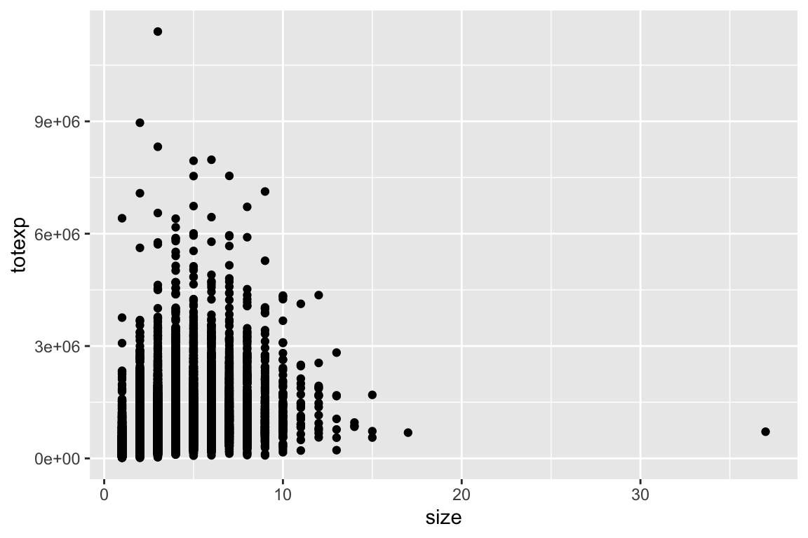

<codeblock id="07_04A">

</codeblock>

<codeblock id="07_04A"> The scatter plots are created using
`geom_point`. </codeblock>

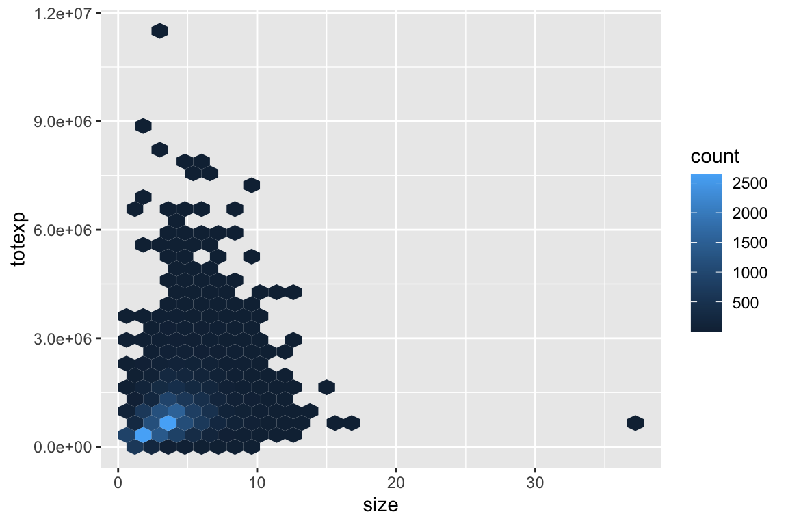

<codeblock id="07_04B">

</codeblock>

<codeblock id="07_04B"> The hex plots are created using `geom_hex`.
</codeblock>

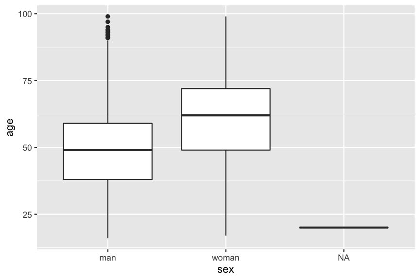

<codeblock id="07_04C">

</codeblock>

<codeblock id="07_04C"> This is a hint. </codeblock>

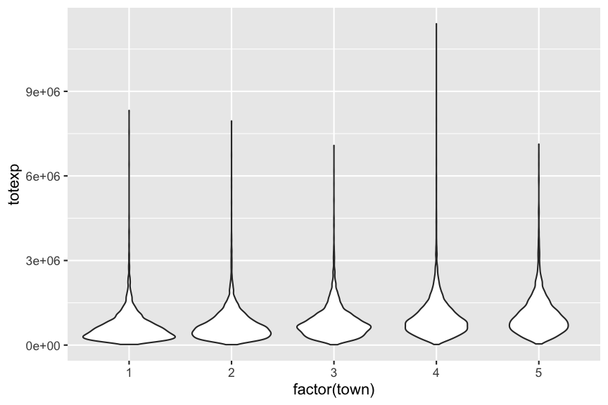

<codeblock id="07_04D">

</codeblock> <codeblock id="07_04D"> This is a hint. </codeblock>

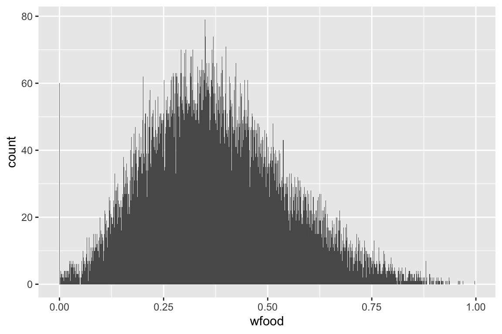

<codeblock id="07_04E">

</codeblock> <codeblock id="07_04E"> This is a hint. </codeblock>

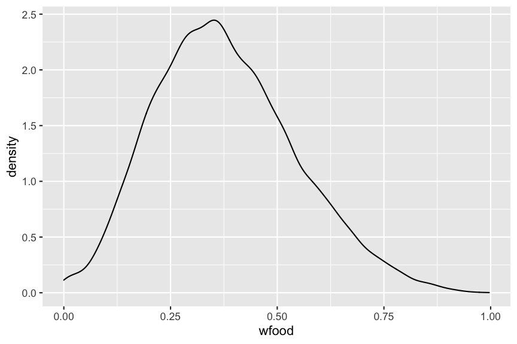

<codeblock id="07_04F">

</codeblock> <codeblock id="07_04F"> This is a hint. </codeblock>

</exercise>

<exercise id="5" title="Multiple layers in ggplot2">
<slides source="chapter7_03_ggplot2layers"> </slides> </exercise>

<exercise id="6" title="Practice creating multiple layers">

We are again going to use the `BudgetFood` data from the `Ecdat` package
to make the plots.

Try to recreate the scatter plot below. Is there anything that unusual
that you notice about the plot?

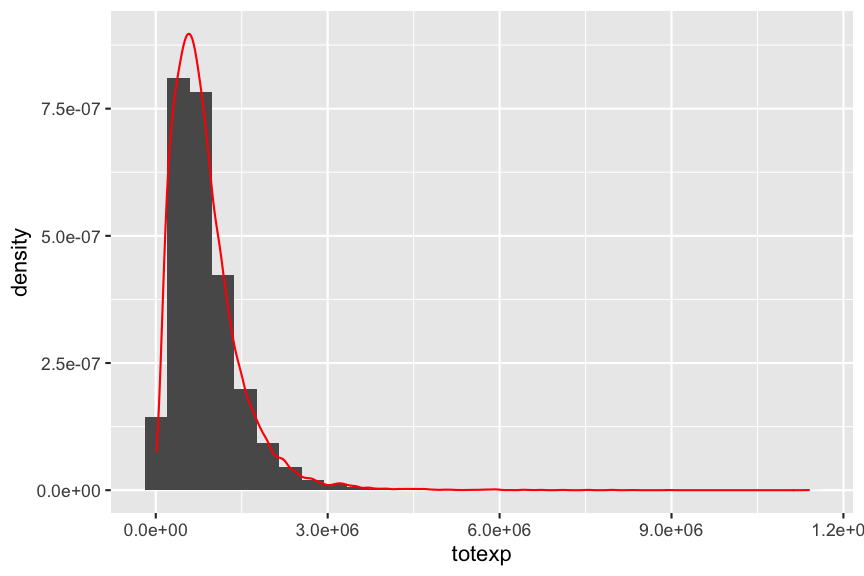

<codeblock id="07_06A">

</codeblock> <codeblock id="07_06A"> XX. </codeblock>

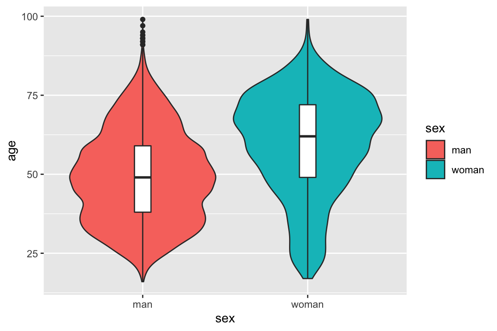

<codeblock id="07_06B">

</codeblock> <codeblock id="07_06B"> XX. </codeblock>

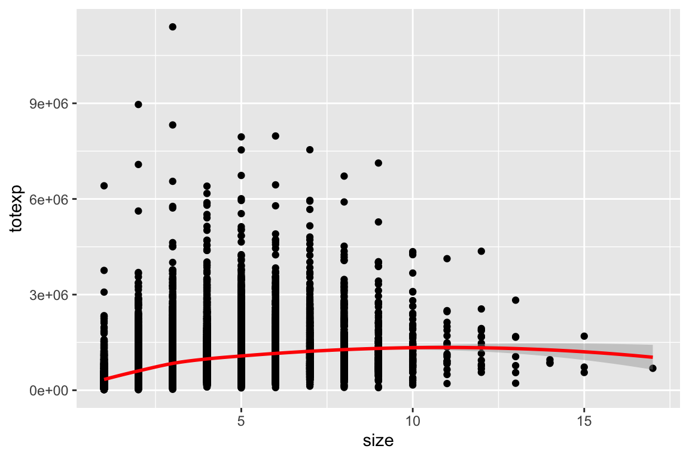

<codeblock id="07_06C">

</codeblock> <codeblock id="07_06C"> XX. </codeblock>

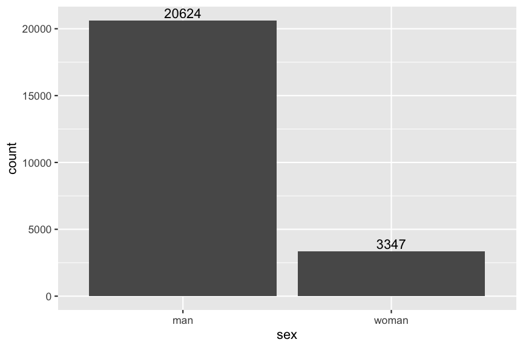

<codeblock id="07_06D">

</codeblock> <codeblock id="07_06D"> XX. </codeblock>

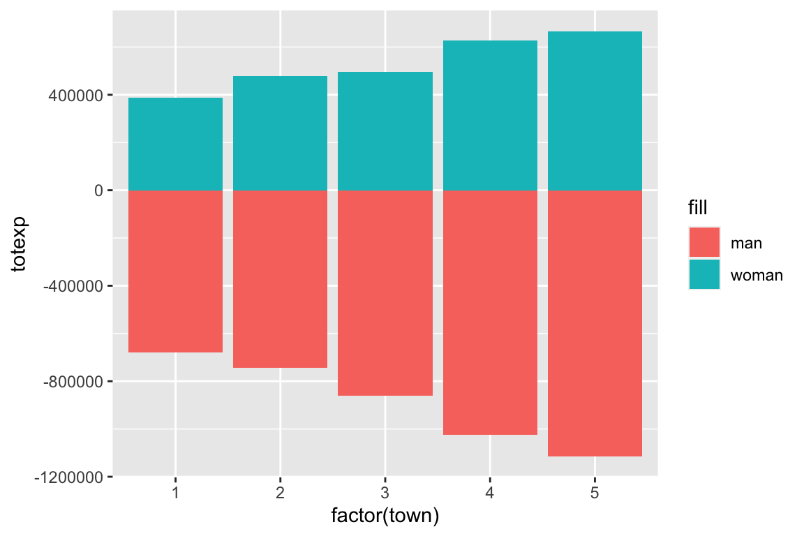

<codeblock id="07_06E">

</codeblock> <codeblock id="07_06E"> XX. </codeblock>

</exercise>

<exercise id="7" title="Scales and guides in ggplot2">
<slides source="chapter7_04_ggplot2scales"> </slides> </exercise>

<exercise id="8" title="Practice changing scales and guides.">

</exercise>

<exercise id="9" title="Multiple plots in one figure">
<slides source="chapter7_05_ggplot2facet"> </slides> </exercise>

<exercise id="10" title="Practice combining multiple plots.">

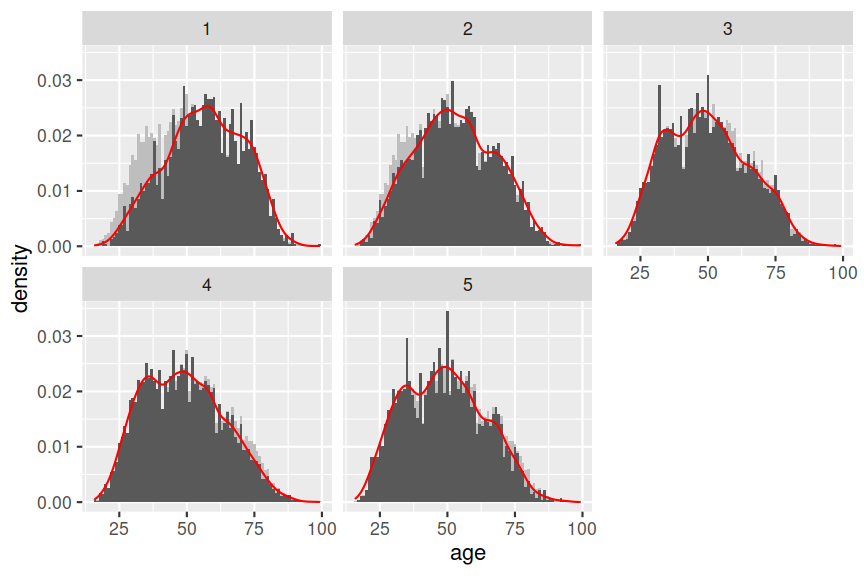

<codeblock id="07_10A">

</codeblock> <codeblock id="07_10A"> XX. </codeblock>

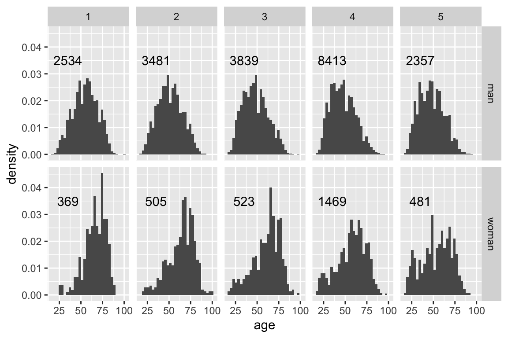

<codeblock id="07_10B">

</codeblock> <codeblock id="07_10B"> XX. </codeblock>

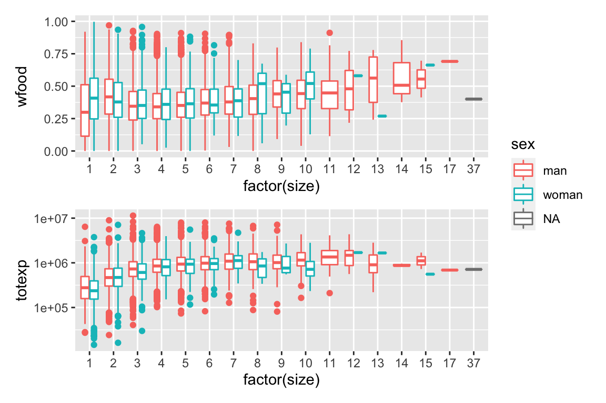

<codeblock id="07_10C">

</codeblock> <codeblock id="07_10C"> XX. </codeblock> </exercise>

<exercise id="11" title="Customise the look with themes in ggplot2">
<slides source="chapter7_06_ggplot2theme"> </slides> </exercise>

<exercise id="12" title="Make publication ready plots.">

</exercise>
