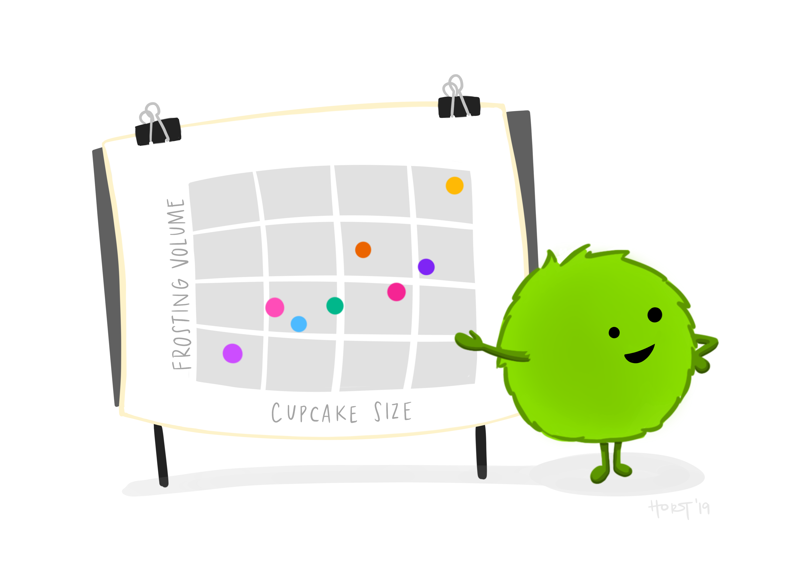

:::::::: flex

::: box
{.box-image}

Getting started with R and RStudio IDE
:::

::: box
{.box-image}

R programming basics
:::

::: box
{.box-image}

How to ask for help
:::

::: box
{.box-image}

Project structure
:::

::: box
{.box-image}

Importing and exporting data
:::

::: box
{.box-image}

Data wrangling
:::

::: box
{.box-image}

Data visualisation
:::

::: box
{.box-image}

Functional programming
:::

::: box
{.box-image}

Linear regression
:::

::: box
{.box-image}

R Markdown
:::
::::::::

