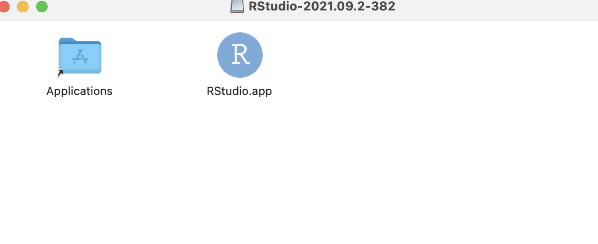

## Why do we want to learn and use R and RStudio?

-   R and RStudio are powerful tools for statistical analysis

-   It is user friendly and open sourced

-   Provide reproducible code

-   Easy data cleaning and data visualisation

-   And many more for you to explore

---

## What is R and RStudio?

R is a free software environment for statistical computing and graphics.
RStudio is an integrated development environment (IDE) for R. Before you
download and install RStudio, you must first downloaded and install R.
One way to think about the relationship between R and RStudio is that R
acts like the CPU of a computer where RStudio acts like your computer
which provides easy-to-work-with interface.

---

## Download and Install R

Download the latest version of R from: [The Comprehensive R Archive
Network (CRAN)](https://cloud.r-project.org/).

Please select Download R for `your operating system`

---

## macOS users

You should see this webpage once you click on `Download R for macOS`.

Click on `R-4.1.2.pkg` to start the download. (The top one will always
be the most recent version. During the first development of this short
course, 4.1.2 is the latest version of R.)

---

## macOS users

After finishing the download of `R-4.1.2.pkg`, double click on it, you
should see the message below.

Click `Continue`.

---

## macOS users

Read through the important information about R.

Click `Continue`.

---

## macOS users

Read through the software licence agreement about R.

Click `Continue`.

---

## macOS users

The default installation location for macOS is the `Macintosh HD`. If
you want to change the install location, click
`Change Install Location`. Otherwise, click `Install`.

---

## macOS users

Once you successfully installed R. You can click `Close` to exit the
installation process.

---

## Install RStudio

Download the latest version of RStudio from
[RStudio](https://www.rstudio.com/products/rstudio/download/).

Scroll down to `All Installers` and download the RStudio version for
your operating system.

---

## macOS users

Drag RStudio.app into the `Applications` folder.

After this step, you should have RStudio ready to explore!
