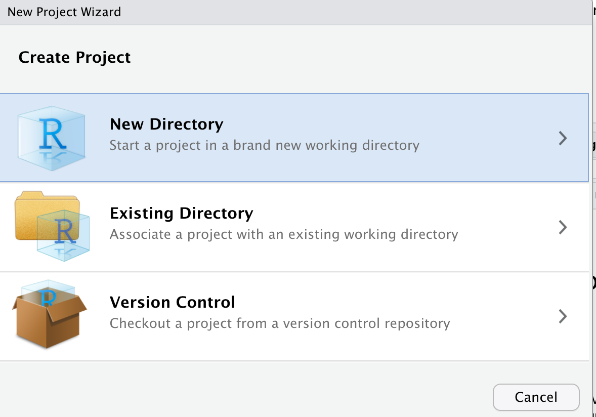
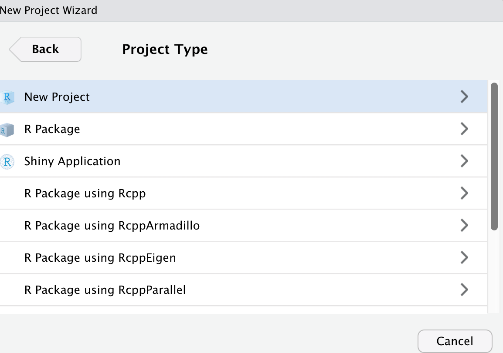

### Why do I want to start an R Project?

-    It is good project management practice which help
    you get all your data, scripts and RMarkdown file organised. 

-    When you are learning with multiple subjects that
    all requires working in R but with totally different datasets and
    knowledge. Having an R project for each of the subject will help you
    manage your datasets,(space is missing here)analyses and learning
    materials. 

---

### Why do I want to start an R Project?

-    This is similar to process of organising your word
    documents, PDFs, excel files and ect. 

-    Having individual R project for different things you
    are working on keep your workflow and files organised. 

---

### Starting an R project

Note: On the right top corner, click on the blue project icon, you will
see the pop-up window below.

---

### Starting an R project

Note: Click on `New Project...` you will see the window below.

If you want to start a new R project in a new location on your computer,
select `New Directory`.

If you want to start a new R project in a location where you have other
R projects, select `Existing Directory`.

For you very first R project, please select `New Directory`.

---

### Starting an R project

Note: There are a few different R project including `New project`,
`R Package` and `Shiny Application`.

If you want to start writing an R package, you can choose `R Package`.
If you want to start a shiny app, you can choose `Shiny Application`.

For general R project, click `New Project`.

---

### Starting an R project

Note: You can name the under `Directory name` and choose the project
location under `Create project as subdirectory of:`.

You can also `Browse...` for locations on your computer.

---

### Setting working directory

Note: After getting your R project, you current working directory is
where the R project located on your computer.

When you open up your R project, on the `Console` window, it shows your
current working directory.

To double check your current working directory use function `getwd()`.
After running this function in `Console`, you should have your current
working directory printed out.

---

### Setting working directory

Note: If you are not working in a R project, you can still set up an
working directory for your analyses.

Go to the right bottom window, click on `More`. You can click on
`Set As working Directory`. This will set the current location you are
in showing on the `Files` window as the current working directory.

Alternatively, use function `setwd()` to set your working directory.
Noted that the path you are putting in `setwd()` need to be double
quoted `""`. For example, `setwd("~/Desktop/Tutoring /data vis")`.

---

### Relative path vs Absolute path

-    Relative path means that the file path you use is
    relative to your current working directory. 

-    Absolute path means that the file path is the path
    on your personal computer which you should never use. Using absolute
    path would create problem when you trying to communicate your
    project to others. They might not have the same absolute path you
    used in this project. 

---

### Relative path vs Absolute path

-    Make sure that all your data and scripts are all
    packed in one R project and use the relative path to direct where
    are the files located. 

-    For example, an relative path to the `data vis`
    project would be `\data\cars.csv` 

---

### Let’s not store any past information in the R environment

-    Every time you run some R code and read in datasets,
    they will be automatically stored in the `Environment` which is the
    top right window. 

-    When you quite RStudio session, the data you read
    in, the functions you created will be stored in this `Environment`.
    So later on, you can come back and continue from where you left.
    

---

### Let’s not store any past information in the R environment

-    However, this could create problems. It is hard to
    communicate your code and analyses to others as they might not have
    the same variables or data stored in their environment. 

-    The better project management way is to disable this
    function. This way you will keep all your analysis steps in one
    script and it is reproducible by others. 

---

### Let’s not store any past information in the R environment

Note: To disable this function in RStudio, go to `Tools`
<svg viewBox="0 0 512 512" style="height:1em;position:relative;display:inline-block;top:.1em;" xmlns="http://www.w3.org/2000/svg">
<path d="M256 8c137 0 248 111 248 248S393 504 256 504 8 393 8 256 119 8 256 8zm-28.9 143.6l75.5 72.4H120c-13.3 0-24 10.7-24 24v16c0 13.3 10.7 24 24 24h182.6l-75.5 72.4c-9.7 9.3-9.9 24.8-.4 34.3l11 10.9c9.4 9.4 24.6 9.4 33.9 0L404.3 273c9.4-9.4 9.4-24.6 0-33.9L271.6 106.3c-9.4-9.4-24.6-9.4-33.9 0l-11 10.9c-9.5 9.6-9.3 25.1.4 34.4z"></path></svg>
`Global Options`
<svg viewBox="0 0 512 512" style="height:1em;position:relative;display:inline-block;top:.1em;" xmlns="http://www.w3.org/2000/svg">
<path d="M256 8c137 0 248 111 248 248S393 504 256 504 8 393 8 256 119 8 256 8zm-28.9 143.6l75.5 72.4H120c-13.3 0-24 10.7-24 24v16c0 13.3 10.7 24 24 24h182.6l-75.5 72.4c-9.7 9.3-9.9 24.8-.4 34.3l11 10.9c9.4 9.4 24.6 9.4 33.9 0L404.3 273c9.4-9.4 9.4-24.6 0-33.9L271.6 106.3c-9.4-9.4-24.6-9.4-33.9 0l-11 10.9c-9.5 9.6-9.3 25.1.4 34.4z"></path></svg>
`General`

Unselected `Rstore .RData into workspace at startup` and change
`Save workspace to .RData on exit` to `Never`
