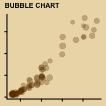
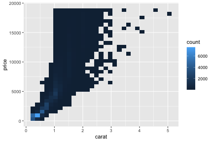
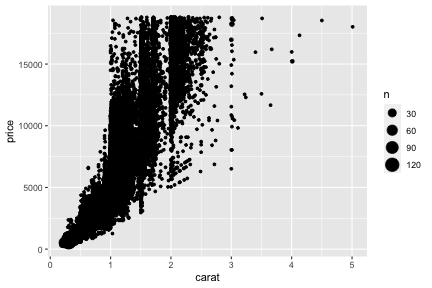
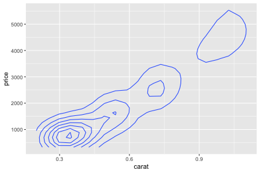
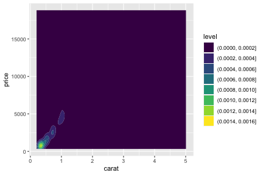
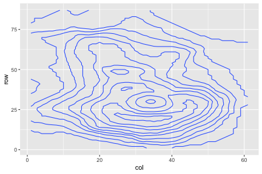
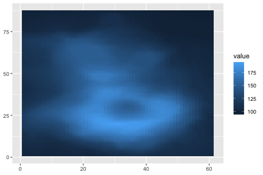
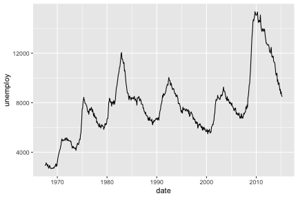
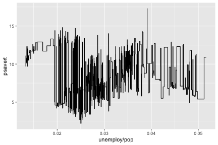

---

## Examining two or more variables

---

## Illustrative data 💎 diamonds

-   Let’s have a look at the `diamonds` data which contains information
    about different attributes of diamonds

<!-- -->

    data(diamonds, package = "ggplot2")
    diamonds

    ## # A tibble: 53,940 × 10
    ##    carat cut       color clarity depth table price     x     y     z
    ##    <dbl> <ord>     <ord> <ord>   <dbl> <dbl> <int> <dbl> <dbl> <dbl>
    ##  1  0.23 Ideal     E     SI2      61.5    55   326  3.95  3.98  2.43
    ##  2  0.21 Premium   E     SI1      59.8    61   326  3.89  3.84  2.31
    ##  3  0.23 Good      E     VS1      56.9    65   327  4.05  4.07  2.31
    ##  4  0.29 Premium   I     VS2      62.4    58   334  4.2   4.23  2.63
    ##  5  0.31 Good      J     SI2      63.3    58   335  4.34  4.35  2.75
    ##  6  0.24 Very Good J     VVS2     62.8    57   336  3.94  3.96  2.48
    ##  7  0.24 Very Good I     VVS1     62.3    57   336  3.95  3.98  2.47
    ##  8  0.26 Very Good H     SI1      61.9    55   337  4.07  4.11  2.53
    ##  9  0.22 Fair      E     VS2      65.1    61   337  3.87  3.78  2.49
    ## 10  0.23 Very Good H     VS1      59.4    61   338  4     4.05  2.39
    ## # … with 53,930 more rows

---

## A scatterplot with `geom_point()`

    ggplot(data = diamonds,
           mapping = aes(x = carat, y = price)) +
      geom_point()

-   Scatter plot of price vs carat of diamonds
-   Each point correponds to a dimaond

---

## A hexagonal 2D heatmap with `geom_hex()`

    ggplot(data = diamonds,
           mapping = aes(x = carat, y = price)) +
      geom_hex()

-   A hexagon shows the count of observations within the region.

---

## A rectangular 2D heatmap with `geom_bin_2d()`

    ggplot(data = diamonds,
           mapping = aes(x = carat, y = price)) +
      geom_bin_2d()

-   Similar to `geom_hex()` but the shape is a rectangle.

---

## Count of overlapping points with `geom_count()`

    ggplot(data = diamonds,
           mapping = aes(x = carat, y = price)) +
      geom_count()

---

## Contour of a 2D density with `geom_density_2d()`

    ggplot(data = diamonds,
           mapping = aes(x = carat, y = price)) +
      geom_density_2d()

---

## Contour of a 2D density with `geom_density_2d_filled()`

    ggplot(data = diamonds,
           mapping = aes(x = carat, y = price)) +
      geom_density_2d_filled()

---

## Motivating data ⛰️ volcano

-   The data contains topographic information on Auckland’s Maunga Whau
    Volcano
-   The original data is a matrix and we must wrangle in the form ready
    for `ggplot` first.

<!-- -->

    volcanod <- data.frame(row = as.vector(row(volcano)),
                           col = as.vector(col(volcano)),
                           value = as.vector(volcano))

    volcanod

    ##     row col value
    ## 1     1   1   100
    ## 2     2   1   101
    ## 3     3   1   102
    ## 4     4   1   103
    ## 5     5   1   104
    ## 6     6   1   105
    ## 7     7   1   105
    ## 8     8   1   106
    ## 9     9   1   107
    ## 10   10   1   108
    ## 11   11   1   109
    ## 12   12   1   110
    ## 13   13   1   110
    ## 14   14   1   111
    ## 15   15   1   114
    ## 16   16   1   116
    ## 17   17   1   118
    ## 18   18   1   120
    ## 19   19   1   120
    ## 20   20   1   121
    ## 21   21   1   122
    ## 22   22   1   122
    ## 23   23   1   123
    ## 24   24   1   124
    ## 25   25   1   123
    ## 26   26   1   123
    ## 27   27   1   120
    ## 28   28   1   118
    ## 29   29   1   117
    ## 30   30   1   115
    ## 31   31   1   114
    ## 32   32   1   115
    ## 33   33   1   113
    ## 34   34   1   111
    ## 35   35   1   110
    ## 36   36   1   109
    ## 37   37   1   108
    ## 38   38   1   108
    ## 39   39   1   107
    ## 40   40   1   107
    ## 41   41   1   107
    ## 42   42   1   108
    ## 43   43   1   109
    ## 44   44   1   110
    ## 45   45   1   111
    ## 46   46   1   111
    ## 47   47   1   112
    ## 48   48   1   113
    ## 49   49   1   113
    ## 50   50   1   114
    ## 51   51   1   115
    ## 52   52   1   115
    ## 53   53   1   114
    ## 54   54   1   113
    ## 55   55   1   112
    ## 56   56   1   111
    ## 57   57   1   111
    ## 58   58   1   112
    ## 59   59   1   112
    ## 60   60   1   112
    ## 61   61   1   113
    ## 62   62   1   114
    ## 63   63   1   114
    ## 64   64   1   115
    ## 65   65   1   115
    ## 66   66   1   116
    ## 67   67   1   116
    ## 68   68   1   117
    ## 69   69   1   117
    ## 70   70   1   116
    ## 71   71   1   114
    ## 72   72   1   112
    ## 73   73   1   109
    ## 74   74   1   106
    ## 75   75   1   104
    ## 76   76   1   102
    ## 77   77   1   101
    ## 78   78   1   100
    ## 79   79   1   100
    ## 80   80   1    99
    ## 81   81   1    99
    ## 82   82   1    99
    ## 83   83   1    99
    ## 84   84   1    98
    ## 85   85   1    98
    ## 86   86   1    97
    ## 87   87   1    97
    ## 88    1   2   100
    ## 89    2   2   101
    ## 90    3   2   102
    ## 91    4   2   103
    ## 92    5   2   104
    ## 93    6   2   105
    ## 94    7   2   106
    ## 95    8   2   107
    ## 96    9   2   108
    ## 97   10   2   109
    ## 98   11   2   110
    ## 99   12   2   110
    ## 100  13   2   111
    ## 101  14   2   113
    ## 102  15   2   115
    ## 103  16   2   118
    ## 104  17   2   120
    ## 105  18   2   121
    ## 106  19   2   122
    ## 107  20   2   124
    ## 108  21   2   125
    ## 109  22   2   125
    ## 110  23   2   126
    ## 111  24   2   127
    ## 112  25   2   128
    ## 113  26   2   127
    ## 114  27   2   124
    ## 115  28   2   121
    ## 116  29   2   120
    ## 117  30   2   118
    ## 118  31   2   116
    ## 119  32   2   114
    ## 120  33   2   113
    ## 121  34   2   112
    ## 122  35   2   112
    ## 123  36   2   110
    ## 124  37   2   109
    ## 125  38   2   109
    ## 126  39   2   108
    ## 127  40   2   108
    ## 128  41   2   108
    ## 129  42   2   109
    ## 130  43   2   110
    ## 131  44   2   111
    ## 132  45   2   112
    ## 133  46   2   112
    ## 134  47   2   113
    ## 135  48   2   114
    ## 136  49   2   114
    ## 137  50   2   115
    ## 138  51   2   116
    ## 139  52   2   116
    ## 140  53   2   115
    ## 141  54   2   114
    ## 142  55   2   113
    ## 143  56   2   112
    ## 144  57   2   112
    ## 145  58   2   113
    ## 146  59   2   113
    ## 147  60   2   114
    ## 148  61   2   114
    ## 149  62   2   115
    ## 150  63   2   115
    ## 151  64   2   116
    ## 152  65   2   116
    ## 153  66   2   117
    ## 154  67   2   117
    ## 155  68   2   118
    ## 156  69   2   118
    ## 157  70   2   117
    ## 158  71   2   115
    ## 159  72   2   113
    ## 160  73   2   111
    ## 161  74   2   107
    ## 162  75   2   105
    ## 163  76   2   103
    ## 164  77   2   102
    ## 165  78   2   101
    ## 166  79   2   101
    ## 167  80   2   100
    ## 168  81   2   100
    ## 169  82   2   100
    ## 170  83   2    99
    ## 171  84   2    99
    ## 172  85   2    98
    ## 173  86   2    98
    ## 174  87   2    97
    ## 175   1   3   101
    ## 176   2   3   102
    ## 177   3   3   103
    ## 178   4   3   104
    ## 179   5   3   105
    ## 180   6   3   105
    ## 181   7   3   106
    ## 182   8   3   107
    ## 183   9   3   108
    ## 184  10   3   109
    ## 185  11   3   110
    ## 186  12   3   111
    ## 187  13   3   113
    ## 188  14   3   115
    ## 189  15   3   117
    ## 190  16   3   118
    ## 191  17   3   120
    ## 192  18   3   122
    ## 193  19   3   125
    ## 194  20   3   126
    ## 195  21   3   127
    ## 196  22   3   128
    ## 197  23   3   129
    ## 198  24   3   130
    ## 199  25   3   131
    ## 200  26   3   131
    ## 201  27   3   128
    ## 202  28   3   125
    ## 203  29   3   121
    ## 204  30   3   120
    ## 205  31   3   118
    ## 206  32   3   116
    ## 207  33   3   114
    ## 208  34   3   113
    ## 209  35   3   113
    ## 210  36   3   111
    ## 211  37   3   111
    ## 212  38   3   111
    ## 213  39   3   111
    ## 214  40   3   110
    ## 215  41   3   109
    ## 216  42   3   110
    ## 217  43   3   111
    ## 218  44   3   112
    ## 219  45   3   113
    ## 220  46   3   113
    ## 221  47   3   114
    ## 222  48   3   115
    ## 223  49   3   115
    ## 224  50   3   116
    ## 225  51   3   117
    ## 226  52   3   117
    ## 227  53   3   116
    ## 228  54   3   115
    ## 229  55   3   114
    ## 230  56   3   114
    ## 231  57   3   113
    ## 232  58   3   113
    ## 233  59   3   114
    ## 234  60   3   114
    ## 235  61   3   115
    ## 236  62   3   115
    ## 237  63   3   116
    ## 238  64   3   116
    ## 239  65   3   117
    ## 240  66   3   118
    ## 241  67   3   118
    ## 242  68   3   119
    ## 243  69   3   119
    ## 244  70   3   118
    ## 245  71   3   116
    ## 246  72   3   114
    ## 247  73   3   112
    ## 248  74   3   108
    ## 249  75   3   105
    ## 250  76   3   103
    ## 251  77   3   103
    ## 252  78   3   102
    ## 253  79   3   101
    ## 254  80   3   101
    ## 255  81   3   100
    ## 256  82   3   100
    ## 257  83   3    99
    ## 258  84   3    99
    ## 259  85   3    98
    ## 260  86   3    98
    ## 261  87   3    97
    ## 262   1   4   101
    ## 263   2   4   102
    ## 264   3   4   103
    ## 265   4   4   104
    ## 266   5   4   105
    ## 267   6   4   106
    ## 268   7   4   107
    ## 269   8   4   108
    ## 270   9   4   109
    ## 271  10   4   110
    ## 272  11   4   111
    ## 273  12   4   113
    ## 274  13   4   115
    ## 275  14   4   117
    ## 276  15   4   117
    ## 277  16   4   118
    ## 278  17   4   121
    ## 279  18   4   123
    ## 280  19   4   126
    ## 281  20   4   128
    ## 282  21   4   130
    ## 283  22   4   130
    ## 284  23   4   131
    ## 285  24   4   132
    ## 286  25   4   133
    ## 287  26   4   134
    ## 288  27   4   131
    ## 289  28   4   129
    ## 290  29   4   125
    ## 291  30   4   122
    ## 292  31   4   120
    ## 293  32   4   118
    ## 294  33   4   116
    ## 295  34   4   114
    ## 296  35   4   113
    ## 297  36   4   112
    ## 298  37   4   112
    ## 299  38   4   113
    ## 300  39   4   112
    ## 301  40   4   112
    ## 302  41   4   111
    ## 303  42   4   112
    ## 304  43   4   113
    ## 305  44   4   113
    ## 306  45   4   114
    ## 307  46   4   115
    ## 308  47   4   116
    ## 309  48   4   116
    ## 310  49   4   117
    ## 311  50   4   117
    ## 312  51   4   118
    ## 313  52   4   118
    ## 314  53   4   116
    ## 315  54   4   116
    ## 316  55   4   115
    ## 317  56   4   115
    ## 318  57   4   115
    ## 319  58   4   114
    ## 320  59   4   114
    ## 321  60   4   115
    ## 322  61   4   116
    ## 323  62   4   116
    ## 324  63   4   117
    ## 325  64   4   117
    ## 326  65   4   118
    ## 327  66   4   118
    ## 328  67   4   119
    ## 329  68   4   119
    ## 330  69   4   120
    ## 331  70   4   120
    ## 332  71   4   117
    ## 333  72   4   115
    ##  [ reached 'max' / getOption("max.print") -- omitted 4974 rows ]

---

## A 2D contour plot with `geom_contour()`

    ggplot(data = volcanod, 
           mapping = aes(x = col, y = row, z = value)) + 
      geom_contour()

---

## A 2D contour plot with `geom_contour_filled()`

    ggplot(data = volcanod, 
           mapping = aes(x = col, y = row, z = value)) + 
      geom_contour_filled()

---

## Tile plots with `geom_tile()`

    ggplot(volcanod, aes(col, row, fill = value)) +
     geom_tile()

---

## Raster plots with `geom_raster()`

    ggplot(volcanod, aes(col, row, fill = value)) +
     geom_raster()

-   A high performance special case of `geom_tile()` for when the tiles
    are the same size

---

## Rectangular plots with `geom_rect()`

    ggplot(volcanod, aes(xmin = col - 0.5, xmax = col + 0.5,
                         ymin = row - 0.5, ymax = row + 0.5, fill = value)) +
     geom_rect()

-   A reparameterised version of `geom_tile()`

---

## Motivating data 📈 economics

    data(economics, package = "ggplot2")
    economics

    ## # A tibble: 574 × 6
    ##    date         pce    pop psavert uempmed unemploy
    ##    <date>     <dbl>  <dbl>   <dbl>   <dbl>    <dbl>
    ##  1 1967-07-01  507. 198712    12.6     4.5     2944
    ##  2 1967-08-01  510. 198911    12.6     4.7     2945
    ##  3 1967-09-01  516. 199113    11.9     4.6     2958
    ##  4 1967-10-01  512. 199311    12.9     4.9     3143
    ##  5 1967-11-01  517. 199498    12.8     4.7     3066
    ##  6 1967-12-01  525. 199657    11.8     4.8     3018
    ##  7 1968-01-01  531. 199808    11.7     5.1     2878
    ##  8 1968-02-01  534. 199920    12.3     4.5     3001
    ##  9 1968-03-01  544. 200056    11.7     4.1     2877
    ## 10 1968-04-01  544  200208    12.3     4.6     2709
    ## # … with 564 more rows

---

## Line plot with `geom_line()`

    ggplot(economics, aes(date, unemploy)) + 
      geom_line()

---

## `geom_path()`

    ggplot(economics, aes(unemploy/pop, psavert)) +
      geom_path()

---

## `geom_step()`

    ggplot(economics, aes(unemploy/pop, psavert)) +
      geom_step()

---

## Drawing maps

-   Drawing maps require the map data

<!-- -->

    world <- map_data("world")
    world

    ##          long      lat group order      region subregion
    ## 1   -69.89912 12.45200     1     1       Aruba      <NA>
    ## 2   -69.89571 12.42300     1     2       Aruba      <NA>
    ## 3   -69.94219 12.43853     1     3       Aruba      <NA>
    ## 4   -70.00415 12.50049     1     4       Aruba      <NA>
    ## 5   -70.06612 12.54697     1     5       Aruba      <NA>
    ## 6   -70.05088 12.59707     1     6       Aruba      <NA>
    ## 7   -70.03511 12.61411     1     7       Aruba      <NA>
    ## 8   -69.97314 12.56763     1     8       Aruba      <NA>
    ## 9   -69.91181 12.48047     1     9       Aruba      <NA>
    ## 10  -69.89912 12.45200     1    10       Aruba      <NA>
    ## 12   74.89131 37.23164     2    12 Afghanistan      <NA>
    ## 13   74.84023 37.22505     2    13 Afghanistan      <NA>
    ## 14   74.76738 37.24917     2    14 Afghanistan      <NA>
    ## 15   74.73896 37.28564     2    15 Afghanistan      <NA>
    ## 16   74.72666 37.29072     2    16 Afghanistan      <NA>
    ## 17   74.66895 37.26670     2    17 Afghanistan      <NA>
    ## 18   74.55899 37.23662     2    18 Afghanistan      <NA>
    ## 19   74.37217 37.15771     2    19 Afghanistan      <NA>
    ## 20   74.37617 37.13735     2    20 Afghanistan      <NA>
    ## 21   74.49796 37.05722     2    21 Afghanistan      <NA>
    ## 22   74.52646 37.03066     2    22 Afghanistan      <NA>
    ## 23   74.54140 37.02217     2    23 Afghanistan      <NA>
    ## 24   74.43106 36.98369     2    24 Afghanistan      <NA>
    ## 25   74.19473 36.89688     2    25 Afghanistan      <NA>
    ## 26   74.03887 36.82573     2    26 Afghanistan      <NA>
    ## 27   74.00185 36.82310     2    27 Afghanistan      <NA>
    ## 28   73.90781 36.85293     2    28 Afghanistan      <NA>
    ## 29   73.76914 36.88848     2    29 Afghanistan      <NA>
    ## 30   73.73183 36.88779     2    30 Afghanistan      <NA>
    ## 31   73.41113 36.88169     2    31 Afghanistan      <NA>
    ## 32   73.11680 36.86856     2    32 Afghanistan      <NA>
    ## 33   72.99374 36.85161     2    33 Afghanistan      <NA>
    ## 34   72.76621 36.83501     2    34 Afghanistan      <NA>
    ## 35   72.62286 36.82959     2    35 Afghanistan      <NA>
    ## 36   72.53135 36.80200     2    36 Afghanistan      <NA>
    ## 37   72.43115 36.76582     2    37 Afghanistan      <NA>
    ## 38   72.32696 36.74239     2    38 Afghanistan      <NA>
    ## 39   72.24980 36.73472     2    39 Afghanistan      <NA>
    ## 40   72.15674 36.70088     2    40 Afghanistan      <NA>
    ## 41   72.09560 36.63374     2    41 Afghanistan      <NA>
    ## 42   71.92070 36.53418     2    42 Afghanistan      <NA>
    ## 43   71.82227 36.48608     2    43 Afghanistan      <NA>
    ## 44   71.77266 36.43184     2    44 Afghanistan      <NA>
    ## 45   71.71641 36.42656     2    45 Afghanistan      <NA>
    ## 46   71.62051 36.43647     2    46 Afghanistan      <NA>
    ## 47   71.54590 36.37769     2    47 Afghanistan      <NA>
    ## 48   71.46328 36.29326     2    48 Afghanistan      <NA>
    ## 49   71.31260 36.17119     2    49 Afghanistan      <NA>
    ## 50   71.23291 36.12178     2    50 Afghanistan      <NA>
    ## 51   71.18506 36.04209     2    51 Afghanistan      <NA>
    ## 52   71.22021 36.00068     2    52 Afghanistan      <NA>
    ## 53   71.34287 35.93853     2    53 Afghanistan      <NA>
    ## 54   71.39756 35.88018     2    54 Afghanistan      <NA>
    ## 55   71.42754 35.83374     2    55 Afghanistan      <NA>
    ## 56   71.48359 35.71460     2    56 Afghanistan      <NA>
    ## 57   71.51904 35.59751     2    57 Afghanistan      <NA>
    ## 58   71.57198 35.54683     2    58 Afghanistan      <NA>
    ## 59   71.58740 35.46084     2    59 Afghanistan      <NA>
    ## 60   71.60059 35.40791     2    60 Afghanistan      <NA>
    ## 61   71.57198 35.37041     2    61 Afghanistan      <NA>
    ## 62   71.54551 35.32851     2    62 Afghanistan      <NA>
    ## 63   71.54551 35.28886     2    63 Afghanistan      <NA>
    ## 64   71.57725 35.24800     2    64 Afghanistan      <NA>
    ## 65   71.60527 35.21177     2    65 Afghanistan      <NA>
    ## 66   71.62051 35.18301     2    66 Afghanistan      <NA>
    ## 67   71.60166 35.15068     2    67 Afghanistan      <NA>
    ## 68   71.54551 35.10141     2    68 Afghanistan      <NA>
    ## 69   71.51709 35.05112     2    69 Afghanistan      <NA>
    ## 70   71.45508 34.96694     2    70 Afghanistan      <NA>
    ## 71   71.35811 34.90962     2    71 Afghanistan      <NA>
    ## 72   71.29414 34.86773     2    72 Afghanistan      <NA>
    ## 73   71.22578 34.77954     2    73 Afghanistan      <NA>
    ## 74   71.11328 34.68159     2    74 Afghanistan      <NA>
    ## 75   71.06563 34.59961     2    75 Afghanistan      <NA>
    ## 76   71.01631 34.55464     2    76 Afghanistan      <NA>
    ## 77   70.96562 34.53037     2    77 Afghanistan      <NA>
    ## 78   70.97891 34.48628     2    78 Afghanistan      <NA>
    ## 79   71.02295 34.43115     2    79 Afghanistan      <NA>
    ## 80   71.09570 34.36943     2    80 Afghanistan      <NA>
    ## 81   71.09238 34.27324     2    81 Afghanistan      <NA>
    ## 82   71.08906 34.20406     2    82 Afghanistan      <NA>
    ## 83   71.09131 34.12027     2    83 Afghanistan      <NA>
    ## 84   71.05156 34.04971     2    84 Afghanistan      <NA>
    ## 85   70.84844 33.98188     2    85 Afghanistan      <NA>
    ## 86   70.65401 33.95229     2    86 Afghanistan      <NA>
    ## 87   70.41573 33.95044     2    87 Afghanistan      <NA>
    ## 88   70.32568 33.96113     2    88 Afghanistan      <NA>
    ## 89   70.25361 33.97598     2    89 Afghanistan      <NA>
    ## 90   69.99473 34.05181     2    90 Afghanistan      <NA>
    ## 91   69.88965 34.00727     2    91 Afghanistan      <NA>
    ## 92   69.86806 33.89766     2    92 Afghanistan      <NA>
    ## 93   70.05664 33.71987     2    93 Afghanistan      <NA>
    ## 94   70.13418 33.62075     2    94 Afghanistan      <NA>
    ## 95   70.21973 33.45469     2    95 Afghanistan      <NA>
    ## 96   70.28418 33.36904     2    96 Afghanistan      <NA>
    ## 97   70.26113 33.28901     2    97 Afghanistan      <NA>
    ## 98   70.09023 33.19810     2    98 Afghanistan      <NA>
    ## 99   69.92012 33.11250     2    99 Afghanistan      <NA>
    ## 100  69.70371 33.09473     2   100 Afghanistan      <NA>
    ## 101  69.56777 33.06416     2   101 Afghanistan      <NA>
    ## 102  69.50156 33.02007     2   102 Afghanistan      <NA>
    ## 103  69.45312 32.83281     2   103 Afghanistan      <NA>
    ## 104  69.40459 32.76426     2   104 Afghanistan      <NA>
    ## 105  69.40537 32.68272     2   105 Afghanistan      <NA>
    ## 106  69.35947 32.59033     2   106 Afghanistan      <NA>
    ## 107  69.28994 32.53057     2   107 Afghanistan      <NA>
    ## 108  69.24140 32.43354     2   108 Afghanistan      <NA>
    ## 109  69.25654 32.24946     2   109 Afghanistan      <NA>
    ## 110  69.27930 31.93682     2   110 Afghanistan      <NA>
    ## 111  69.18691 31.83809     2   111 Afghanistan      <NA>
    ## 112  69.08311 31.73848     2   112 Afghanistan      <NA>
    ## 113  68.97343 31.66738     2   113 Afghanistan      <NA>
    ## 114  68.86895 31.63423     2   114 Afghanistan      <NA>
    ## 115  68.78233 31.64643     2   115 Afghanistan      <NA>
    ## 116  68.71367 31.70806     2   116 Afghanistan      <NA>
    ## 117  68.67324 31.75972     2   117 Afghanistan      <NA>
    ## 118  68.59766 31.80298     2   118 Afghanistan      <NA>
    ## 119  68.52071 31.79414     2   119 Afghanistan      <NA>
    ## 120  68.44326 31.75449     2   120 Afghanistan      <NA>
    ## 121  68.31982 31.76767     2   121 Afghanistan      <NA>
    ## 122  68.21397 31.80737     2   122 Afghanistan      <NA>
    ## 123  68.16103 31.80298     2   123 Afghanistan      <NA>
    ## 124  68.13017 31.76328     2   124 Afghanistan      <NA>
    ## 125  68.01719 31.67798     2   125 Afghanistan      <NA>
    ## 126  67.73985 31.54819     2   126 Afghanistan      <NA>
    ## 127  67.62675 31.53877     2   127 Afghanistan      <NA>
    ## 128  67.57822 31.50649     2   128 Afghanistan      <NA>
    ## 129  67.59756 31.45332     2   129 Afghanistan      <NA>
    ## 130  67.64706 31.40996     2   130 Afghanistan      <NA>
    ## 131  67.73350 31.37925     2   131 Afghanistan      <NA>
    ## 132  67.73789 31.34395     2   132 Afghanistan      <NA>
    ## 133  67.66152 31.31299     2   133 Afghanistan      <NA>
    ## 134  67.59639 31.27769     2   134 Afghanistan      <NA>
    ## 135  67.45283 31.23462     2   135 Afghanistan      <NA>
    ## 136  67.28730 31.21782     2   136 Afghanistan      <NA>
    ## 137  67.11592 31.24292     2   137 Afghanistan      <NA>
    ## 138  67.02773 31.30024     2   138 Afghanistan      <NA>
    ## 139  66.92432 31.30561     2   139 Afghanistan      <NA>
    ## 140  66.82929 31.26367     2   140 Afghanistan      <NA>
    ## 141  66.73135 31.19453     2   141 Afghanistan      <NA>
    ## 142  66.62422 31.04604     2   142 Afghanistan      <NA>
    ## 143  66.59580 31.01997     2   143 Afghanistan      <NA>
    ## 144  66.56680 30.99658     2   144 Afghanistan      <NA>
    ## 145  66.49736 30.96455     2   145 Afghanistan      <NA>
    ## 146  66.39717 30.91221     2   146 Afghanistan      <NA>
    ## 147  66.34687 30.80278     2   147 Afghanistan      <NA>
    ## 148  66.28691 30.60791     2   148 Afghanistan      <NA>
    ## 149  66.30097 30.50298     2   149 Afghanistan      <NA>
    ## 150  66.30547 30.32114     2   150 Afghanistan      <NA>
    ## 151  66.28184 30.19346     2   151 Afghanistan      <NA>
    ## 152  66.23848 30.10962     2   152 Afghanistan      <NA>
    ## 153  66.24717 30.04351     2   153 Afghanistan      <NA>
    ## 154  66.31338 29.96856     2   154 Afghanistan      <NA>
    ## 155  66.28691 29.92002     2   155 Afghanistan      <NA>
    ## 156  66.23125 29.86572     2   156 Afghanistan      <NA>
    ## 157  66.17706 29.83559     2   157 Afghanistan      <NA>
    ## 158  65.96162 29.77891     2   158 Afghanistan      <NA>
    ## 159  65.66621 29.70132     2   159 Afghanistan      <NA>
    ## 160  65.47099 29.65156     2   160 Afghanistan      <NA>
    ## 161  65.18047 29.57763     2   161 Afghanistan      <NA>
    ## 162  65.09550 29.55947     2   162 Afghanistan      <NA>
    ## 163  64.91895 29.55278     2   163 Afghanistan      <NA>
    ## 164  64.82734 29.56416     2   164 Afghanistan      <NA>
    ## 165  64.70351 29.56714     2   165 Afghanistan      <NA>
    ## 166  64.52110 29.56450     2   166 Afghanistan      <NA>
    ## 167  64.39375 29.54433     2   167 Afghanistan      <NA>
    ##  [ reached 'max' / getOption("max.print") -- omitted 99172 rows ]

---

## Drawing world map with `geom_polygon()`

    world <- map_data("world")
    ggplot(world, aes(long, lat, group = group)) +
      geom_polygon()
