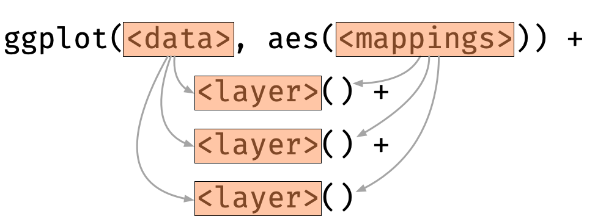
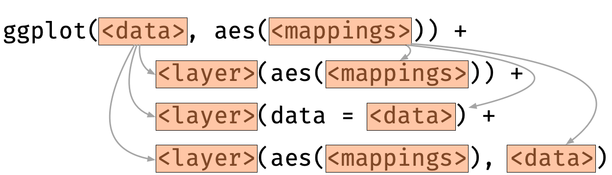

## Layer

-   A layer is usually added using functions with prefix `geom_` and
    `stat_`
-   A layer is comprised of:
    -   `data`
    -   `mapping`
    -   statistical tranformation (`stat`)
    -   geometric object (`geom`)
    -   position adjustment (`position`)
-   `data` and `mapping` are often inherited from `ggplot`

## The boxplot layer

    ggplot(data = diamonds,
           mapping = aes(x = cut, y = price)) +
      geom_boxplot()

---

## You can add more than one layer

    ggplot(data = diamonds,
           mapping = aes(x = cut, y = price)) +
      geom_violin() + 
      geom_boxplot(width = 0.1)

---

## The order of the layer matters

    ggplot(data = diamonds,
           mapping = aes(x = cut, y = price)) +
      geom_boxplot(width = 0.1) +
      geom_violin()

---

## Inheriting data and mapping

-   A layer inherits the data and mapping from the initialised ggplot
    object by default

---

## Layer-specific data and aesthetic mapping

-   For each layer, aesthetic and/or data can be overwritten

---

    ggplot(data = diamonds) +
      geom_violin(aes(x = cut, y = price, color = cut)) + 
      geom_boxplot(aes(x = cut, y = price),
                   width = 0.1)

---

## Aesthetic or Attribute?

Not what you want:

    ggplot(diamonds, aes(carat, price)) +
      geom_point(aes(color = "blue"))

What you want:

    ggplot(diamonds, aes(carat, price)) +
      geom_point(color = "blue")

---

## Bonus tip

-   Use `I()` operator to mean “as-is” in aesthetic mapping.

<!-- -->

    ggplot(diamonds, aes(carat, price)) +
      geom_point(aes(color = I("blue")))

