---

## Facets

-   Faceting in `ggplot2` refers to partitioning of the plot region to
    multiple panels each showing a different subset of the data.

-   There are three types of faceting:

    -   `facet_null()` (the default),
    -   `facet_wrap()`, and
    -   `facet_grid()`.

---

## Motivating data: growth of soybean

    data(davidian.soybean, package = "agridat")
    str(davidian.soybean)

    ## 'data.frame':    412 obs. of  5 variables:
    ##  $ plot   : Factor w/ 48 levels "1988F1","1988F2",..: 1 1 1 1 1 1 1 1 1 1 ...
    ##  $ variety: Factor w/ 2 levels "F","P": 1 1 1 1 1 1 1 1 1 1 ...
    ##  $ year   : int  1988 1988 1988 1988 1988 1988 1988 1988 1988 1988 ...
    ##  $ day    : int  14 21 28 35 42 49 56 63 70 77 ...
    ##  $ weight : num  0.106 0.261 0.666 2.11 3.56 ...

-   The data contains:
    -   `plot`: the plot code
    -   `variety`: the code (`F` = commercial and `P` = experimental)
        for which soybean variety
    -   `year`: the year it was grown (1988-1990)
    -   `day` days after planting
    -   `weight` weight of soybean leaves

---

## `facet_wrap()`

-   `facet_wrap()` divides the data into mutually exclusive subset based
    on the input variable and create subplots based on the data in the
    corresponding panel.

<!-- -->

    library(ggplot2)
    ggplot(davidian.soybean, aes(day, weight)) + 
      geom_point() +
      facet_wrap(~year)

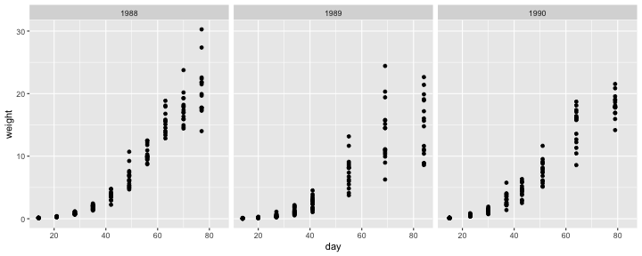

---

## Wrapping many panels

-   It “wraps” the panels into 2d if you have many panels

<!-- -->

    ggplot(davidian.soybean, aes(day, weight)) + 
      geom_point() +
      facet_wrap(~plot)

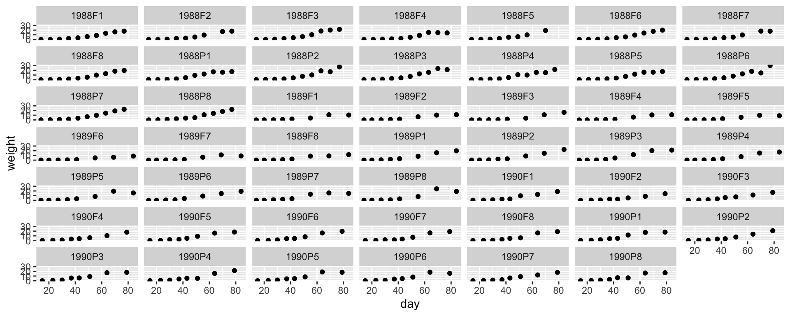

---

## Wrapping by a continuous variable

-   If you want to wrap the facet by a continuous variable, then you
    first need to discretize the continuous variable, e.g. using
    `cut()`, `cut_width()`, `cut_interval()` or `cut_number()`.

<!-- -->

    ggplot(davidian.soybean, aes(day, weight)) + 
      geom_point() +
      facet_wrap(~cut_number(day, 4))

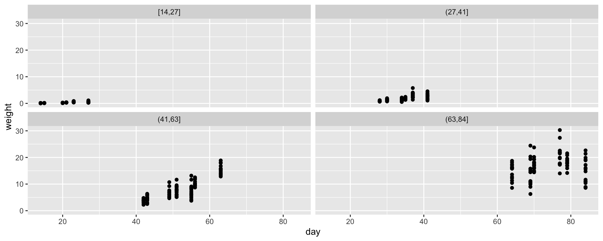

---

## Changing the scales for each panel

-   By default the scales are shared across the panels but you can
    choose to have scales built independently for each panel:

<!-- -->

    ggplot(davidian.soybean, aes(day, weight)) + 
      geom_point() +
      facet_wrap(~cut_number(day, 4), scales = "free")

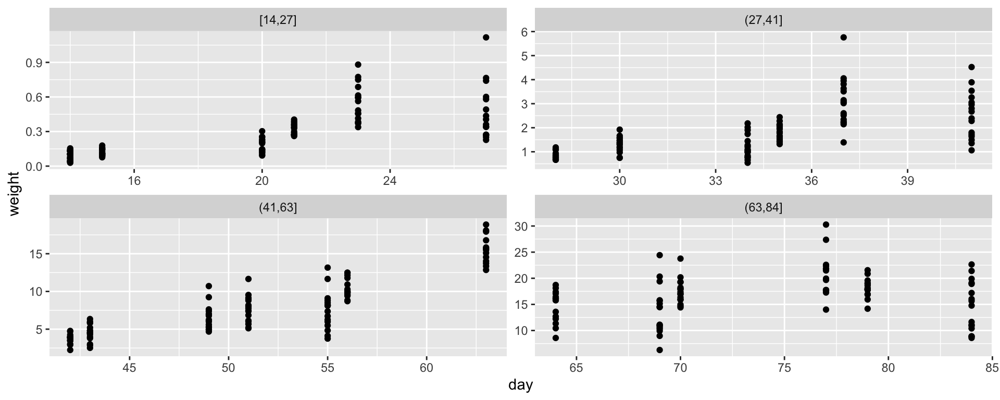

---

## Wrapping with more than one variables

-   If you want to wrap the facet by more than one variable, you can
    combine the variables by using `+`:

<!-- -->

    ggplot(davidian.soybean, aes(day, weight)) + 
      geom_point() +
      facet_wrap(~ year + variety)

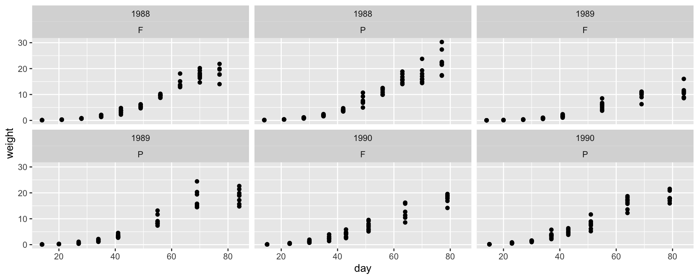

---

## `facet_grid()`

-   Alternatively, you can use `facet_grid()` to lay out the panels in a
    2d grid:

<!-- -->

    ggplot(davidian.soybean, aes(day, weight)) + 
      geom_point() +
      facet_grid(variety ~ year)

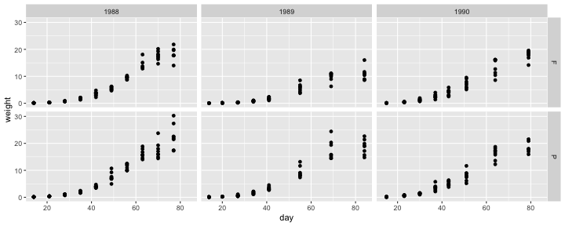

---

## Missing facet variables

-   If a layer data is missing the faceting variable(s), then the layer
    will be shown across all panels based on all of the layer data

<!-- -->

    ggplot(davidian.soybean, aes(day, weight)) + 
      geom_point(data = dplyr::select(davidian.soybean, -c(variety, year)),
                 color = "grey70") +
      geom_point() +
      facet_grid(variety ~ year)

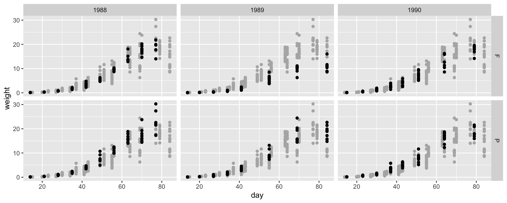

---

## Combining plots with `patchwork`

-   We use the `patchwork` package for combining plots.

<!-- -->

    library(patchwork)

-   Combining multiple `ggplot` objects is then just a matter of using
    `+` (side-by-side) or `/` (top-to-bottom).

<!-- -->

    g1 <- ggplot(davidian.soybean, aes(day, weight)) +
      geom_point(aes(color = as.factor(year))) 
    g2 <- ggplot(davidian.soybean, aes(as.factor(year), weight)) +
      geom_jitter(aes(color = as.factor(year))) 
    g1 + g2

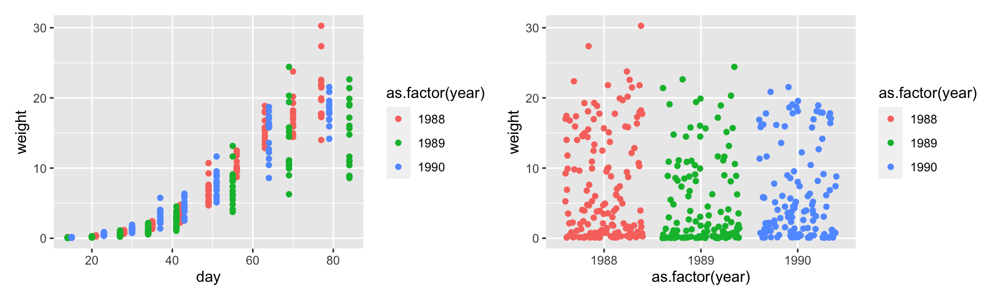

---

### Combining plot layouts

-   `patchwork` can collect the same guides across the plots as well as
    automatically add tag labels

<!-- -->

    g1 + g2 + 
      plot_layout(guides = "collect") + 
      plot_annotation(tag_levels = "A")

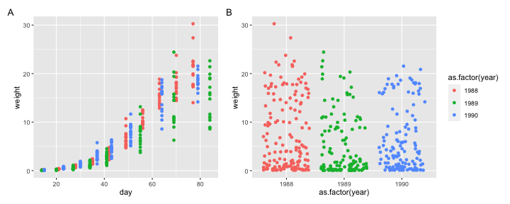

---

### Plot layout

-   You can combine the use of `+` and `/` to layout plots horizontally
    or vertically using `(` to group rows or columns

<!-- -->

    (g1 + g2) / (g2 + g1) + 
      plot_layout(guides = "collect")

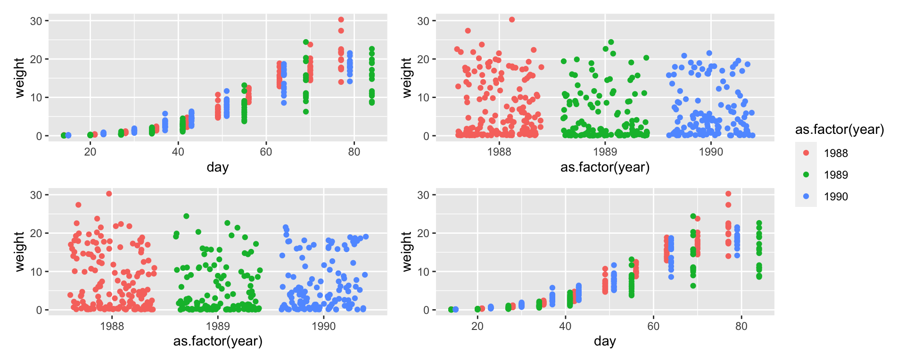

---

## Flexible plot layout

-   If you want even more control over the plot layout, then you can
    specify a strinng with the structure you want like below:

<!-- -->

    design <- "
     11###
     11###
     #2222"

    g1 + g2 + 
      plot_layout(guides = "collect",
                  design = design)

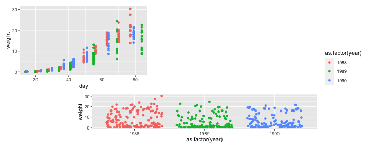
