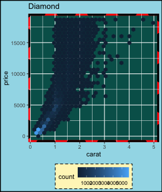

## `theme`: modify the *look* of texts

`element_text()`

---

## `element_text()`

-   There are many text elements in a plot – modify any part of it how
    you like it!

    ggplot(diamonds, aes(carat, price)) + 
      geom_hex() +
     labs(title = "Diamond") +
     theme(axis.title.x = element_text(size = 30,
                                     color = "red",
                                     face = "bold",
                                     angle = 10,
                                     family = "Fira Code"),
           legend.title = element_text(size = 25,
                                       color = "#ef42eb", 
                                       margin = margin(b = 5)),
           plot.title = element_text(size = 35,
                                     face = "bold",
                                     family = "Nunito",
                                     color = "blue"
                                    ))

---

## `theme`: modify the *look* of the lines

`element_line()`

---

## `element_line()`

    ggplot(diamonds, aes(carat, price)) + 
      geom_hex() +
     labs(title = "Diamond") +
     theme(axis.line.y = element_line(color = "black",
                                      size = 1.2,
                                      arrow = grid::arrow()),
           axis.line.x = element_line(linetype = "dashed", 
                                      color = "brown",
                                      size = 1.2),
           axis.ticks = element_line(color = "red", size = 1.1),
           axis.ticks.length = unit(3, "mm"),
           panel.grid.major = element_line(color = "blue", 
                                           size = 1.2),
           panel.grid.minor = element_line(color = "#0080ff",
                                           size = 1.2,
                                           linetype = "dotted"))

-   If there’s a line in the plot that’s not data related, then it’s
    generally controlled in the `theme` with `element_line()`.

---

## `theme`: modify the *look* of the  rectangular regions

`element_rect()`

---

## `element_rect()`

    ggplot(diamonds, aes(carat, price)) + 
      geom_hex() +
     labs(title = "Diamond") +
     theme(
      legend.background = element_rect(fill = "#fff6c2", 
                                      color = "black",
                                   linetype = "dashed"),
      legend.key = element_rect(fill = "grey", color = "brown"),
      panel.background = element_rect(fill = "#005F59",
                              color = "red", size = 3),
      panel.border = element_rect(color = "black", 
                                  fill = "transparent",
                        linetype = "dashed", size = 3),
      plot.background = element_rect(fill = "#a1dce9",
                                    color = "black",
                                     size = 1.3),
      legend.position = "bottom")

-   The selected colors don’t make it a pretty plot but it’s easier to
    distinguish between the different rectangular elements

---

## Professional-looking plots

-   You can make very pretty plots using `ggplot`.
-   Using code to draw plots has an advantage over making plots and
    editing the plot manually, e.g. using Adobe Illustrator – your plots
    are easily reproducible!
-   Imagine that after you manually edit a plot, the data was updated –
    you’ll have to redo your manual task from scratch again!
