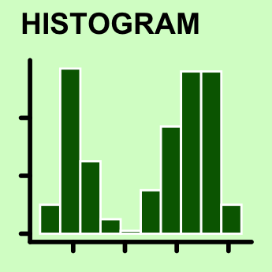

## Why data visualisation?

<blockquote>
A picture is worth a thousand words
</blockquote>

-   Data visualisation is a powerful tool to ***explore***,
    ***understand*** and ***communicate*** data

Note: What do you notice from the number of COVID-19 cases from the
graph? Is this easy to see from the table below?

<table>
<thead>
<tr>
<th style="text-align:left;">
date
</th>
<th style="text-align:right;">
case
</th>
</tr>
</thead>
<tbody>
<tr>
<td style="text-align:left;">
2020-01-23
</td>
<td style="text-align:right;">
1
</td>
</tr>
<tr>
<td style="text-align:left;">
2020-01-24
</td>
<td style="text-align:right;">
1
</td>
</tr>
<tr>
<td style="text-align:left;">
2020-01-25
</td>
<td style="text-align:right;">
1
</td>
</tr>
<tr>
<td style="text-align:left;">
2020-01-26
</td>
<td style="text-align:right;">
5
</td>
</tr>
<tr>
<td style="text-align:left;">
2020-01-27
</td>
<td style="text-align:right;">
2
</td>
</tr>
<tr>
<td style="text-align:left;">
2020-01-28
</td>
<td style="text-align:right;">
1
</td>
</tr>
<tr>
<td style="text-align:left;">
2020-01-29
</td>
<td style="text-align:right;">
2
</td>
</tr>
<tr>
<td style="text-align:left;">
2020-01-30
</td>
<td style="text-align:right;">
4
</td>
</tr>
<tr>
<td style="text-align:left;">
2020-01-31
</td>
<td style="text-align:right;">
1
</td>
</tr>
<tr>
<td style="text-align:left;">
2020-02-01
</td>
<td style="text-align:right;">
4
</td>
</tr>
<tr>
<td style="text-align:left;">
2020-02-02
</td>
<td style="text-align:right;">
1
</td>
</tr>
<tr>
<td style="text-align:left;">
2020-02-03
</td>
<td style="text-align:right;">
1
</td>
</tr>
<tr>
<td style="text-align:left;">
2020-02-04
</td>
<td style="text-align:right;">
2
</td>
</tr>
<tr>
<td style="text-align:left;">
2020-02-05
</td>
<td style="text-align:right;">
1
</td>
</tr>
<tr>
<td style="text-align:left;">
2020-02-06
</td>
<td style="text-align:right;">
2
</td>
</tr>
<tr>
<td style="text-align:left;">
2020-02-07
</td>
<td style="text-align:right;">
2
</td>
</tr>
<tr>
<td style="text-align:left;">
2020-02-08
</td>
<td style="text-align:right;">
1
</td>
</tr>
<tr>
<td style="text-align:left;">
2020-02-09
</td>
<td style="text-align:right;">
1
</td>
</tr>
<tr>
<td style="text-align:left;">
2020-02-10
</td>
<td style="text-align:right;">
1
</td>
</tr>
<tr>
<td style="text-align:left;">
2020-02-11
</td>
<td style="text-align:right;">
1
</td>
</tr>
<tr>
<td style="text-align:left;">
2020-02-12
</td>
<td style="text-align:right;">
1
</td>
</tr>
<tr>
<td style="text-align:left;">
2020-02-13
</td>
<td style="text-align:right;">
1
</td>
</tr>
<tr>
<td style="text-align:left;">
2020-02-14
</td>
<td style="text-align:right;">
1
</td>
</tr>
<tr>
<td style="text-align:left;">
2020-02-15
</td>
<td style="text-align:right;">
1
</td>
</tr>
<tr>
<td style="text-align:left;">
2020-02-16
</td>
<td style="text-align:right;">
1
</td>
</tr>
<tr>
<td style="text-align:left;">
2020-02-17
</td>
<td style="text-align:right;">
1
</td>
</tr>
<tr>
<td style="text-align:left;">
2020-02-18
</td>
<td style="text-align:right;">
1
</td>
</tr>
<tr>
<td style="text-align:left;">
2020-02-19
</td>
<td style="text-align:right;">
1
</td>
</tr>
<tr>
<td style="text-align:left;">
2020-02-20
</td>
<td style="text-align:right;">
1
</td>
</tr>
<tr>
<td style="text-align:left;">
2020-02-21
</td>
<td style="text-align:right;">
1
</td>
</tr>
<tr>
<td style="text-align:left;">
2020-02-22
</td>
<td style="text-align:right;">
1
</td>
</tr>
<tr>
<td style="text-align:left;">
2020-02-23
</td>
<td style="text-align:right;">
1
</td>
</tr>
<tr>
<td style="text-align:left;">
2020-02-24
</td>
<td style="text-align:right;">
1
</td>
</tr>
<tr>
<td style="text-align:left;">
2020-02-25
</td>
<td style="text-align:right;">
1
</td>
</tr>
<tr>
<td style="text-align:left;">
2020-02-26
</td>
<td style="text-align:right;">
1
</td>
</tr>
<tr>
<td style="text-align:left;">
2020-02-27
</td>
<td style="text-align:right;">
1
</td>
</tr>
<tr>
<td style="text-align:left;">
2020-02-28
</td>
<td style="text-align:right;">
1
</td>
</tr>
<tr>
<td style="text-align:left;">
2020-02-29
</td>
<td style="text-align:right;">
11
</td>
</tr>
<tr>
<td style="text-align:left;">
2020-03-01
</td>
<td style="text-align:right;">
3
</td>
</tr>
<tr>
<td style="text-align:left;">
2020-03-02
</td>
<td style="text-align:right;">
4
</td>
</tr>
<tr>
<td style="text-align:left;">
2020-03-03
</td>
<td style="text-align:right;">
10
</td>
</tr>
<tr>
<td style="text-align:left;">
2020-03-04
</td>
<td style="text-align:right;">
14
</td>
</tr>
<tr>
<td style="text-align:left;">
2020-03-05
</td>
<td style="text-align:right;">
4
</td>
</tr>
<tr>
<td style="text-align:left;">
2020-03-06
</td>
<td style="text-align:right;">
6
</td>
</tr>
<tr>
<td style="text-align:left;">
2020-03-07
</td>
<td style="text-align:right;">
4
</td>
</tr>
<tr>
<td style="text-align:left;">
2020-03-08
</td>
<td style="text-align:right;">
14
</td>
</tr>
<tr>
<td style="text-align:left;">
2020-03-09
</td>
<td style="text-align:right;">
16
</td>
</tr>
<tr>
<td style="text-align:left;">
2020-03-10
</td>
<td style="text-align:right;">
17
</td>
</tr>
<tr>
<td style="text-align:left;">
2020-03-11
</td>
<td style="text-align:right;">
22
</td>
</tr>
<tr>
<td style="text-align:left;">
2020-03-12
</td>
<td style="text-align:right;">
1
</td>
</tr>
<tr>
<td style="text-align:left;">
2020-03-13
</td>
<td style="text-align:right;">
73
</td>
</tr>
<tr>
<td style="text-align:left;">
2020-03-14
</td>
<td style="text-align:right;">
51
</td>
</tr>
<tr>
<td style="text-align:left;">
2020-03-15
</td>
<td style="text-align:right;">
48
</td>
</tr>
<tr>
<td style="text-align:left;">
2020-03-16
</td>
<td style="text-align:right;">
81
</td>
</tr>
<tr>
<td style="text-align:left;">
2020-03-17
</td>
<td style="text-align:right;">
76
</td>
</tr>
<tr>
<td style="text-align:left;">
2020-03-18
</td>
<td style="text-align:right;">
117
</td>
</tr>
<tr>
<td style="text-align:left;">
2020-03-19
</td>
<td style="text-align:right;">
114
</td>
</tr>
<tr>
<td style="text-align:left;">
2020-03-20
</td>
<td style="text-align:right;">
111
</td>
</tr>
<tr>
<td style="text-align:left;">
2020-03-21
</td>
<td style="text-align:right;">
281
</td>
</tr>
<tr>
<td style="text-align:left;">
2020-03-22
</td>
<td style="text-align:right;">
479
</td>
</tr>
<tr>
<td style="text-align:left;">
2020-03-23
</td>
<td style="text-align:right;">
134
</td>
</tr>
<tr>
<td style="text-align:left;">
2020-03-24
</td>
<td style="text-align:right;">
363
</td>
</tr>
<tr>
<td style="text-align:left;">
2020-03-25
</td>
<td style="text-align:right;">
321
</td>
</tr>
<tr>
<td style="text-align:left;">
2020-03-26
</td>
<td style="text-align:right;">
447
</td>
</tr>
<tr>
<td style="text-align:left;">
2020-03-27
</td>
<td style="text-align:right;">
334
</td>
</tr>
<tr>
<td style="text-align:left;">
2020-03-28
</td>
<td style="text-align:right;">
498
</td>
</tr>
<tr>
<td style="text-align:left;">
2020-03-29
</td>
<td style="text-align:right;">
345
</td>
</tr>
<tr>
<td style="text-align:left;">
2020-03-30
</td>
<td style="text-align:right;">
378
</td>
</tr>
<tr>
<td style="text-align:left;">
2020-03-31
</td>
<td style="text-align:right;">
199
</td>
</tr>
<tr>
<td style="text-align:left;">
2020-04-01
</td>
<td style="text-align:right;">
304
</td>
</tr>
<tr>
<td style="text-align:left;">
2020-04-02
</td>
<td style="text-align:right;">
255
</td>
</tr>
<tr>
<td style="text-align:left;">
2020-04-03
</td>
<td style="text-align:right;">
215
</td>
</tr>
<tr>
<td style="text-align:left;">
2020-04-04
</td>
<td style="text-align:right;">
221
</td>
</tr>
<tr>
<td style="text-align:left;">
2020-04-05
</td>
<td style="text-align:right;">
138
</td>
</tr>
<tr>
<td style="text-align:left;">
2020-04-06
</td>
<td style="text-align:right;">
111
</td>
</tr>
<tr>
<td style="text-align:left;">
2020-04-07
</td>
<td style="text-align:right;">
99
</td>
</tr>
<tr>
<td style="text-align:left;">
2020-04-08
</td>
<td style="text-align:right;">
116
</td>
</tr>
<tr>
<td style="text-align:left;">
2020-04-09
</td>
<td style="text-align:right;">
99
</td>
</tr>
<tr>
<td style="text-align:left;">
2020-04-10
</td>
<td style="text-align:right;">
108
</td>
</tr>
<tr>
<td style="text-align:left;">
2020-04-11
</td>
<td style="text-align:right;">
89
</td>
</tr>
<tr>
<td style="text-align:left;">
2020-04-12
</td>
<td style="text-align:right;">
13
</td>
</tr>
<tr>
<td style="text-align:left;">
2020-04-13
</td>
<td style="text-align:right;">
37
</td>
</tr>
<tr>
<td style="text-align:left;">
2020-04-14
</td>
<td style="text-align:right;">
65
</td>
</tr>
<tr>
<td style="text-align:left;">
2020-04-15
</td>
<td style="text-align:right;">
26
</td>
</tr>
<tr>
<td style="text-align:left;">
2020-04-16
</td>
<td style="text-align:right;">
23
</td>
</tr>
<tr>
<td style="text-align:left;">
2020-04-17
</td>
<td style="text-align:right;">
61
</td>
</tr>
<tr>
<td style="text-align:left;">
2020-04-18
</td>
<td style="text-align:right;">
47
</td>
</tr>
<tr>
<td style="text-align:left;">
2020-04-19
</td>
<td style="text-align:right;">
43
</td>
</tr>
<tr>
<td style="text-align:left;">
2020-04-20
</td>
<td style="text-align:right;">
14
</td>
</tr>
<tr>
<td style="text-align:left;">
2020-04-21
</td>
<td style="text-align:right;">
23
</td>
</tr>
<tr>
<td style="text-align:left;">
2020-04-22
</td>
<td style="text-align:right;">
8
</td>
</tr>
<tr>
<td style="text-align:left;">
2020-04-23
</td>
<td style="text-align:right;">
11
</td>
</tr>
<tr>
<td style="text-align:left;">
2020-04-24
</td>
<td style="text-align:right;">
16
</td>
</tr>
<tr>
<td style="text-align:left;">
2020-04-25
</td>
<td style="text-align:right;">
18
</td>
</tr>
<tr>
<td style="text-align:left;">
2020-04-26
</td>
<td style="text-align:right;">
21
</td>
</tr>
<tr>
<td style="text-align:left;">
2020-04-27
</td>
<td style="text-align:right;">
8
</td>
</tr>
<tr>
<td style="text-align:left;">
2020-04-28
</td>
<td style="text-align:right;">
24
</td>
</tr>
<tr>
<td style="text-align:left;">
2020-04-29
</td>
<td style="text-align:right;">
9
</td>
</tr>
<tr>
<td style="text-align:left;">
2020-04-30
</td>
<td style="text-align:right;">
15
</td>
</tr>
<tr>
<td style="text-align:left;">
2020-05-01
</td>
<td style="text-align:right;">
13
</td>
</tr>
<tr>
<td style="text-align:left;">
2020-05-02
</td>
<td style="text-align:right;">
22
</td>
</tr>
<tr>
<td style="text-align:left;">
2020-05-03
</td>
<td style="text-align:right;">
24
</td>
</tr>
<tr>
<td style="text-align:left;">
2020-05-04
</td>
<td style="text-align:right;">
26
</td>
</tr>
<tr>
<td style="text-align:left;">
2020-05-05
</td>
<td style="text-align:right;">
29
</td>
</tr>
<tr>
<td style="text-align:left;">
2020-05-06
</td>
<td style="text-align:right;">
20
</td>
</tr>
<tr>
<td style="text-align:left;">
2020-05-07
</td>
<td style="text-align:right;">
20
</td>
</tr>
<tr>
<td style="text-align:left;">
2020-05-08
</td>
<td style="text-align:right;">
6
</td>
</tr>
<tr>
<td style="text-align:left;">
2020-05-09
</td>
<td style="text-align:right;">
22
</td>
</tr>
<tr>
<td style="text-align:left;">
2020-05-10
</td>
<td style="text-align:right;">
10
</td>
</tr>
<tr>
<td style="text-align:left;">
2020-05-11
</td>
<td style="text-align:right;">
23
</td>
</tr>
<tr>
<td style="text-align:left;">
2020-05-12
</td>
<td style="text-align:right;">
11
</td>
</tr>
<tr>
<td style="text-align:left;">
2020-05-13
</td>
<td style="text-align:right;">
10
</td>
</tr>
<tr>
<td style="text-align:left;">
2020-05-14
</td>
<td style="text-align:right;">
31
</td>
</tr>
<tr>
<td style="text-align:left;">
2020-05-15
</td>
<td style="text-align:right;">
17
</td>
</tr>
<tr>
<td style="text-align:left;">
2020-05-16
</td>
<td style="text-align:right;">
10
</td>
</tr>
<tr>
<td style="text-align:left;">
2020-05-17
</td>
<td style="text-align:right;">
11
</td>
</tr>
<tr>
<td style="text-align:left;">
2020-05-18
</td>
<td style="text-align:right;">
15
</td>
</tr>
<tr>
<td style="text-align:left;">
2020-05-19
</td>
<td style="text-align:right;">
5
</td>
</tr>
<tr>
<td style="text-align:left;">
2020-05-20
</td>
<td style="text-align:right;">
10
</td>
</tr>
<tr>
<td style="text-align:left;">
2020-05-21
</td>
<td style="text-align:right;">
15
</td>
</tr>
<tr>
<td style="text-align:left;">
2020-05-22
</td>
<td style="text-align:right;">
5
</td>
</tr>
<tr>
<td style="text-align:left;">
2020-05-23
</td>
<td style="text-align:right;">
16
</td>
</tr>
<tr>
<td style="text-align:left;">
2020-05-24
</td>
<td style="text-align:right;">
1
</td>
</tr>
<tr>
<td style="text-align:left;">
2020-05-25
</td>
<td style="text-align:right;">
13
</td>
</tr>
<tr>
<td style="text-align:left;">
2020-05-26
</td>
<td style="text-align:right;">
14
</td>
</tr>
<tr>
<td style="text-align:left;">
2020-05-27
</td>
<td style="text-align:right;">
12
</td>
</tr>
<tr>
<td style="text-align:left;">
2020-05-28
</td>
<td style="text-align:right;">
16
</td>
</tr>
<tr>
<td style="text-align:left;">
2020-05-29
</td>
<td style="text-align:right;">
20
</td>
</tr>
<tr>
<td style="text-align:left;">
2020-05-30
</td>
<td style="text-align:right;">
9
</td>
</tr>
<tr>
<td style="text-align:left;">
2020-05-31
</td>
<td style="text-align:right;">
11
</td>
</tr>
<tr>
<td style="text-align:left;">
2020-06-01
</td>
<td style="text-align:right;">
20
</td>
</tr>
<tr>
<td style="text-align:left;">
2020-06-02
</td>
<td style="text-align:right;">
9
</td>
</tr>
<tr>
<td style="text-align:left;">
2020-06-03
</td>
<td style="text-align:right;">
12
</td>
</tr>
<tr>
<td style="text-align:left;">
2020-06-04
</td>
<td style="text-align:right;">
8
</td>
</tr>
<tr>
<td style="text-align:left;">
2020-06-05
</td>
<td style="text-align:right;">
6
</td>
</tr>
<tr>
<td style="text-align:left;">
2020-06-06
</td>
<td style="text-align:right;">
8
</td>
</tr>
<tr>
<td style="text-align:left;">
2020-06-07
</td>
<td style="text-align:right;">
7
</td>
</tr>
<tr>
<td style="text-align:left;">
2020-06-08
</td>
<td style="text-align:right;">
3
</td>
</tr>
<tr>
<td style="text-align:left;">
2020-06-09
</td>
<td style="text-align:right;">
8
</td>
</tr>
<tr>
<td style="text-align:left;">
2020-06-10
</td>
<td style="text-align:right;">
12
</td>
</tr>
<tr>
<td style="text-align:left;">
2020-06-11
</td>
<td style="text-align:right;">
5
</td>
</tr>
<tr>
<td style="text-align:left;">
2020-06-12
</td>
<td style="text-align:right;">
6
</td>
</tr>
<tr>
<td style="text-align:left;">
2020-06-13
</td>
<td style="text-align:right;">
27
</td>
</tr>
<tr>
<td style="text-align:left;">
2020-06-14
</td>
<td style="text-align:right;">
16
</td>
</tr>
<tr>
<td style="text-align:left;">
2020-06-15
</td>
<td style="text-align:right;">
13
</td>
</tr>
<tr>
<td style="text-align:left;">
2020-06-16
</td>
<td style="text-align:right;">
24
</td>
</tr>
<tr>
<td style="text-align:left;">
2020-06-17
</td>
<td style="text-align:right;">
22
</td>
</tr>
<tr>
<td style="text-align:left;">
2020-06-18
</td>
<td style="text-align:right;">
19
</td>
</tr>
<tr>
<td style="text-align:left;">
2020-06-19
</td>
<td style="text-align:right;">
3
</td>
</tr>
<tr>
<td style="text-align:left;">
2020-06-20
</td>
<td style="text-align:right;">
51
</td>
</tr>
<tr>
<td style="text-align:left;">
2020-06-21
</td>
<td style="text-align:right;">
14
</td>
</tr>
<tr>
<td style="text-align:left;">
2020-06-22
</td>
<td style="text-align:right;">
19
</td>
</tr>
<tr>
<td style="text-align:left;">
2020-06-23
</td>
<td style="text-align:right;">
30
</td>
</tr>
<tr>
<td style="text-align:left;">
2020-06-24
</td>
<td style="text-align:right;">
38
</td>
</tr>
<tr>
<td style="text-align:left;">
2020-06-25
</td>
<td style="text-align:right;">
38
</td>
</tr>
<tr>
<td style="text-align:left;">
2020-06-26
</td>
<td style="text-align:right;">
7
</td>
</tr>
<tr>
<td style="text-align:left;">
2020-06-27
</td>
<td style="text-align:right;">
86
</td>
</tr>
<tr>
<td style="text-align:left;">
2020-06-28
</td>
<td style="text-align:right;">
79
</td>
</tr>
<tr>
<td style="text-align:left;">
2020-06-29
</td>
<td style="text-align:right;">
71
</td>
</tr>
<tr>
<td style="text-align:left;">
2020-06-30
</td>
<td style="text-align:right;">
87
</td>
</tr>
<tr>
<td style="text-align:left;">
2020-07-01
</td>
<td style="text-align:right;">
82
</td>
</tr>
<tr>
<td style="text-align:left;">
2020-07-02
</td>
<td style="text-align:right;">
66
</td>
</tr>
<tr>
<td style="text-align:left;">
2020-07-03
</td>
<td style="text-align:right;">
195
</td>
</tr>
<tr>
<td style="text-align:left;">
2020-07-04
</td>
<td style="text-align:right;">
184
</td>
</tr>
<tr>
<td style="text-align:left;">
2020-07-05
</td>
<td style="text-align:right;">
141
</td>
</tr>
<tr>
<td style="text-align:left;">
2020-07-06
</td>
<td style="text-align:right;">
173
</td>
</tr>
<tr>
<td style="text-align:left;">
2020-07-07
</td>
<td style="text-align:right;">
132
</td>
</tr>
<tr>
<td style="text-align:left;">
2020-07-08
</td>
<td style="text-align:right;">
171
</td>
</tr>
<tr>
<td style="text-align:left;">
2020-07-09
</td>
<td style="text-align:right;">
319
</td>
</tr>
<tr>
<td style="text-align:left;">
2020-07-10
</td>
<td style="text-align:right;">
180
</td>
</tr>
<tr>
<td style="text-align:left;">
2020-07-11
</td>
<td style="text-align:right;">
245
</td>
</tr>
<tr>
<td style="text-align:left;">
2020-07-12
</td>
<td style="text-align:right;">
184
</td>
</tr>
<tr>
<td style="text-align:left;">
2020-07-13
</td>
<td style="text-align:right;">
272
</td>
</tr>
<tr>
<td style="text-align:left;">
2020-07-14
</td>
<td style="text-align:right;">
237
</td>
</tr>
<tr>
<td style="text-align:left;">
2020-07-15
</td>
<td style="text-align:right;">
324
</td>
</tr>
<tr>
<td style="text-align:left;">
2020-07-16
</td>
<td style="text-align:right;">
424
</td>
</tr>
<tr>
<td style="text-align:left;">
2020-07-17
</td>
<td style="text-align:right;">
209
</td>
</tr>
<tr>
<td style="text-align:left;">
2020-07-18
</td>
<td style="text-align:right;">
362
</td>
</tr>
<tr>
<td style="text-align:left;">
2020-07-19
</td>
<td style="text-align:right;">
268
</td>
</tr>
<tr>
<td style="text-align:left;">
2020-07-20
</td>
<td style="text-align:right;">
360
</td>
</tr>
<tr>
<td style="text-align:left;">
2020-07-21
</td>
<td style="text-align:right;">
467
</td>
</tr>
<tr>
<td style="text-align:left;">
2020-07-22
</td>
<td style="text-align:right;">
409
</td>
</tr>
<tr>
<td style="text-align:left;">
2020-07-23
</td>
<td style="text-align:right;">
294
</td>
</tr>
<tr>
<td style="text-align:left;">
2020-07-24
</td>
<td style="text-align:right;">
356
</td>
</tr>
<tr>
<td style="text-align:left;">
2020-07-25
</td>
<td style="text-align:right;">
454
</td>
</tr>
<tr>
<td style="text-align:left;">
2020-07-26
</td>
<td style="text-align:right;">
533
</td>
</tr>
<tr>
<td style="text-align:left;">
2020-07-27
</td>
<td style="text-align:right;">
369
</td>
</tr>
<tr>
<td style="text-align:left;">
2020-07-28
</td>
<td style="text-align:right;">
280
</td>
</tr>
<tr>
<td style="text-align:left;">
2020-07-29
</td>
<td style="text-align:right;">
717
</td>
</tr>
<tr>
<td style="text-align:left;">
2020-07-30
</td>
<td style="text-align:right;">
606
</td>
</tr>
<tr>
<td style="text-align:left;">
2020-07-31
</td>
<td style="text-align:right;">
378
</td>
</tr>
<tr>
<td style="text-align:left;">
2020-08-01
</td>
<td style="text-align:right;">
616
</td>
</tr>
<tr>
<td style="text-align:left;">
2020-08-02
</td>
<td style="text-align:right;">
424
</td>
</tr>
<tr>
<td style="text-align:left;">
2020-08-03
</td>
<td style="text-align:right;">
413
</td>
</tr>
<tr>
<td style="text-align:left;">
2020-08-04
</td>
<td style="text-align:right;">
716
</td>
</tr>
<tr>
<td style="text-align:left;">
2020-08-05
</td>
<td style="text-align:right;">
446
</td>
</tr>
<tr>
<td style="text-align:left;">
2020-08-06
</td>
<td style="text-align:right;">
383
</td>
</tr>
<tr>
<td style="text-align:left;">
2020-08-07
</td>
<td style="text-align:right;">
427
</td>
</tr>
<tr>
<td style="text-align:left;">
2020-08-08
</td>
<td style="text-align:right;">
387
</td>
</tr>
<tr>
<td style="text-align:left;">
2020-08-09
</td>
<td style="text-align:right;">
314
</td>
</tr>
<tr>
<td style="text-align:left;">
2020-08-10
</td>
<td style="text-align:right;">
317
</td>
</tr>
<tr>
<td style="text-align:left;">
2020-08-11
</td>
<td style="text-align:right;">
415
</td>
</tr>
<tr>
<td style="text-align:left;">
2020-08-12
</td>
<td style="text-align:right;">
232
</td>
</tr>
<tr>
<td style="text-align:left;">
2020-08-13
</td>
<td style="text-align:right;">
385
</td>
</tr>
<tr>
<td style="text-align:left;">
2020-08-14
</td>
<td style="text-align:right;">
294
</td>
</tr>
<tr>
<td style="text-align:left;">
2020-08-15
</td>
<td style="text-align:right;">
253
</td>
</tr>
<tr>
<td style="text-align:left;">
2020-08-16
</td>
<td style="text-align:right;">
272
</td>
</tr>
<tr>
<td style="text-align:left;">
2020-08-17
</td>
<td style="text-align:right;">
216
</td>
</tr>
<tr>
<td style="text-align:left;">
2020-08-18
</td>
<td style="text-align:right;">
217
</td>
</tr>
<tr>
<td style="text-align:left;">
2020-08-19
</td>
<td style="text-align:right;">
248
</td>
</tr>
<tr>
<td style="text-align:left;">
2020-08-20
</td>
<td style="text-align:right;">
172
</td>
</tr>
<tr>
<td style="text-align:left;">
2020-08-21
</td>
<td style="text-align:right;">
196
</td>
</tr>
<tr>
<td style="text-align:left;">
2020-08-22
</td>
<td style="text-align:right;">
210
</td>
</tr>
<tr>
<td style="text-align:left;">
2020-08-23
</td>
<td style="text-align:right;">
105
</td>
</tr>
<tr>
<td style="text-align:left;">
2020-08-24
</td>
<td style="text-align:right;">
139
</td>
</tr>
<tr>
<td style="text-align:left;">
2020-08-25
</td>
<td style="text-align:right;">
152
</td>
</tr>
<tr>
<td style="text-align:left;">
2020-08-26
</td>
<td style="text-align:right;">
119
</td>
</tr>
<tr>
<td style="text-align:left;">
2020-08-27
</td>
<td style="text-align:right;">
127
</td>
</tr>
<tr>
<td style="text-align:left;">
2020-08-28
</td>
<td style="text-align:right;">
100
</td>
</tr>
<tr>
<td style="text-align:left;">
2020-08-29
</td>
<td style="text-align:right;">
124
</td>
</tr>
<tr>
<td style="text-align:left;">
2020-08-30
</td>
<td style="text-align:right;">
77
</td>
</tr>
<tr>
<td style="text-align:left;">
2020-08-31
</td>
<td style="text-align:right;">
74
</td>
</tr>
<tr>
<td style="text-align:left;">
2020-09-01
</td>
<td style="text-align:right;">
105
</td>
</tr>
<tr>
<td style="text-align:left;">
2020-09-02
</td>
<td style="text-align:right;">
127
</td>
</tr>
<tr>
<td style="text-align:left;">
2020-09-03
</td>
<td style="text-align:right;">
88
</td>
</tr>
<tr>
<td style="text-align:left;">
2020-09-04
</td>
<td style="text-align:right;">
72
</td>
</tr>
<tr>
<td style="text-align:left;">
2020-09-05
</td>
<td style="text-align:right;">
72
</td>
</tr>
<tr>
<td style="text-align:left;">
2020-09-06
</td>
<td style="text-align:right;">
44
</td>
</tr>
<tr>
<td style="text-align:left;">
2020-09-07
</td>
<td style="text-align:right;">
53
</td>
</tr>
<tr>
<td style="text-align:left;">
2020-09-08
</td>
<td style="text-align:right;">
93
</td>
</tr>
<tr>
<td style="text-align:left;">
2020-09-09
</td>
<td style="text-align:right;">
60
</td>
</tr>
<tr>
<td style="text-align:left;">
2020-09-10
</td>
<td style="text-align:right;">
41
</td>
</tr>
<tr>
<td style="text-align:left;">
2020-09-11
</td>
<td style="text-align:right;">
44
</td>
</tr>
<tr>
<td style="text-align:left;">
2020-09-12
</td>
<td style="text-align:right;">
45
</td>
</tr>
<tr>
<td style="text-align:left;">
2020-09-13
</td>
<td style="text-align:right;">
42
</td>
</tr>
<tr>
<td style="text-align:left;">
2020-09-14
</td>
<td style="text-align:right;">
48
</td>
</tr>
<tr>
<td style="text-align:left;">
2020-09-15
</td>
<td style="text-align:right;">
40
</td>
</tr>
<tr>
<td style="text-align:left;">
2020-09-16
</td>
<td style="text-align:right;">
36
</td>
</tr>
<tr>
<td style="text-align:left;">
2020-09-17
</td>
<td style="text-align:right;">
49
</td>
</tr>
<tr>
<td style="text-align:left;">
2020-09-18
</td>
<td style="text-align:right;">
25
</td>
</tr>
<tr>
<td style="text-align:left;">
2020-09-19
</td>
<td style="text-align:right;">
14
</td>
</tr>
<tr>
<td style="text-align:left;">
2020-09-20
</td>
<td style="text-align:right;">
15
</td>
</tr>
<tr>
<td style="text-align:left;">
2020-09-21
</td>
<td style="text-align:right;">
31
</td>
</tr>
<tr>
<td style="text-align:left;">
2020-09-22
</td>
<td style="text-align:right;">
31
</td>
</tr>
<tr>
<td style="text-align:left;">
2020-09-23
</td>
<td style="text-align:right;">
9
</td>
</tr>
<tr>
<td style="text-align:left;">
2020-09-24
</td>
<td style="text-align:right;">
21
</td>
</tr>
<tr>
<td style="text-align:left;">
2020-09-25
</td>
<td style="text-align:right;">
17
</td>
</tr>
<tr>
<td style="text-align:left;">
2020-09-26
</td>
<td style="text-align:right;">
25
</td>
</tr>
<tr>
<td style="text-align:left;">
2020-09-27
</td>
<td style="text-align:right;">
5
</td>
</tr>
<tr>
<td style="text-align:left;">
2020-09-28
</td>
<td style="text-align:right;">
12
</td>
</tr>
<tr>
<td style="text-align:left;">
2020-09-29
</td>
<td style="text-align:right;">
24
</td>
</tr>
<tr>
<td style="text-align:left;">
2020-09-30
</td>
<td style="text-align:right;">
19
</td>
</tr>
<tr>
<td style="text-align:left;">
2020-10-01
</td>
<td style="text-align:right;">
14
</td>
</tr>
<tr>
<td style="text-align:left;">
2020-10-02
</td>
<td style="text-align:right;">
13
</td>
</tr>
<tr>
<td style="text-align:left;">
2020-10-03
</td>
<td style="text-align:right;">
15
</td>
</tr>
<tr>
<td style="text-align:left;">
2020-10-04
</td>
<td style="text-align:right;">
14
</td>
</tr>
<tr>
<td style="text-align:left;">
2020-10-05
</td>
<td style="text-align:right;">
26
</td>
</tr>
<tr>
<td style="text-align:left;">
2020-10-06
</td>
<td style="text-align:right;">
9
</td>
</tr>
<tr>
<td style="text-align:left;">
2020-10-07
</td>
<td style="text-align:right;">
26
</td>
</tr>
<tr>
<td style="text-align:left;">
2020-10-08
</td>
<td style="text-align:right;">
21
</td>
</tr>
<tr>
<td style="text-align:left;">
2020-10-09
</td>
<td style="text-align:right;">
19
</td>
</tr>
<tr>
<td style="text-align:left;">
2020-10-10
</td>
<td style="text-align:right;">
20
</td>
</tr>
<tr>
<td style="text-align:left;">
2020-10-11
</td>
<td style="text-align:right;">
23
</td>
</tr>
<tr>
<td style="text-align:left;">
2020-10-12
</td>
<td style="text-align:right;">
26
</td>
</tr>
<tr>
<td style="text-align:left;">
2020-10-13
</td>
<td style="text-align:right;">
28
</td>
</tr>
<tr>
<td style="text-align:left;">
2020-10-14
</td>
<td style="text-align:right;">
21
</td>
</tr>
<tr>
<td style="text-align:left;">
2020-10-15
</td>
<td style="text-align:right;">
15
</td>
</tr>
<tr>
<td style="text-align:left;">
2020-10-16
</td>
<td style="text-align:right;">
8
</td>
</tr>
<tr>
<td style="text-align:left;">
2020-10-17
</td>
<td style="text-align:right;">
13
</td>
</tr>
<tr>
<td style="text-align:left;">
2020-10-18
</td>
<td style="text-align:right;">
10
</td>
</tr>
<tr>
<td style="text-align:left;">
2020-10-19
</td>
<td style="text-align:right;">
7
</td>
</tr>
<tr>
<td style="text-align:left;">
2020-10-20
</td>
<td style="text-align:right;">
39
</td>
</tr>
<tr>
<td style="text-align:left;">
2020-10-21
</td>
<td style="text-align:right;">
16
</td>
</tr>
<tr>
<td style="text-align:left;">
2020-10-22
</td>
<td style="text-align:right;">
19
</td>
</tr>
<tr>
<td style="text-align:left;">
2020-10-23
</td>
<td style="text-align:right;">
20
</td>
</tr>
<tr>
<td style="text-align:left;">
2020-10-24
</td>
<td style="text-align:right;">
19
</td>
</tr>
<tr>
<td style="text-align:left;">
2020-10-25
</td>
<td style="text-align:right;">
13
</td>
</tr>
<tr>
<td style="text-align:left;">
2020-10-26
</td>
<td style="text-align:right;">
15
</td>
</tr>
<tr>
<td style="text-align:left;">
2020-10-27
</td>
<td style="text-align:right;">
15
</td>
</tr>
<tr>
<td style="text-align:left;">
2020-10-28
</td>
<td style="text-align:right;">
13
</td>
</tr>
<tr>
<td style="text-align:left;">
2020-10-29
</td>
<td style="text-align:right;">
15
</td>
</tr>
<tr>
<td style="text-align:left;">
2020-10-30
</td>
<td style="text-align:right;">
7
</td>
</tr>
<tr>
<td style="text-align:left;">
2020-10-31
</td>
<td style="text-align:right;">
11
</td>
</tr>
<tr>
<td style="text-align:left;">
2020-11-01
</td>
<td style="text-align:right;">
7
</td>
</tr>
<tr>
<td style="text-align:left;">
2020-11-02
</td>
<td style="text-align:right;">
10
</td>
</tr>
<tr>
<td style="text-align:left;">
2020-11-03
</td>
<td style="text-align:right;">
13
</td>
</tr>
<tr>
<td style="text-align:left;">
2020-11-04
</td>
<td style="text-align:right;">
9
</td>
</tr>
<tr>
<td style="text-align:left;">
2020-11-05
</td>
<td style="text-align:right;">
15
</td>
</tr>
<tr>
<td style="text-align:left;">
2020-11-06
</td>
<td style="text-align:right;">
9
</td>
</tr>
<tr>
<td style="text-align:left;">
2020-11-07
</td>
<td style="text-align:right;">
7
</td>
</tr>
<tr>
<td style="text-align:left;">
2020-11-08
</td>
<td style="text-align:right;">
8
</td>
</tr>
<tr>
<td style="text-align:left;">
2020-11-09
</td>
<td style="text-align:right;">
5
</td>
</tr>
<tr>
<td style="text-align:left;">
2020-11-10
</td>
<td style="text-align:right;">
3
</td>
</tr>
<tr>
<td style="text-align:left;">
2020-11-11
</td>
<td style="text-align:right;">
5
</td>
</tr>
<tr>
<td style="text-align:left;">
2020-11-12
</td>
<td style="text-align:right;">
2
</td>
</tr>
<tr>
<td style="text-align:left;">
2020-11-13
</td>
<td style="text-align:right;">
7
</td>
</tr>
<tr>
<td style="text-align:left;">
2020-11-14
</td>
<td style="text-align:right;">
30
</td>
</tr>
<tr>
<td style="text-align:left;">
2020-11-15
</td>
<td style="text-align:right;">
39
</td>
</tr>
<tr>
<td style="text-align:left;">
2020-11-16
</td>
<td style="text-align:right;">
10
</td>
</tr>
<tr>
<td style="text-align:left;">
2020-11-17
</td>
<td style="text-align:right;">
20
</td>
</tr>
<tr>
<td style="text-align:left;">
2020-11-18
</td>
<td style="text-align:right;">
9
</td>
</tr>
<tr>
<td style="text-align:left;">
2020-11-19
</td>
<td style="text-align:right;">
8
</td>
</tr>
<tr>
<td style="text-align:left;">
2020-11-20
</td>
<td style="text-align:right;">
15
</td>
</tr>
<tr>
<td style="text-align:left;">
2020-11-21
</td>
<td style="text-align:right;">
16
</td>
</tr>
<tr>
<td style="text-align:left;">
2020-11-22
</td>
<td style="text-align:right;">
14
</td>
</tr>
<tr>
<td style="text-align:left;">
2020-11-23
</td>
<td style="text-align:right;">
10
</td>
</tr>
<tr>
<td style="text-align:left;">
2020-11-24
</td>
<td style="text-align:right;">
11
</td>
</tr>
<tr>
<td style="text-align:left;">
2020-11-25
</td>
<td style="text-align:right;">
13
</td>
</tr>
<tr>
<td style="text-align:left;">
2020-11-26
</td>
<td style="text-align:right;">
9
</td>
</tr>
<tr>
<td style="text-align:left;">
2020-11-27
</td>
<td style="text-align:right;">
14
</td>
</tr>
<tr>
<td style="text-align:left;">
2020-11-28
</td>
<td style="text-align:right;">
7
</td>
</tr>
<tr>
<td style="text-align:left;">
2020-11-29
</td>
<td style="text-align:right;">
11
</td>
</tr>
<tr>
<td style="text-align:left;">
2020-11-30
</td>
<td style="text-align:right;">
11
</td>
</tr>
<tr>
<td style="text-align:left;">
2020-12-01
</td>
<td style="text-align:right;">
12
</td>
</tr>
<tr>
<td style="text-align:left;">
2020-12-02
</td>
<td style="text-align:right;">
17
</td>
</tr>
<tr>
<td style="text-align:left;">
2020-12-03
</td>
<td style="text-align:right;">
11
</td>
</tr>
<tr>
<td style="text-align:left;">
2020-12-04
</td>
<td style="text-align:right;">
8
</td>
</tr>
<tr>
<td style="text-align:left;">
2020-12-05
</td>
<td style="text-align:right;">
10
</td>
</tr>
<tr>
<td style="text-align:left;">
2020-12-06
</td>
<td style="text-align:right;">
8
</td>
</tr>
<tr>
<td style="text-align:left;">
2020-12-07
</td>
<td style="text-align:right;">
16
</td>
</tr>
<tr>
<td style="text-align:left;">
2020-12-08
</td>
<td style="text-align:right;">
7
</td>
</tr>
<tr>
<td style="text-align:left;">
2020-12-09
</td>
<td style="text-align:right;">
8
</td>
</tr>
<tr>
<td style="text-align:left;">
2020-12-10
</td>
<td style="text-align:right;">
12
</td>
</tr>
<tr>
<td style="text-align:left;">
2020-12-11
</td>
<td style="text-align:right;">
15
</td>
</tr>
<tr>
<td style="text-align:left;">
2020-12-12
</td>
<td style="text-align:right;">
6
</td>
</tr>
<tr>
<td style="text-align:left;">
2020-12-13
</td>
<td style="text-align:right;">
8
</td>
</tr>
<tr>
<td style="text-align:left;">
2020-12-14
</td>
<td style="text-align:right;">
12
</td>
</tr>
<tr>
<td style="text-align:left;">
2020-12-15
</td>
<td style="text-align:right;">
13
</td>
</tr>
<tr>
<td style="text-align:left;">
2020-12-16
</td>
<td style="text-align:right;">
13
</td>
</tr>
<tr>
<td style="text-align:left;">
2020-12-17
</td>
<td style="text-align:right;">
22
</td>
</tr>
<tr>
<td style="text-align:left;">
2020-12-18
</td>
<td style="text-align:right;">
34
</td>
</tr>
<tr>
<td style="text-align:left;">
2020-12-19
</td>
<td style="text-align:right;">
43
</td>
</tr>
<tr>
<td style="text-align:left;">
2020-12-20
</td>
<td style="text-align:right;">
31
</td>
</tr>
<tr>
<td style="text-align:left;">
2020-12-21
</td>
<td style="text-align:right;">
22
</td>
</tr>
<tr>
<td style="text-align:left;">
2020-12-22
</td>
<td style="text-align:right;">
19
</td>
</tr>
<tr>
<td style="text-align:left;">
2020-12-23
</td>
<td style="text-align:right;">
26
</td>
</tr>
<tr>
<td style="text-align:left;">
2020-12-24
</td>
<td style="text-align:right;">
13
</td>
</tr>
<tr>
<td style="text-align:left;">
2020-12-25
</td>
<td style="text-align:right;">
24
</td>
</tr>
<tr>
<td style="text-align:left;">
2020-12-26
</td>
<td style="text-align:right;">
12
</td>
</tr>
<tr>
<td style="text-align:left;">
2020-12-27
</td>
<td style="text-align:right;">
30
</td>
</tr>
<tr>
<td style="text-align:left;">
2020-12-28
</td>
<td style="text-align:right;">
13
</td>
</tr>
<tr>
<td style="text-align:left;">
2020-12-29
</td>
<td style="text-align:right;">
33
</td>
</tr>
<tr>
<td style="text-align:left;">
2020-12-30
</td>
<td style="text-align:right;">
25
</td>
</tr>
<tr>
<td style="text-align:left;">
2020-12-31
</td>
<td style="text-align:right;">
21
</td>
</tr>
<tr>
<td style="text-align:left;">
2021-01-01
</td>
<td style="text-align:right;">
36
</td>
</tr>
<tr>
<td style="text-align:left;">
2021-01-02
</td>
<td style="text-align:right;">
25
</td>
</tr>
<tr>
<td style="text-align:left;">
2021-01-03
</td>
<td style="text-align:right;">
21
</td>
</tr>
<tr>
<td style="text-align:left;">
2021-01-04
</td>
<td style="text-align:right;">
14
</td>
</tr>
<tr>
<td style="text-align:left;">
2021-01-05
</td>
<td style="text-align:right;">
20
</td>
</tr>
<tr>
<td style="text-align:left;">
2021-01-06
</td>
<td style="text-align:right;">
11
</td>
</tr>
<tr>
<td style="text-align:left;">
2021-01-07
</td>
<td style="text-align:right;">
26
</td>
</tr>
<tr>
<td style="text-align:left;">
2021-01-08
</td>
<td style="text-align:right;">
12
</td>
</tr>
<tr>
<td style="text-align:left;">
2021-01-09
</td>
<td style="text-align:right;">
14
</td>
</tr>
<tr>
<td style="text-align:left;">
2021-01-10
</td>
<td style="text-align:right;">
20
</td>
</tr>
<tr>
<td style="text-align:left;">
2021-01-11
</td>
<td style="text-align:right;">
21
</td>
</tr>
<tr>
<td style="text-align:left;">
2021-01-12
</td>
<td style="text-align:right;">
17
</td>
</tr>
<tr>
<td style="text-align:left;">
2021-01-13
</td>
<td style="text-align:right;">
11
</td>
</tr>
<tr>
<td style="text-align:left;">
2021-01-14
</td>
<td style="text-align:right;">
10
</td>
</tr>
<tr>
<td style="text-align:left;">
2021-01-15
</td>
<td style="text-align:right;">
21
</td>
</tr>
<tr>
<td style="text-align:left;">
2021-01-16
</td>
<td style="text-align:right;">
20
</td>
</tr>
<tr>
<td style="text-align:left;">
2021-01-17
</td>
<td style="text-align:right;">
14
</td>
</tr>
<tr>
<td style="text-align:left;">
2021-01-18
</td>
<td style="text-align:right;">
11
</td>
</tr>
<tr>
<td style="text-align:left;">
2021-01-19
</td>
<td style="text-align:right;">
10
</td>
</tr>
<tr>
<td style="text-align:left;">
2021-01-20
</td>
<td style="text-align:right;">
10
</td>
</tr>
<tr>
<td style="text-align:left;">
2021-01-21
</td>
<td style="text-align:right;">
7
</td>
</tr>
<tr>
<td style="text-align:left;">
2021-01-22
</td>
<td style="text-align:right;">
6
</td>
</tr>
<tr>
<td style="text-align:left;">
2021-01-23
</td>
<td style="text-align:right;">
7
</td>
</tr>
<tr>
<td style="text-align:left;">
2021-01-24
</td>
<td style="text-align:right;">
12
</td>
</tr>
<tr>
<td style="text-align:left;">
2021-01-25
</td>
<td style="text-align:right;">
4
</td>
</tr>
<tr>
<td style="text-align:left;">
2021-01-26
</td>
<td style="text-align:right;">
7
</td>
</tr>
<tr>
<td style="text-align:left;">
2021-01-27
</td>
<td style="text-align:right;">
9
</td>
</tr>
<tr>
<td style="text-align:left;">
2021-01-28
</td>
<td style="text-align:right;">
6
</td>
</tr>
<tr>
<td style="text-align:left;">
2021-01-29
</td>
<td style="text-align:right;">
8
</td>
</tr>
<tr>
<td style="text-align:left;">
2021-01-30
</td>
<td style="text-align:right;">
6
</td>
</tr>
<tr>
<td style="text-align:left;">
2021-01-31
</td>
<td style="text-align:right;">
8
</td>
</tr>
<tr>
<td style="text-align:left;">
2021-02-01
</td>
<td style="text-align:right;">
6
</td>
</tr>
<tr>
<td style="text-align:left;">
2021-02-02
</td>
<td style="text-align:right;">
7
</td>
</tr>
<tr>
<td style="text-align:left;">
2021-02-03
</td>
<td style="text-align:right;">
10
</td>
</tr>
<tr>
<td style="text-align:left;">
2021-02-04
</td>
<td style="text-align:right;">
5
</td>
</tr>
<tr>
<td style="text-align:left;">
2021-02-05
</td>
<td style="text-align:right;">
7
</td>
</tr>
<tr>
<td style="text-align:left;">
2021-02-06
</td>
<td style="text-align:right;">
4
</td>
</tr>
<tr>
<td style="text-align:left;">
2021-02-07
</td>
<td style="text-align:right;">
7
</td>
</tr>
<tr>
<td style="text-align:left;">
2021-02-08
</td>
<td style="text-align:right;">
4
</td>
</tr>
<tr>
<td style="text-align:left;">
2021-02-09
</td>
<td style="text-align:right;">
12
</td>
</tr>
<tr>
<td style="text-align:left;">
2021-02-10
</td>
<td style="text-align:right;">
9
</td>
</tr>
<tr>
<td style="text-align:left;">
2021-02-11
</td>
<td style="text-align:right;">
9
</td>
</tr>
<tr>
<td style="text-align:left;">
2021-02-12
</td>
<td style="text-align:right;">
6
</td>
</tr>
<tr>
<td style="text-align:left;">
2021-02-13
</td>
<td style="text-align:right;">
7
</td>
</tr>
<tr>
<td style="text-align:left;">
2021-02-14
</td>
<td style="text-align:right;">
3
</td>
</tr>
<tr>
<td style="text-align:left;">
2021-02-15
</td>
<td style="text-align:right;">
6
</td>
</tr>
<tr>
<td style="text-align:left;">
2021-02-16
</td>
<td style="text-align:right;">
7
</td>
</tr>
<tr>
<td style="text-align:left;">
2021-02-17
</td>
<td style="text-align:right;">
2
</td>
</tr>
<tr>
<td style="text-align:left;">
2021-02-18
</td>
<td style="text-align:right;">
7
</td>
</tr>
<tr>
<td style="text-align:left;">
2021-02-19
</td>
<td style="text-align:right;">
3
</td>
</tr>
<tr>
<td style="text-align:left;">
2021-02-20
</td>
<td style="text-align:right;">
7
</td>
</tr>
<tr>
<td style="text-align:left;">
2021-02-21
</td>
<td style="text-align:right;">
5
</td>
</tr>
<tr>
<td style="text-align:left;">
2021-02-22
</td>
<td style="text-align:right;">
8
</td>
</tr>
<tr>
<td style="text-align:left;">
2021-02-23
</td>
<td style="text-align:right;">
3
</td>
</tr>
<tr>
<td style="text-align:left;">
2021-02-24
</td>
<td style="text-align:right;">
9
</td>
</tr>
<tr>
<td style="text-align:left;">
2021-02-25
</td>
<td style="text-align:right;">
11
</td>
</tr>
<tr>
<td style="text-align:left;">
2021-02-26
</td>
<td style="text-align:right;">
9
</td>
</tr>
<tr>
<td style="text-align:left;">
2021-02-27
</td>
<td style="text-align:right;">
6
</td>
</tr>
<tr>
<td style="text-align:left;">
2021-02-28
</td>
<td style="text-align:right;">
9
</td>
</tr>
<tr>
<td style="text-align:left;">
2021-03-01
</td>
<td style="text-align:right;">
9
</td>
</tr>
<tr>
<td style="text-align:left;">
2021-03-02
</td>
<td style="text-align:right;">
11
</td>
</tr>
<tr>
<td style="text-align:left;">
2021-03-03
</td>
<td style="text-align:right;">
12
</td>
</tr>
<tr>
<td style="text-align:left;">
2021-03-04
</td>
<td style="text-align:right;">
15
</td>
</tr>
<tr>
<td style="text-align:left;">
2021-03-05
</td>
<td style="text-align:right;">
9
</td>
</tr>
<tr>
<td style="text-align:left;">
2021-03-06
</td>
<td style="text-align:right;">
6
</td>
</tr>
<tr>
<td style="text-align:left;">
2021-03-07
</td>
<td style="text-align:right;">
13
</td>
</tr>
<tr>
<td style="text-align:left;">
2021-03-08
</td>
<td style="text-align:right;">
16
</td>
</tr>
<tr>
<td style="text-align:left;">
2021-03-09
</td>
<td style="text-align:right;">
14
</td>
</tr>
<tr>
<td style="text-align:left;">
2021-03-10
</td>
<td style="text-align:right;">
17
</td>
</tr>
<tr>
<td style="text-align:left;">
2021-03-11
</td>
<td style="text-align:right;">
13
</td>
</tr>
<tr>
<td style="text-align:left;">
2021-03-12
</td>
<td style="text-align:right;">
11
</td>
</tr>
<tr>
<td style="text-align:left;">
2021-03-13
</td>
<td style="text-align:right;">
6
</td>
</tr>
<tr>
<td style="text-align:left;">
2021-03-14
</td>
<td style="text-align:right;">
14
</td>
</tr>
<tr>
<td style="text-align:left;">
2021-03-15
</td>
<td style="text-align:right;">
8
</td>
</tr>
<tr>
<td style="text-align:left;">
2021-03-16
</td>
<td style="text-align:right;">
18
</td>
</tr>
<tr>
<td style="text-align:left;">
2021-03-17
</td>
<td style="text-align:right;">
13
</td>
</tr>
<tr>
<td style="text-align:left;">
2021-03-18
</td>
<td style="text-align:right;">
18
</td>
</tr>
<tr>
<td style="text-align:left;">
2021-03-19
</td>
<td style="text-align:right;">
10
</td>
</tr>
<tr>
<td style="text-align:left;">
2021-03-20
</td>
<td style="text-align:right;">
5
</td>
</tr>
<tr>
<td style="text-align:left;">
2021-03-21
</td>
<td style="text-align:right;">
11
</td>
</tr>
<tr>
<td style="text-align:left;">
2021-03-22
</td>
<td style="text-align:right;">
6
</td>
</tr>
<tr>
<td style="text-align:left;">
2021-03-23
</td>
<td style="text-align:right;">
11
</td>
</tr>
<tr>
<td style="text-align:left;">
2021-03-24
</td>
<td style="text-align:right;">
10
</td>
</tr>
<tr>
<td style="text-align:left;">
2021-03-25
</td>
<td style="text-align:right;">
10
</td>
</tr>
<tr>
<td style="text-align:left;">
2021-03-26
</td>
<td style="text-align:right;">
14
</td>
</tr>
<tr>
<td style="text-align:left;">
2021-03-27
</td>
<td style="text-align:right;">
8
</td>
</tr>
<tr>
<td style="text-align:left;">
2021-03-28
</td>
<td style="text-align:right;">
18
</td>
</tr>
<tr>
<td style="text-align:left;">
2021-03-29
</td>
<td style="text-align:right;">
21
</td>
</tr>
<tr>
<td style="text-align:left;">
2021-03-30
</td>
<td style="text-align:right;">
9
</td>
</tr>
<tr>
<td style="text-align:left;">
2021-03-31
</td>
<td style="text-align:right;">
19
</td>
</tr>
<tr>
<td style="text-align:left;">
2021-04-01
</td>
<td style="text-align:right;">
12
</td>
</tr>
<tr>
<td style="text-align:left;">
2021-04-02
</td>
<td style="text-align:right;">
9
</td>
</tr>
<tr>
<td style="text-align:left;">
2021-04-03
</td>
<td style="text-align:right;">
8
</td>
</tr>
<tr>
<td style="text-align:left;">
2021-04-04
</td>
<td style="text-align:right;">
10
</td>
</tr>
<tr>
<td style="text-align:left;">
2021-04-05
</td>
<td style="text-align:right;">
9
</td>
</tr>
<tr>
<td style="text-align:left;">
2021-04-06
</td>
<td style="text-align:right;">
15
</td>
</tr>
<tr>
<td style="text-align:left;">
2021-04-07
</td>
<td style="text-align:right;">
7
</td>
</tr>
<tr>
<td style="text-align:left;">
2021-04-08
</td>
<td style="text-align:right;">
6
</td>
</tr>
<tr>
<td style="text-align:left;">
2021-04-09
</td>
<td style="text-align:right;">
7
</td>
</tr>
<tr>
<td style="text-align:left;">
2021-04-10
</td>
<td style="text-align:right;">
10
</td>
</tr>
<tr>
<td style="text-align:left;">
2021-04-11
</td>
<td style="text-align:right;">
15
</td>
</tr>
<tr>
<td style="text-align:left;">
2021-04-12
</td>
<td style="text-align:right;">
11
</td>
</tr>
<tr>
<td style="text-align:left;">
2021-04-13
</td>
<td style="text-align:right;">
22
</td>
</tr>
<tr>
<td style="text-align:left;">
2021-04-14
</td>
<td style="text-align:right;">
20
</td>
</tr>
<tr>
<td style="text-align:left;">
2021-04-15
</td>
<td style="text-align:right;">
16
</td>
</tr>
<tr>
<td style="text-align:left;">
2021-04-16
</td>
<td style="text-align:right;">
16
</td>
</tr>
<tr>
<td style="text-align:left;">
2021-04-17
</td>
<td style="text-align:right;">
21
</td>
</tr>
<tr>
<td style="text-align:left;">
2021-04-18
</td>
<td style="text-align:right;">
15
</td>
</tr>
<tr>
<td style="text-align:left;">
2021-04-19
</td>
<td style="text-align:right;">
24
</td>
</tr>
<tr>
<td style="text-align:left;">
2021-04-20
</td>
<td style="text-align:right;">
21
</td>
</tr>
<tr>
<td style="text-align:left;">
2021-04-21
</td>
<td style="text-align:right;">
19
</td>
</tr>
<tr>
<td style="text-align:left;">
2021-04-22
</td>
<td style="text-align:right;">
45
</td>
</tr>
<tr>
<td style="text-align:left;">
2021-04-23
</td>
<td style="text-align:right;">
16
</td>
</tr>
<tr>
<td style="text-align:left;">
2021-04-24
</td>
<td style="text-align:right;">
11
</td>
</tr>
<tr>
<td style="text-align:left;">
2021-04-25
</td>
<td style="text-align:right;">
18
</td>
</tr>
<tr>
<td style="text-align:left;">
2021-04-26
</td>
<td style="text-align:right;">
38
</td>
</tr>
<tr>
<td style="text-align:left;">
2021-04-27
</td>
<td style="text-align:right;">
34
</td>
</tr>
<tr>
<td style="text-align:left;">
2021-04-28
</td>
<td style="text-align:right;">
24
</td>
</tr>
<tr>
<td style="text-align:left;">
2021-04-29
</td>
<td style="text-align:right;">
26
</td>
</tr>
<tr>
<td style="text-align:left;">
2021-04-30
</td>
<td style="text-align:right;">
14
</td>
</tr>
<tr>
<td style="text-align:left;">
2021-05-01
</td>
<td style="text-align:right;">
14
</td>
</tr>
<tr>
<td style="text-align:left;">
2021-05-02
</td>
<td style="text-align:right;">
15
</td>
</tr>
<tr>
<td style="text-align:left;">
2021-05-03
</td>
<td style="text-align:right;">
13
</td>
</tr>
<tr>
<td style="text-align:left;">
2021-05-04
</td>
<td style="text-align:right;">
16
</td>
</tr>
<tr>
<td style="text-align:left;">
2021-05-05
</td>
<td style="text-align:right;">
20
</td>
</tr>
<tr>
<td style="text-align:left;">
2021-05-06
</td>
<td style="text-align:right;">
10
</td>
</tr>
<tr>
<td style="text-align:left;">
2021-05-07
</td>
<td style="text-align:right;">
14
</td>
</tr>
<tr>
<td style="text-align:left;">
2021-05-08
</td>
<td style="text-align:right;">
17
</td>
</tr>
<tr>
<td style="text-align:left;">
2021-05-09
</td>
<td style="text-align:right;">
10
</td>
</tr>
<tr>
<td style="text-align:left;">
2021-05-10
</td>
<td style="text-align:right;">
8
</td>
</tr>
<tr>
<td style="text-align:left;">
2021-05-11
</td>
<td style="text-align:right;">
9
</td>
</tr>
<tr>
<td style="text-align:left;">
2021-05-12
</td>
<td style="text-align:right;">
10
</td>
</tr>
<tr>
<td style="text-align:left;">
2021-05-13
</td>
<td style="text-align:right;">
3
</td>
</tr>
<tr>
<td style="text-align:left;">
2021-05-14
</td>
<td style="text-align:right;">
8
</td>
</tr>
<tr>
<td style="text-align:left;">
2021-05-15
</td>
<td style="text-align:right;">
12
</td>
</tr>
<tr>
<td style="text-align:left;">
2021-05-16
</td>
<td style="text-align:right;">
4
</td>
</tr>
<tr>
<td style="text-align:left;">
2021-05-17
</td>
<td style="text-align:right;">
6
</td>
</tr>
<tr>
<td style="text-align:left;">
2021-05-18
</td>
<td style="text-align:right;">
10
</td>
</tr>
<tr>
<td style="text-align:left;">
2021-05-19
</td>
<td style="text-align:right;">
4
</td>
</tr>
<tr>
<td style="text-align:left;">
2021-05-20
</td>
<td style="text-align:right;">
5
</td>
</tr>
<tr>
<td style="text-align:left;">
2021-05-21
</td>
<td style="text-align:right;">
5
</td>
</tr>
<tr>
<td style="text-align:left;">
2021-05-22
</td>
<td style="text-align:right;">
5
</td>
</tr>
<tr>
<td style="text-align:left;">
2021-05-23
</td>
<td style="text-align:right;">
13
</td>
</tr>
<tr>
<td style="text-align:left;">
2021-05-24
</td>
<td style="text-align:right;">
11
</td>
</tr>
<tr>
<td style="text-align:left;">
2021-05-25
</td>
<td style="text-align:right;">
18
</td>
</tr>
<tr>
<td style="text-align:left;">
2021-05-26
</td>
<td style="text-align:right;">
18
</td>
</tr>
<tr>
<td style="text-align:left;">
2021-05-27
</td>
<td style="text-align:right;">
12
</td>
</tr>
<tr>
<td style="text-align:left;">
2021-05-28
</td>
<td style="text-align:right;">
10
</td>
</tr>
<tr>
<td style="text-align:left;">
2021-05-29
</td>
<td style="text-align:right;">
14
</td>
</tr>
<tr>
<td style="text-align:left;">
2021-05-30
</td>
<td style="text-align:right;">
10
</td>
</tr>
<tr>
<td style="text-align:left;">
2021-05-31
</td>
<td style="text-align:right;">
14
</td>
</tr>
<tr>
<td style="text-align:left;">
2021-06-01
</td>
<td style="text-align:right;">
7
</td>
</tr>
<tr>
<td style="text-align:left;">
2021-06-02
</td>
<td style="text-align:right;">
14
</td>
</tr>
<tr>
<td style="text-align:left;">
2021-06-03
</td>
<td style="text-align:right;">
5
</td>
</tr>
<tr>
<td style="text-align:left;">
2021-06-04
</td>
<td style="text-align:right;">
17
</td>
</tr>
<tr>
<td style="text-align:left;">
2021-06-05
</td>
<td style="text-align:right;">
17
</td>
</tr>
<tr>
<td style="text-align:left;">
2021-06-06
</td>
<td style="text-align:right;">
19
</td>
</tr>
<tr>
<td style="text-align:left;">
2021-06-07
</td>
<td style="text-align:right;">
15
</td>
</tr>
<tr>
<td style="text-align:left;">
2021-06-08
</td>
<td style="text-align:right;">
6
</td>
</tr>
<tr>
<td style="text-align:left;">
2021-06-09
</td>
<td style="text-align:right;">
16
</td>
</tr>
<tr>
<td style="text-align:left;">
2021-06-10
</td>
<td style="text-align:right;">
4
</td>
</tr>
<tr>
<td style="text-align:left;">
2021-06-11
</td>
<td style="text-align:right;">
7
</td>
</tr>
<tr>
<td style="text-align:left;">
2021-06-12
</td>
<td style="text-align:right;">
15
</td>
</tr>
<tr>
<td style="text-align:left;">
2021-06-13
</td>
<td style="text-align:right;">
15
</td>
</tr>
<tr>
<td style="text-align:left;">
2021-06-14
</td>
<td style="text-align:right;">
12
</td>
</tr>
<tr>
<td style="text-align:left;">
2021-06-15
</td>
<td style="text-align:right;">
14
</td>
</tr>
<tr>
<td style="text-align:left;">
2021-06-16
</td>
<td style="text-align:right;">
16
</td>
</tr>
<tr>
<td style="text-align:left;">
2021-06-17
</td>
<td style="text-align:right;">
9
</td>
</tr>
<tr>
<td style="text-align:left;">
2021-06-18
</td>
<td style="text-align:right;">
14
</td>
</tr>
<tr>
<td style="text-align:left;">
2021-06-19
</td>
<td style="text-align:right;">
10
</td>
</tr>
<tr>
<td style="text-align:left;">
2021-06-20
</td>
<td style="text-align:right;">
25
</td>
</tr>
<tr>
<td style="text-align:left;">
2021-06-21
</td>
<td style="text-align:right;">
12
</td>
</tr>
<tr>
<td style="text-align:left;">
2021-06-22
</td>
<td style="text-align:right;">
15
</td>
</tr>
<tr>
<td style="text-align:left;">
2021-06-23
</td>
<td style="text-align:right;">
25
</td>
</tr>
<tr>
<td style="text-align:left;">
2021-06-24
</td>
<td style="text-align:right;">
21
</td>
</tr>
<tr>
<td style="text-align:left;">
2021-06-25
</td>
<td style="text-align:right;">
34
</td>
</tr>
<tr>
<td style="text-align:left;">
2021-06-26
</td>
<td style="text-align:right;">
43
</td>
</tr>
<tr>
<td style="text-align:left;">
2021-06-27
</td>
<td style="text-align:right;">
30
</td>
</tr>
<tr>
<td style="text-align:left;">
2021-06-28
</td>
<td style="text-align:right;">
33
</td>
</tr>
<tr>
<td style="text-align:left;">
2021-06-29
</td>
<td style="text-align:right;">
43
</td>
</tr>
<tr>
<td style="text-align:left;">
2021-06-30
</td>
<td style="text-align:right;">
42
</td>
</tr>
<tr>
<td style="text-align:left;">
2021-07-01
</td>
<td style="text-align:right;">
42
</td>
</tr>
<tr>
<td style="text-align:left;">
2021-07-02
</td>
<td style="text-align:right;">
51
</td>
</tr>
<tr>
<td style="text-align:left;">
2021-07-03
</td>
<td style="text-align:right;">
20
</td>
</tr>
<tr>
<td style="text-align:left;">
2021-07-04
</td>
<td style="text-align:right;">
52
</td>
</tr>
<tr>
<td style="text-align:left;">
2021-07-05
</td>
<td style="text-align:right;">
28
</td>
</tr>
<tr>
<td style="text-align:left;">
2021-07-06
</td>
<td style="text-align:right;">
31
</td>
</tr>
<tr>
<td style="text-align:left;">
2021-07-07
</td>
<td style="text-align:right;">
43
</td>
</tr>
<tr>
<td style="text-align:left;">
2021-07-08
</td>
<td style="text-align:right;">
49
</td>
</tr>
<tr>
<td style="text-align:left;">
2021-07-09
</td>
<td style="text-align:right;">
65
</td>
</tr>
<tr>
<td style="text-align:left;">
2021-07-10
</td>
<td style="text-align:right;">
86
</td>
</tr>
<tr>
<td style="text-align:left;">
2021-07-11
</td>
<td style="text-align:right;">
122
</td>
</tr>
<tr>
<td style="text-align:left;">
2021-07-12
</td>
<td style="text-align:right;">
103
</td>
</tr>
<tr>
<td style="text-align:left;">
2021-07-13
</td>
<td style="text-align:right;">
107
</td>
</tr>
<tr>
<td style="text-align:left;">
2021-07-14
</td>
<td style="text-align:right;">
85
</td>
</tr>
<tr>
<td style="text-align:left;">
2021-07-15
</td>
<td style="text-align:right;">
114
</td>
</tr>
<tr>
<td style="text-align:left;">
2021-07-16
</td>
<td style="text-align:right;">
146
</td>
</tr>
<tr>
<td style="text-align:left;">
2021-07-17
</td>
<td style="text-align:right;">
129
</td>
</tr>
<tr>
<td style="text-align:left;">
2021-07-18
</td>
<td style="text-align:right;">
118
</td>
</tr>
<tr>
<td style="text-align:left;">
2021-07-19
</td>
<td style="text-align:right;">
105
</td>
</tr>
<tr>
<td style="text-align:left;">
2021-07-20
</td>
<td style="text-align:right;">
147
</td>
</tr>
<tr>
<td style="text-align:left;">
2021-07-21
</td>
<td style="text-align:right;">
161
</td>
</tr>
<tr>
<td style="text-align:left;">
2021-07-22
</td>
<td style="text-align:right;">
157
</td>
</tr>
<tr>
<td style="text-align:left;">
2021-07-23
</td>
<td style="text-align:right;">
172
</td>
</tr>
<tr>
<td style="text-align:left;">
2021-07-24
</td>
<td style="text-align:right;">
166
</td>
</tr>
<tr>
<td style="text-align:left;">
2021-07-25
</td>
<td style="text-align:right;">
165
</td>
</tr>
<tr>
<td style="text-align:left;">
2021-07-26
</td>
<td style="text-align:right;">
185
</td>
</tr>
<tr>
<td style="text-align:left;">
2021-07-27
</td>
<td style="text-align:right;">
208
</td>
</tr>
<tr>
<td style="text-align:left;">
2021-07-28
</td>
<td style="text-align:right;">
254
</td>
</tr>
<tr>
<td style="text-align:left;">
2021-07-29
</td>
<td style="text-align:right;">
184
</td>
</tr>
<tr>
<td style="text-align:left;">
2021-07-30
</td>
<td style="text-align:right;">
222
</td>
</tr>
<tr>
<td style="text-align:left;">
2021-07-31
</td>
<td style="text-align:right;">
254
</td>
</tr>
<tr>
<td style="text-align:left;">
2021-08-01
</td>
<td style="text-align:right;">
230
</td>
</tr>
<tr>
<td style="text-align:left;">
2021-08-02
</td>
<td style="text-align:right;">
225
</td>
</tr>
<tr>
<td style="text-align:left;">
2021-08-03
</td>
<td style="text-align:right;">
254
</td>
</tr>
<tr>
<td style="text-align:left;">
2021-08-04
</td>
<td style="text-align:right;">
303
</td>
</tr>
<tr>
<td style="text-align:left;">
2021-08-05
</td>
<td style="text-align:right;">
308
</td>
</tr>
<tr>
<td style="text-align:left;">
2021-08-06
</td>
<td style="text-align:right;">
354
</td>
</tr>
<tr>
<td style="text-align:left;">
2021-08-07
</td>
<td style="text-align:right;">
278
</td>
</tr>
<tr>
<td style="text-align:left;">
2021-08-08
</td>
<td style="text-align:right;">
303
</td>
</tr>
<tr>
<td style="text-align:left;">
2021-08-09
</td>
<td style="text-align:right;">
381
</td>
</tr>
<tr>
<td style="text-align:left;">
2021-08-10
</td>
<td style="text-align:right;">
368
</td>
</tr>
<tr>
<td style="text-align:left;">
2021-08-11
</td>
<td style="text-align:right;">
373
</td>
</tr>
<tr>
<td style="text-align:left;">
2021-08-12
</td>
<td style="text-align:right;">
417
</td>
</tr>
<tr>
<td style="text-align:left;">
2021-08-13
</td>
<td style="text-align:right;">
494
</td>
</tr>
<tr>
<td style="text-align:left;">
2021-08-14
</td>
<td style="text-align:right;">
440
</td>
</tr>
<tr>
<td style="text-align:left;">
2021-08-15
</td>
<td style="text-align:right;">
519
</td>
</tr>
<tr>
<td style="text-align:left;">
2021-08-16
</td>
<td style="text-align:right;">
483
</td>
</tr>
<tr>
<td style="text-align:left;">
2021-08-17
</td>
<td style="text-align:right;">
678
</td>
</tr>
<tr>
<td style="text-align:left;">
2021-08-18
</td>
<td style="text-align:right;">
748
</td>
</tr>
<tr>
<td style="text-align:left;">
2021-08-19
</td>
<td style="text-align:right;">
708
</td>
</tr>
<tr>
<td style="text-align:left;">
2021-08-20
</td>
<td style="text-align:right;">
892
</td>
</tr>
<tr>
<td style="text-align:left;">
2021-08-21
</td>
<td style="text-align:right;">
908
</td>
</tr>
<tr>
<td style="text-align:left;">
2021-08-22
</td>
<td style="text-align:right;">
895
</td>
</tr>
<tr>
<td style="text-align:left;">
2021-08-23
</td>
<td style="text-align:right;">
835
</td>
</tr>
<tr>
<td style="text-align:left;">
2021-08-24
</td>
<td style="text-align:right;">
972
</td>
</tr>
<tr>
<td style="text-align:left;">
2021-08-25
</td>
<td style="text-align:right;">
1116
</td>
</tr>
<tr>
<td style="text-align:left;">
2021-08-26
</td>
<td style="text-align:right;">
977
</td>
</tr>
<tr>
<td style="text-align:left;">
2021-08-27
</td>
<td style="text-align:right;">
1120
</td>
</tr>
<tr>
<td style="text-align:left;">
2021-08-28
</td>
<td style="text-align:right;">
1322
</td>
</tr>
<tr>
<td style="text-align:left;">
2021-08-29
</td>
<td style="text-align:right;">
1356
</td>
</tr>
<tr>
<td style="text-align:left;">
2021-08-30
</td>
<td style="text-align:right;">
1258
</td>
</tr>
<tr>
<td style="text-align:left;">
2021-08-31
</td>
<td style="text-align:right;">
1226
</td>
</tr>
<tr>
<td style="text-align:left;">
2021-09-01
</td>
<td style="text-align:right;">
1468
</td>
</tr>
<tr>
<td style="text-align:left;">
2021-09-02
</td>
<td style="text-align:right;">
1649
</td>
</tr>
<tr>
<td style="text-align:left;">
2021-09-03
</td>
<td style="text-align:right;">
1742
</td>
</tr>
<tr>
<td style="text-align:left;">
2021-09-04
</td>
<td style="text-align:right;">
1671
</td>
</tr>
<tr>
<td style="text-align:left;">
2021-09-05
</td>
<td style="text-align:right;">
1537
</td>
</tr>
<tr>
<td style="text-align:left;">
2021-09-06
</td>
<td style="text-align:right;">
1467
</td>
</tr>
<tr>
<td style="text-align:left;">
2021-09-07
</td>
<td style="text-align:right;">
1697
</td>
</tr>
<tr>
<td style="text-align:left;">
2021-09-08
</td>
<td style="text-align:right;">
1726
</td>
</tr>
<tr>
<td style="text-align:left;">
2021-09-09
</td>
<td style="text-align:right;">
1871
</td>
</tr>
<tr>
<td style="text-align:left;">
2021-09-10
</td>
<td style="text-align:right;">
2076
</td>
</tr>
<tr>
<td style="text-align:left;">
2021-09-11
</td>
<td style="text-align:right;">
1617
</td>
</tr>
<tr>
<td style="text-align:left;">
2021-09-12
</td>
<td style="text-align:right;">
1721
</td>
</tr>
<tr>
<td style="text-align:left;">
2021-09-13
</td>
<td style="text-align:right;">
1579
</td>
</tr>
<tr>
<td style="text-align:left;">
2021-09-14
</td>
<td style="text-align:right;">
1644
</td>
</tr>
<tr>
<td style="text-align:left;">
2021-09-15
</td>
<td style="text-align:right;">
1857
</td>
</tr>
<tr>
<td style="text-align:left;">
2021-09-16
</td>
<td style="text-align:right;">
1801
</td>
</tr>
<tr>
<td style="text-align:left;">
2021-09-17
</td>
<td style="text-align:right;">
1857
</td>
</tr>
<tr>
<td style="text-align:left;">
2021-09-18
</td>
<td style="text-align:right;">
1573
</td>
</tr>
<tr>
<td style="text-align:left;">
2021-09-19
</td>
<td style="text-align:right;">
1501
</td>
</tr>
<tr>
<td style="text-align:left;">
2021-09-20
</td>
<td style="text-align:right;">
1583
</td>
</tr>
<tr>
<td style="text-align:left;">
2021-09-21
</td>
<td style="text-align:right;">
1660
</td>
</tr>
<tr>
<td style="text-align:left;">
2021-09-22
</td>
<td style="text-align:right;">
1810
</td>
</tr>
<tr>
<td style="text-align:left;">
2021-09-23
</td>
<td style="text-align:right;">
1765
</td>
</tr>
<tr>
<td style="text-align:left;">
2021-09-24
</td>
<td style="text-align:right;">
1866
</td>
</tr>
<tr>
<td style="text-align:left;">
2021-09-25
</td>
<td style="text-align:right;">
1753
</td>
</tr>
<tr>
<td style="text-align:left;">
2021-09-26
</td>
<td style="text-align:right;">
1473
</td>
</tr>
<tr>
<td style="text-align:left;">
2021-09-27
</td>
<td style="text-align:right;">
1881
</td>
</tr>
<tr>
<td style="text-align:left;">
2021-09-28
</td>
<td style="text-align:right;">
1813
</td>
</tr>
<tr>
<td style="text-align:left;">
2021-09-29
</td>
<td style="text-align:right;">
2401
</td>
</tr>
<tr>
<td style="text-align:left;">
2021-09-30
</td>
<td style="text-align:right;">
2059
</td>
</tr>
<tr>
<td style="text-align:left;">
2021-10-01
</td>
<td style="text-align:right;">
2336
</td>
</tr>
<tr>
<td style="text-align:left;">
2021-10-02
</td>
<td style="text-align:right;">
1873
</td>
</tr>
<tr>
<td style="text-align:left;">
2021-10-03
</td>
<td style="text-align:right;">
2024
</td>
</tr>
<tr>
<td style="text-align:left;">
2021-10-04
</td>
<td style="text-align:right;">
2390
</td>
</tr>
<tr>
<td style="text-align:left;">
2021-10-05
</td>
<td style="text-align:right;">
2027
</td>
</tr>
<tr>
<td style="text-align:left;">
2021-10-06
</td>
<td style="text-align:right;">
2217
</td>
</tr>
<tr>
<td style="text-align:left;">
2021-10-07
</td>
<td style="text-align:right;">
2525
</td>
</tr>
<tr>
<td style="text-align:left;">
2021-10-08
</td>
<td style="text-align:right;">
2516
</td>
</tr>
<tr>
<td style="text-align:left;">
2021-10-09
</td>
<td style="text-align:right;">
2391
</td>
</tr>
<tr>
<td style="text-align:left;">
2021-10-10
</td>
<td style="text-align:right;">
2097
</td>
</tr>
<tr>
<td style="text-align:left;">
2021-10-11
</td>
<td style="text-align:right;">
1849
</td>
</tr>
<tr>
<td style="text-align:left;">
2021-10-12
</td>
<td style="text-align:right;">
2030
</td>
</tr>
<tr>
<td style="text-align:left;">
2021-10-13
</td>
<td style="text-align:right;">
2745
</td>
</tr>
<tr>
<td style="text-align:left;">
2021-10-14
</td>
<td style="text-align:right;">
2533
</td>
</tr>
<tr>
<td style="text-align:left;">
2021-10-15
</td>
<td style="text-align:right;">
2312
</td>
</tr>
<tr>
<td style="text-align:left;">
2021-10-16
</td>
<td style="text-align:right;">
2174
</td>
</tr>
<tr>
<td style="text-align:left;">
2021-10-17
</td>
<td style="text-align:right;">
2060
</td>
</tr>
<tr>
<td style="text-align:left;">
2021-10-18
</td>
<td style="text-align:right;">
2039
</td>
</tr>
<tr>
<td style="text-align:left;">
2021-10-19
</td>
<td style="text-align:right;">
2098
</td>
</tr>
<tr>
<td style="text-align:left;">
2021-10-20
</td>
<td style="text-align:right;">
2545
</td>
</tr>
<tr>
<td style="text-align:left;">
2021-10-21
</td>
<td style="text-align:right;">
2548
</td>
</tr>
<tr>
<td style="text-align:left;">
2021-10-22
</td>
<td style="text-align:right;">
1884
</td>
</tr>
<tr>
<td style="text-align:left;">
2021-10-23
</td>
<td style="text-align:right;">
2175
</td>
</tr>
<tr>
<td style="text-align:left;">
2021-10-24
</td>
<td style="text-align:right;">
1685
</td>
</tr>
<tr>
<td style="text-align:left;">
2021-10-25
</td>
<td style="text-align:right;">
1787
</td>
</tr>
<tr>
<td style="text-align:left;">
2021-10-26
</td>
<td style="text-align:right;">
1851
</td>
</tr>
<tr>
<td style="text-align:left;">
2021-10-27
</td>
<td style="text-align:right;">
2039
</td>
</tr>
<tr>
<td style="text-align:left;">
2021-10-28
</td>
<td style="text-align:right;">
1887
</td>
</tr>
<tr>
<td style="text-align:left;">
2021-10-29
</td>
<td style="text-align:right;">
1590
</td>
</tr>
<tr>
<td style="text-align:left;">
2021-10-30
</td>
<td style="text-align:right;">
1186
</td>
</tr>
<tr>
<td style="text-align:left;">
2021-10-31
</td>
<td style="text-align:right;">
1467
</td>
</tr>
<tr>
<td style="text-align:left;">
2021-11-01
</td>
<td style="text-align:right;">
1136
</td>
</tr>
<tr>
<td style="text-align:left;">
2021-11-02
</td>
<td style="text-align:right;">
1112
</td>
</tr>
<tr>
<td style="text-align:left;">
2021-11-03
</td>
<td style="text-align:right;">
1538
</td>
</tr>
<tr>
<td style="text-align:left;">
2021-11-04
</td>
<td style="text-align:right;">
1581
</td>
</tr>
<tr>
<td style="text-align:left;">
2021-11-05
</td>
<td style="text-align:right;">
1535
</td>
</tr>
<tr>
<td style="text-align:left;">
2021-11-06
</td>
<td style="text-align:right;">
1388
</td>
</tr>
<tr>
<td style="text-align:left;">
2021-11-07
</td>
<td style="text-align:right;">
1265
</td>
</tr>
<tr>
<td style="text-align:left;">
2021-11-08
</td>
<td style="text-align:right;">
1293
</td>
</tr>
<tr>
<td style="text-align:left;">
2021-11-09
</td>
<td style="text-align:right;">
1202
</td>
</tr>
<tr>
<td style="text-align:left;">
2021-11-10
</td>
<td style="text-align:right;">
1557
</td>
</tr>
<tr>
<td style="text-align:left;">
2021-11-11
</td>
<td style="text-align:right;">
1415
</td>
</tr>
<tr>
<td style="text-align:left;">
2021-11-12
</td>
<td style="text-align:right;">
1453
</td>
</tr>
<tr>
<td style="text-align:left;">
2021-11-13
</td>
<td style="text-align:right;">
1116
</td>
</tr>
<tr>
<td style="text-align:left;">
2021-11-14
</td>
<td style="text-align:right;">
996
</td>
</tr>
<tr>
<td style="text-align:left;">
2021-11-15
</td>
<td style="text-align:right;">
1015
</td>
</tr>
<tr>
<td style="text-align:left;">
2021-11-16
</td>
<td style="text-align:right;">
1229
</td>
</tr>
<tr>
<td style="text-align:left;">
2021-11-17
</td>
<td style="text-align:right;">
1268
</td>
</tr>
<tr>
<td style="text-align:left;">
2021-11-18
</td>
<td style="text-align:right;">
1506
</td>
</tr>
<tr>
<td style="text-align:left;">
2021-11-19
</td>
<td style="text-align:right;">
1361
</td>
</tr>
<tr>
<td style="text-align:left;">
2021-11-20
</td>
<td style="text-align:right;">
1466
</td>
</tr>
<tr>
<td style="text-align:left;">
2021-11-21
</td>
<td style="text-align:right;">
1208
</td>
</tr>
<tr>
<td style="text-align:left;">
2021-11-22
</td>
<td style="text-align:right;">
1003
</td>
</tr>
<tr>
<td style="text-align:left;">
2021-11-23
</td>
<td style="text-align:right;">
1465
</td>
</tr>
<tr>
<td style="text-align:left;">
2021-11-24
</td>
<td style="text-align:right;">
1528
</td>
</tr>
<tr>
<td style="text-align:left;">
2021-11-25
</td>
<td style="text-align:right;">
1628
</td>
</tr>
<tr>
<td style="text-align:left;">
2021-11-26
</td>
<td style="text-align:right;">
1481
</td>
</tr>
<tr>
<td style="text-align:left;">
2021-11-27
</td>
<td style="text-align:right;">
1236
</td>
</tr>
<tr>
<td style="text-align:left;">
2021-11-28
</td>
<td style="text-align:right;">
1156
</td>
</tr>
<tr>
<td style="text-align:left;">
2021-11-29
</td>
<td style="text-align:right;">
1100
</td>
</tr>
<tr>
<td style="text-align:left;">
2021-11-30
</td>
<td style="text-align:right;">
1418
</td>
</tr>
<tr>
<td style="text-align:left;">
2021-12-01
</td>
<td style="text-align:right;">
1703
</td>
</tr>
<tr>
<td style="text-align:left;">
2021-12-02
</td>
<td style="text-align:right;">
1523
</td>
</tr>
<tr>
<td style="text-align:left;">
2021-12-03
</td>
<td style="text-align:right;">
1709
</td>
</tr>
<tr>
<td style="text-align:left;">
2021-12-04
</td>
<td style="text-align:right;">
1250
</td>
</tr>
<tr>
<td style="text-align:left;">
2021-12-05
</td>
<td style="text-align:right;">
1286
</td>
</tr>
<tr>
<td style="text-align:left;">
2021-12-06
</td>
<td style="text-align:right;">
1435
</td>
</tr>
<tr>
<td style="text-align:left;">
2021-12-07
</td>
<td style="text-align:right;">
1706
</td>
</tr>
<tr>
<td style="text-align:left;">
2021-12-08
</td>
<td style="text-align:right;">
1655
</td>
</tr>
<tr>
<td style="text-align:left;">
2021-12-09
</td>
<td style="text-align:right;">
1712
</td>
</tr>
<tr>
<td style="text-align:left;">
2021-12-10
</td>
<td style="text-align:right;">
1758
</td>
</tr>
<tr>
<td style="text-align:left;">
2021-12-11
</td>
<td style="text-align:right;">
1544
</td>
</tr>
<tr>
<td style="text-align:left;">
2021-12-12
</td>
<td style="text-align:right;">
1844
</td>
</tr>
<tr>
<td style="text-align:left;">
2021-12-13
</td>
<td style="text-align:right;">
1971
</td>
</tr>
<tr>
<td style="text-align:left;">
2021-12-14
</td>
<td style="text-align:right;">
2810
</td>
</tr>
<tr>
<td style="text-align:left;">
2021-12-15
</td>
<td style="text-align:right;">
3424
</td>
</tr>
<tr>
<td style="text-align:left;">
2021-12-16
</td>
<td style="text-align:right;">
3803
</td>
</tr>
<tr>
<td style="text-align:left;">
2021-12-17
</td>
<td style="text-align:right;">
4018
</td>
</tr>
<tr>
<td style="text-align:left;">
2021-12-18
</td>
<td style="text-align:right;">
3863
</td>
</tr>
<tr>
<td style="text-align:left;">
2021-12-19
</td>
<td style="text-align:right;">
4032
</td>
</tr>
<tr>
<td style="text-align:left;">
2021-12-20
</td>
<td style="text-align:right;">
4493
</td>
</tr>
<tr>
<td style="text-align:left;">
2021-12-21
</td>
<td style="text-align:right;">
5532
</td>
</tr>
<tr>
<td style="text-align:left;">
2021-12-22
</td>
<td style="text-align:right;">
8358
</td>
</tr>
<tr>
<td style="text-align:left;">
2021-12-23
</td>
<td style="text-align:right;">
8219
</td>
</tr>
<tr>
<td style="text-align:left;">
2021-12-24
</td>
<td style="text-align:right;">
9856
</td>
</tr>
<tr>
<td style="text-align:left;">
2021-12-25
</td>
<td style="text-align:right;">
9460
</td>
</tr>
<tr>
<td style="text-align:left;">
2021-12-26
</td>
<td style="text-align:right;">
9885
</td>
</tr>
<tr>
<td style="text-align:left;">
2021-12-27
</td>
<td style="text-align:right;">
11798
</td>
</tr>
<tr>
<td style="text-align:left;">
2021-12-28
</td>
<td style="text-align:right;">
17679
</td>
</tr>
<tr>
<td style="text-align:left;">
2021-12-29
</td>
<td style="text-align:right;">
21370
</td>
</tr>
<tr>
<td style="text-align:left;">
2021-12-30
</td>
<td style="text-align:right;">
33812
</td>
</tr>
<tr>
<td style="text-align:left;">
2021-12-31
</td>
<td style="text-align:right;">
30364
</td>
</tr>
<tr>
<td style="text-align:left;">
2022-01-01
</td>
<td style="text-align:right;">
37460
</td>
</tr>
<tr>
<td style="text-align:left;">
2022-01-02
</td>
<td style="text-align:right;">
29609
</td>
</tr>
<tr>
<td style="text-align:left;">
2022-01-03
</td>
<td style="text-align:right;">
44746
</td>
</tr>
<tr>
<td style="text-align:left;">
2022-01-04
</td>
<td style="text-align:right;">
71496
</td>
</tr>
<tr>
<td style="text-align:left;">
2022-01-05
</td>
<td style="text-align:right;">
75427
</td>
</tr>
<tr>
<td style="text-align:left;">
2022-01-06
</td>
<td style="text-align:right;">
78230
</td>
</tr>
<tr>
<td style="text-align:left;">
2022-01-07
</td>
<td style="text-align:right;">
98093
</td>
</tr>
<tr>
<td style="text-align:left;">
2022-01-08
</td>
<td style="text-align:right;">
111908
</td>
</tr>
<tr>
<td style="text-align:left;">
2022-01-09
</td>
<td style="text-align:right;">
72835
</td>
</tr>
<tr>
<td style="text-align:left;">
2022-01-10
</td>
<td style="text-align:right;">
93807
</td>
</tr>
<tr>
<td style="text-align:left;">
2022-01-11
</td>
<td style="text-align:right;">
84409
</td>
</tr>
<tr>
<td style="text-align:left;">
2022-01-12
</td>
<td style="text-align:right;">
175272
</td>
</tr>
<tr>
<td style="text-align:left;">
2022-01-13
</td>
<td style="text-align:right;">
128186
</td>
</tr>
<tr>
<td style="text-align:left;">
2022-01-14
</td>
<td style="text-align:right;">
86289
</td>
</tr>
<tr>
<td style="text-align:left;">
2022-01-15
</td>
<td style="text-align:right;">
112868
</td>
</tr>
<tr>
<td style="text-align:left;">
2022-01-16
</td>
<td style="text-align:right;">
59892
</td>
</tr>
<tr>
<td style="text-align:left;">
2022-01-17
</td>
<td style="text-align:right;">
84356
</td>
</tr>
<tr>
<td style="text-align:left;">
2022-01-18
</td>
<td style="text-align:right;">
84616
</td>
</tr>
<tr>
<td style="text-align:left;">
2022-01-19
</td>
<td style="text-align:right;">
67605
</td>
</tr>
</tbody>
</table>

---

## A data visualisation catalogue

Note:

-   There are a large range of choices to visualise your data.
-   The data visualisation catalogue shown here is not exhaustive.
-   A good data visualisation depends on a number of factors, including
    the context of the data.
-   Well give you some tips along the way but you shouldnt take them
    to be prescriptive.
-   The most important thing is to **plot many graphs for your data** 
    you never know what you will uncover by looking at different views
    of your data!

---

## Graphics 

-   Graphics are commonly stored in a standard image format such as
    **svg**, **jpg** (or **jpeg**), **png**, **pdf**, and so on.
-   When you view these graphics electronically, you would be using some
    graphical device to render the stored image.
-   In R, the graphic is rendered by the graphical engine, `grDevices`
    (one of the core R package).

Note:

-   A core R package means that the package is already pre-installed in
    a standard installation of R.
-   This means that you do not need to install `grDevices` if you
    already installed R.

---

## Graphics model in R

-   Two main graphics model in R are implemented via two core packages:
    -   `graphics` package, and
    -   `grid` package.
-   Plot using the `graphics` system is normally referred to as the
    **base graphics**.
-   If the graphics is produced using the `grid` package, then it is
    using the **`grid` graphics** model.

Note:

-   Remember core package means that the packages are already
    pre-installed in R  you do not need to install `graphics` and
    `grid` packages.
-   The `graphics` package is loaded when you launch R so there is no
    need to load this.
-   The `grid` package is *not* automatically loaded so you need to use
    `library(grid)` to load the functions within it.
-   You wont use the `grid` package directly in a typical data
    visualisation.

---

## Base graphics

-   Base graphics are drawn via the `graphics` package.

Note:

-   Functions like `plot()`, `barplot()`, `hist()` usually produce base
    graphics.
-   Base graphics draw a **complete plot** straight to the canvas
    (i.e.the graphical device).
-   There are some low-level base graphics functions like `legend()` and
    `abline()` that draws a small segment of the plot but these are
    drawn on top of an existing complete plot.
-   Well only briefly cover base plots  most of the plots are expected
    to be drawn using `ggplot2`.

---

## `grid` graphics

-   The `grid` package contains low-level functions, i.e.draws only
    parts of the plot.
-   This system gives a lot of control over the graphics, but requires
    the user to do a lot of work to draw a complete plot.
-   You wont be directly interacting with the `grid` package.
-   Instead youll be using the **`ggplot2` package** that provides
    high-level functions for plotting via the `grid` system.

Note:

-   Below is a demo of the `grid` package.
-   Its not designed to easily draw a complete plot.

`library(grid)`

`grid.circle()`

`grid.newpage()`

`grid.rect()`

---

## Other graphical systems

-   All other graphical systems are provided via contributed packages
    (i.e.you need to install it once to use it).
-   The two most well known packages are:
    -   `lattice` and
    -   `ggplot2`.
-   Both of these packages use the `grid` package to draw the plots.

Note:

-   Youll probably come across more graphical systems in your journey
    in learning R!
-   R also offers a range of interactive graphics, e.g.`plotly`, and
    animated graphs, e.g.`gganimate`. We wont be delving in these
    though!

---

## Summary of R graphics

 Note:

-   There are two main graphics model in R: base and grid graphics.
-   All graphics are rendered using `grDevices` to your graphical
    devices.
-   `ggplot2` is a convenient framework to draw complete plots using the
    `grid` graphics system.
-   `ggplot2` is one of the most popular packages in R for data
    visualisation and widely used in scientific outputs, reports, and
    even news articles.
-   In the following lessons well focus only on learning to plot with
    the `ggplot2` package.
