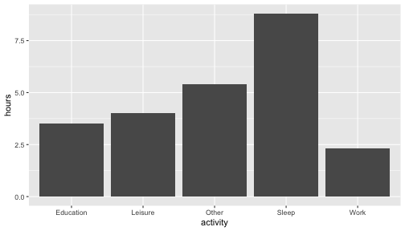

## Why data visualisation?

<blockquote>
A picture is worth a thousand words
</blockquote>

* Data visualisation is a powerful tool to **_explore_**, **_understand_** and **_communicate_** data

::: {.cell layout-align="center"}
::: {.cell-output-display}
{fig-align='center' width=960}
:::
:::

---


## A data visualisation catalogue

::: {.cell layout-align="center"}

:::
::: {.cell layout-align="center"}
<style type="text/css">
.catalogue img {
  margin-right: 20px;
  margin-top: 0px;
  margin-bottom: 0px;
  width: 18%;
}
</style>
:::

<div class="catalogue">

</div>


---

## Graphics

* Graphics are commonly stored in a standard image format such as svg, jpg, png, pdf, and so on. 
* When you view these graphics electronically, you would be using some graphical device to render the stored image. 
* R would render these using either `windows`, `X11` or `quartz` graphical devices (depending on the your operating system).
* This rendering is carried out by R's graphics engine, `grDevices`, which is one of the core package within the R system.


---

## Graphics model in R 

* There are two main graphics model in R through two core packages: 
    * `graphics` package, and
    * `grid` package.
* The `graphics` package is loaded when you launch R so there is no need to load this.
* Plot using the `graphics` system is normally refered to as the **base graphics**.
* If the graphics is produced using the `grid` package, then it is using the **`grid` graphics** model.

---

## Base graphics

* Base graphics are drawn via the `graphics` package.


---

## Base graphics

* Base functions generally draw a complete plot.

::: {.cell layout-align="center"}

```{.r .cell-code}
x <- 1:10
plot(x, x^2)
```

::: {.cell-output-display}
{fig-align='center' width=384}
:::
:::
---

## `grid` graphics

* The `grid` package contains low-level graphics system.
* This system gives a lot of control over the graphics, but requires the user to do a lot of work.
* You won't be directly interacting with the `grid` package.
* Instead you'll be using the **`ggplot2` package** that provides high-level functions for plotting via the `grid` system.

---

## Other graphics system

* All other graphics system are provided via contributed packages (i.e. you need to install it once to use it).
* The two most well known systems are the `lattice` and `ggplot2` graphics that make use of the `grid` package.

---

## `grid` graphics


---

## R Graphics


---

## Plotting with R (base version)
::: {.cell layout-align="center"}

```{.r .cell-code}
data <- data.frame(duty = c("Teaching", "Research", "Engagement"),
                   perc = c(40, 40, 20))
```
:::
::: columns

::: {.column width="25%"}

::: {.cell layout-align="center"}

```{.r .cell-code}
data
```

::: {.cell-output-stdout}
```
        duty perc
1   Teaching   40
2   Research   40
3 Engagement   20
```
:::
:::


:::
::: {.column width="60%"}

::: {.cell layout-align="center"}

```{.r .cell-code}
barplot(perc ~ duty,
        data = data)
```

::: {.cell-output-display}
{fig-align='center' width=672}
:::
:::
:::

:::

---

## Plotting with R (ggplot2 version)
::: {.cell layout-align="center"}

```{.r .cell-code}
data <- data.frame(duty = c("Teaching", "Research", "Engagement"),
                   perc = c(40, 40, 20))
```
:::
::: columns

::: {.column width="25%"}

::: {.cell layout-align="center"}

```{.r .cell-code}
data
```

::: {.cell-output-stdout}
```
        duty perc
1   Teaching   40
2   Research   40
3 Engagement   20
```
:::
:::


:::
::: {.column width="60%"}

::: {.cell layout-align="center"}

```{.r .cell-code}
library(ggplot2)
ggplot(data = data, 
       mapping = aes(x = duty, 
                     y = perc)) +
  geom_col()
```

::: {.cell-output-display}
{fig-align='center' width=672}
:::
:::
:::

:::


---

## `ggplot2` graphics

* In the following lessons we'll focus only on learning to plot with the `ggplot2` package.
* It is one of the most popular packages in R for data visualisation and widely used in scientific outputs, reports, and even news articles.