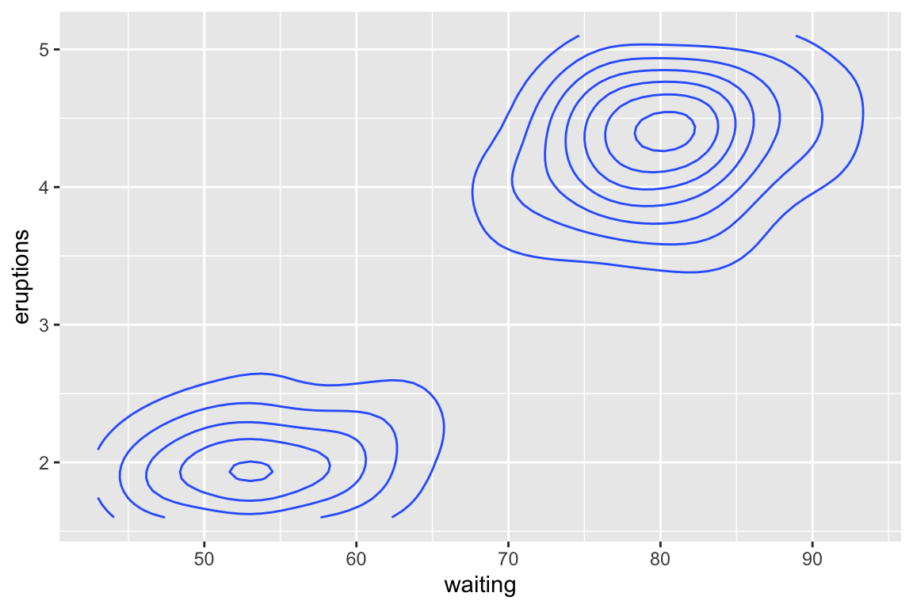
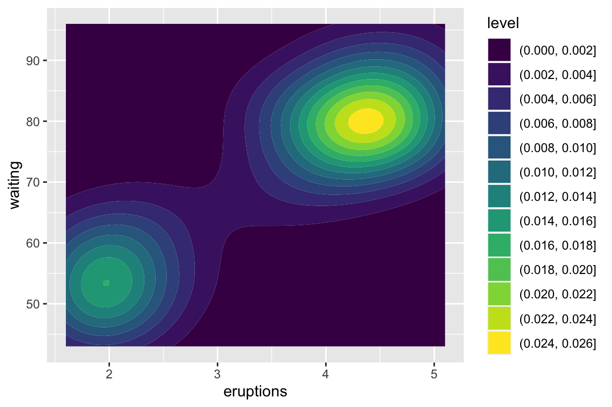
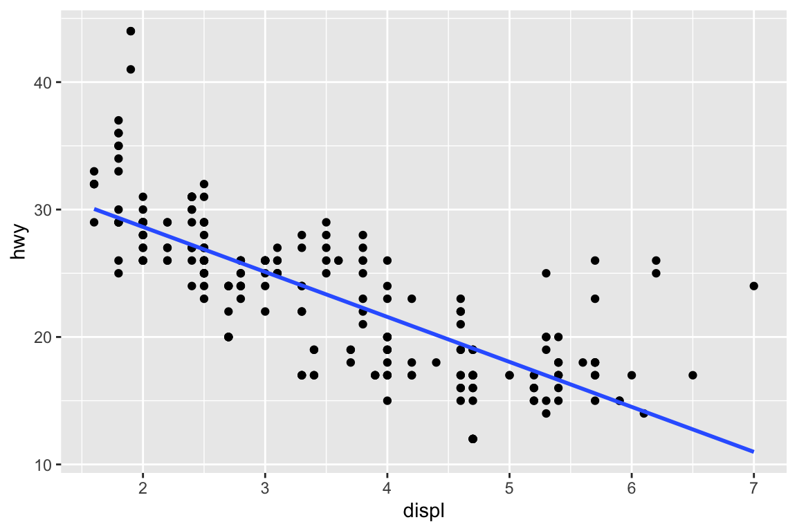
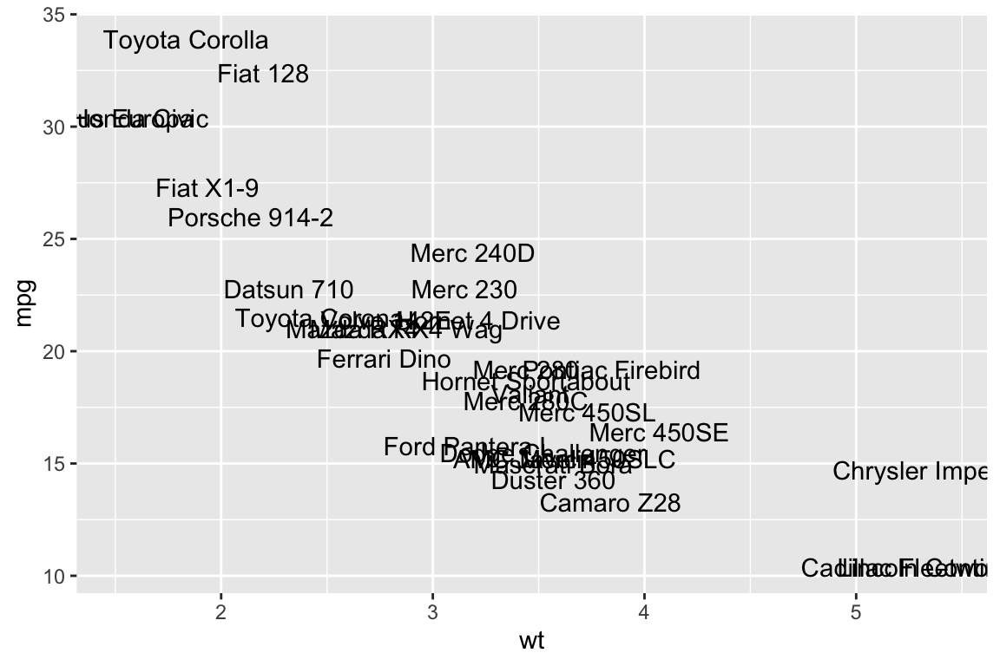

## What is `ggplot2`?


* `ggplot2` is an R-package that was initially developed by Hadley Wickham as part of his PhD
* `ggplot2` implements a particular interpretation of the "The Grammar of Graphics" by Leland Wilkinson 
* It is one of the most popular packages in R for data visualisation and widely used in scientific outputs, reports, and even news articles

---

## Installing and loading `ggplot2` 


* To use `ggplot2`, you first have to install the package 

::: {.cell layout-align="center" hash='cache/unnamed-chunk-2_f68ac0ad89b2b0deb9d86786573d3dc8'}

```{.r .cell-code}
install.packages("ggplot2")
```
:::

* Once you have installed it, you can load the package:

::: {.cell layout-align="center" hash='cache/unnamed-chunk-4_62cdab7f42fd5efd7df0a6c0f5859a3f'}

```{.r .cell-code}
library(ggplot2)
```
:::
* `ggplot2` is part of the `tidyverse` family so if you load `tidyverse`, you don't need to load `ggplot2` like above

::: {.cell layout-align="center" hash='cache/unnamed-chunk-6_50c1ef4e89e8e871160ea8797212efcf'}

```{.r .cell-code}
library(tidyverse)
```
:::

---

## Motivating data 1 💎 diamonds

* Let's have a look at the `diamonds` data which contains information about different attributes of diamonds

::: {.cell layout-align="center" hash='cache/unnamed-chunk-8_e9abdaf6c43542b71d39d21062949372'}

```{.r .cell-code}
data(diamonds, package = "ggplot2")
diamonds
```

::: {.cell-output-stdout}
```
# A tibble: 53,940 × 10
   carat cut       color clarity depth table price     x     y     z
   <dbl> <ord>     <ord> <ord>   <dbl> <dbl> <int> <dbl> <dbl> <dbl>
 1  0.23 Ideal     E     SI2      61.5    55   326  3.95  3.98  2.43
 2  0.21 Premium   E     SI1      59.8    61   326  3.89  3.84  2.31
 3  0.23 Good      E     VS1      56.9    65   327  4.05  4.07  2.31
 4  0.29 Premium   I     VS2      62.4    58   334  4.2   4.23  2.63
 5  0.31 Good      J     SI2      63.3    58   335  4.34  4.35  2.75
 6  0.24 Very Good J     VVS2     62.8    57   336  3.94  3.96  2.48
 7  0.24 Very Good I     VVS1     62.3    57   336  3.95  3.98  2.47
 8  0.26 Very Good H     SI1      61.9    55   337  4.07  4.11  2.53
 9  0.22 Fair      E     VS2      65.1    61   337  3.87  3.78  2.49
10  0.23 Very Good H     VS1      59.4    61   338  4     4.05  2.39
# … with 53,930 more rows
```
:::
:::


---

## Initialising the plot


::: {.cell layout-align="center" hash='cache/plot-initial_471828803830ba9cc4b2788212a6d8f7'}

```{.r .cell-code}
ggplot(data = diamonds) 
```

::: {.cell-output-display}
{fig-align='center' width=384}
:::
:::

* When there is no layer, it produces a blank layer like top plot.

---

## Mapping data variables to aesthestics

::: {.cell layout-align="center" hash='cache/plot-mapping_a96b0cdc9db300869469b37a48f356e0'}

```{.r .cell-code}
ggplot(data = diamonds,
       mapping = aes(x = carat, y = price)) 
```

::: {.cell-output-display}
{fig-align='center' width=384}
:::
:::

* This get the scale ready but no layer is defined so nothing is rendered in the panel.

---

# `geom` layers


---

## A scatterplot with `geom_point()`

::: {.cell layout-align="center" hash='cache/geom-point_fd8be80a63aebcf69a4464841388bd16'}

```{.r .cell-code}
ggplot(data = diamonds,
       mapping = aes(x = carat, y = price)) +
  geom_point()
```

::: {.cell-output-display}
{fig-align='center' width=384}
:::
:::

* Scatter plot of price vs carat of diamonds
* Each point correponds to a dimaond

---

## A hexagonal 2D heatmap with `geom_hex()`

::: {.cell layout-align="center" hash='cache/geom-hex_81fa7a6fee78edb2f9ca6121bab71ad1'}

```{.r .cell-code}
ggplot(data = diamonds,
       mapping = aes(x = carat, y = price)) +
  geom_hex()
```

::: {.cell-output-display}
{fig-align='center' width=384}
:::
:::

* The hexagon shows the count of observations within the region.

---

## A 2D heatmap with `geom_bin_2d()`

::: {.cell layout-align="center" hash='cache/geom-bin2d_224aa0814db305c6d7a83976a8f31332'}

```{.r .cell-code}
ggplot(data = diamonds,
       mapping = aes(x = carat, y = price)) +
  geom_bin_2d()
```

::: {.cell-output-display}
{fig-align='center' width=384}
:::
:::

* Similar to `geom_hex()` but the shapes are boxes.

---

## Count of overlapping points with `geom_count()`

::: {.cell layout-align="center" hash='cache/geom-count_2cd2244ec818a227afb7bca43f556073'}

```{.r .cell-code}
ggplot(data = diamonds,
       mapping = aes(x = carat, y = price)) +
  geom_count()
```

::: {.cell-output-display}
{fig-align='center' width=384}
:::
:::


---

## A boxplot with `geom_boxplot()`

::: {.cell layout-align="center" hash='cache/geom-boxplot_a070ed244cfb4d13d969edcd910a62a9'}

```{.r .cell-code}
ggplot(data = diamonds, 
       mapping = aes(x = cut, y = price)) +
  geom_boxplot()
```

::: {.cell-output-display}
{fig-align='center' width=384}
:::
:::


---

## A violin plot with `geom_violin()`

::: {.cell layout-align="center" hash='cache/geom-violin_b38388cf3537bf480ff3a133f9ed36e0'}

```{.r .cell-code}
ggplot(data = diamonds, 
       mapping = aes(x = cut, y = price)) +
  geom_violin()
```

::: {.cell-output-display}
{fig-align='center' width=384}
:::
:::

---

## A dot plot with `geom_dotplot()`

::: {.cell layout-align="center" hash='cache/geom-dotplot_c29bd538a396dbcf8dced5b737217580'}

```{.r .cell-code}
ggplot(data = mtcars, 
       mapping = aes(x = mpg)) +
  geom_dotplot()
```

::: {.cell-output-display}
{fig-align='center' width=384}
:::
:::

---

## A histogram with `geom_histogram()`

::: {.cell layout-align="center" hash='cache/geom-histogram_7741201f8d56e786faaa0ffe9606370f'}

```{.r .cell-code}
ggplot(data = mtcars, 
       mapping = aes(x = mpg)) +
  geom_histogram()
```

::: {.cell-output-display}
{fig-align='center' width=384}
:::
:::

---

## A frequency polygon with `geom_freqpoly()`

::: {.cell layout-align="center" hash='cache/geom-freqpoly_77c9830c65b95bc9bfe1f0a9818c45b0'}

```{.r .cell-code}
ggplot(data = mtcars, 
       mapping = aes(x = mpg)) +
  geom_freqpoly()
```

::: {.cell-output-display}
{fig-align='center' width=384}
:::
:::


---

## A 2D contour plot with `geom_contour()`

::: {.cell layout-align="center" hash='cache/unnamed-chunk-10_13c06639c12024a98d5a65f190ba3d3d'}

```{.r .cell-code}
ggplot(data = faithfuld, 
       mapping = aes(x = waiting, y = eruptions, z = density)) + 
  geom_contour()
```

::: {.cell-output-display}
{fig-align='center' width=384}
:::
:::

---

## A 2D contour plot with `geom_contour_filled()`

::: {.cell layout-align="center" hash='cache/unnamed-chunk-12_f95e9b7deefff90dd895a481ddfc6420'}

```{.r .cell-code}
ggplot(data = faithfuld, 
       mapping = aes(x = waiting, y = eruptions, z = density)) + 
  geom_contour_filled()
```

::: {.cell-output-display}
{fig-align='center' width=384}
:::
:::

---

## A 2D contour plot with `geom_density_2d()`

::: {.cell layout-align="center" hash='cache/unnamed-chunk-14_a08e002cd34f588c80a7fe8c3512a33f'}

```{.r .cell-code}
ggplot(data = faithful, 
       mapping = aes(x = eruptions, y = waiting)) + 
  geom_density_2d()
```

::: {.cell-output-display}
{fig-align='center' width=384}
:::
:::

---

## A 2D contour plot with `geom_density_2d_filled()`

::: {.cell layout-align="center" hash='cache/unnamed-chunk-16_20e0638695e3200e8fbbdfd3986bd27e'}

```{.r .cell-code}
ggplot(faithful, aes(x = eruptions, y = waiting)) +
 geom_density_2d_filled()
```

::: {.cell-output-display}
{fig-align='center' width=384}
:::
:::

---

## Density plot with `geom_density()`

::: {.cell layout-align="center" hash='cache/unnamed-chunk-18_c3d1e2f4d9f56faf51c62ad8d32434fe'}

```{.r .cell-code}
ggplot(data = diamonds, 
       mapping = aes(x = carat)) +
  geom_density()
```

::: {.cell-output-display}
{fig-align='center' width=384}
:::
:::

---

## `geom_line`

::: {.cell layout-align="center" hash='cache/unnamed-chunk-20_392f2cc5cc61541bf05a028a58ad6134'}

```{.r .cell-code}
ggplot(economics, aes(date, unemploy)) + 
  geom_line()
```

::: {.cell-output-display}
{fig-align='center' width=384}
:::
:::

---

::: {.cell layout-align="center" hash='cache/unnamed-chunk-22_63f796e1072c6f1059fced9247151c83'}

```{.r .cell-code}
ggplot(economics, aes(unemploy/pop, psavert)) +
  geom_path()
```

::: {.cell-output-display}
{fig-align='center' width=384}
:::
:::

---

::: {.cell layout-align="center" hash='cache/unnamed-chunk-24_dc4fed2f40a5c3ebd66fd26bd5303793'}

```{.r .cell-code}
ggplot(economics, aes(unemploy/pop, psavert)) +
  geom_step()
```

::: {.cell-output-display}
{fig-align='center' width=384}
:::
:::


---

::: {.cell layout-align="center" hash='cache/unnamed-chunk-26_e939c26b9a30fc3127491f862b6d6512'}

```{.r .cell-code}
world <- map_data("world")
ggplot(world, aes(long, lat, group = group)) +
  geom_polygon()
```

::: {.cell-output-display}
{fig-align='center' width=384}
:::
:::

---

::: {.cell layout-align="center" hash='cache/unnamed-chunk-28_f2fa983323fca84ee781f1a70264272d'}

```{.r .cell-code}
ggplot(mpg, aes(displ, hwy)) +
  geom_point() +
  geom_smooth(method = lm, se = FALSE)
```

::: {.cell-output-display}
{fig-align='center' width=384}
:::
:::


---

::: {.cell layout-align="center" hash='cache/unnamed-chunk-30_418b1f360ca69ed4228346e9416c88de'}

```{.r .cell-code}
ggplot(mtcars, aes(wt, mpg, label = rownames(mtcars))) +
  geom_text()
```

::: {.cell-output-display}
{fig-align='center' width=384}
:::
:::

---

::: {.cell layout-align="center" hash='cache/unnamed-chunk-32_55a12bbc1be77605eec0018d194f1480'}

```{.r .cell-code}
ggplot(mtcars, aes(wt, mpg, label = rownames(mtcars))) +
  geom_label()
```

::: {.cell-output-display}
{fig-align='center' width=384}
:::
:::

---

::: {.cell layout-align="center" hash='cache/unnamed-chunk-34_e26c2082965690d79087231374726e8a'}

```{.r .cell-code}
ggplot(faithfuld, aes(waiting, eruptions)) +
 geom_raster(aes(fill = density))
```

::: {.cell-output-display}
{fig-align='center' width=384}
:::
:::

---

::: {.cell layout-align="center" hash='cache/unnamed-chunk-36_fc5221c44b00a3c6a28e8dd3d784feee'}

```{.r .cell-code}
df <- data.frame(
  x = rep(c(2, 5, 7, 9, 12), 2),
  y = rep(c(1, 2), each = 5),
  z = factor(rep(1:5, each = 2)),
  w = rep(diff(c(0, 4, 6, 8, 10, 14)), 2)
)
ggplot(df, aes(x, y)) +
  geom_tile(aes(fill = z), colour = "grey50")
```

::: {.cell-output-display}
{fig-align='center' width=384}
:::

```{.r .cell-code}
ggplot(df, aes(x, y, width = w)) +
  geom_tile(aes(fill = z), colour = "grey50")
```

::: {.cell-output-display}
{fig-align='center' width=384}
:::

```{.r .cell-code}
ggplot(df, aes(xmin = x - w / 2, xmax = x + w / 2, ymin = y, ymax = y + 1)) +
  geom_rect(aes(fill = z), colour = "grey50")
```

::: {.cell-output-display}
{fig-align='center' width=384}
:::
:::
