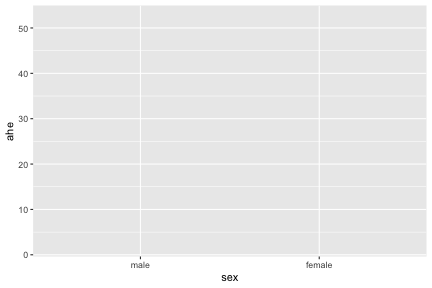
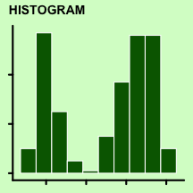
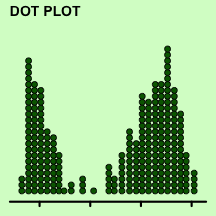
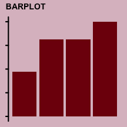
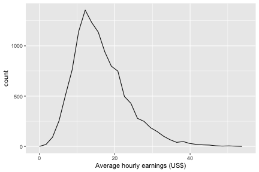
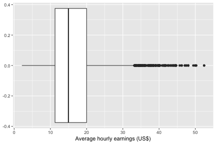
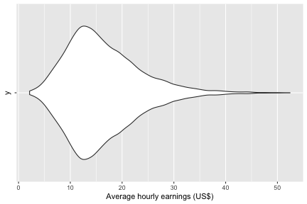
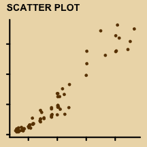
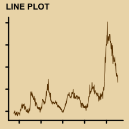
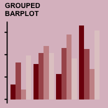

## What is `ggplot2`?


* `ggplot2` is an R-package that was initially developed by Hadley Wickham as part of his PhD
* `ggplot2` implements a particular interpretation of the "The Grammar of Graphics" by Leland Wilkinson 
* It is one of the most popular packages in R for data visualisation and widely used in scientific outputs, reports, and even news articles

---

## Installing and loading `ggplot2` 


* To use `ggplot2`, you first have to install the package 

::: {.cell layout-align="center" hash='cache/unnamed-chunk-2_f976565e8cd956a52ccc069d9fffb904'}

```{.r .cell-code}
install.packages("ggplot2")
```
:::

* Once you have installed it, you can load the package:

::: {.cell layout-align="center" hash='cache/unnamed-chunk-4_9c1f6f893e1bc48e52fd0dfc92d129a9'}

```{.r .cell-code}
library(ggplot2)
```
:::
* `ggplot2` is part of the `tidyverse` family so if you load `tidyverse`, you don't need to load `ggplot2` like above

::: {.cell layout-align="center" hash='cache/unnamed-chunk-6_ef2a23a1103c79dbd60b56ac29f12102'}

```{.r .cell-code}
library(tidyverse)
```
:::

---

## Basic structure of `ggplot`


1. **data** as `data.frame`
2. a set of **aesthetic** mappings between variables in the data and visual properties
3. at least one **layer** which describes how to render each observation


---

## Initialising the plot


::: {.cell layout-align="center" hash='cache/plot-initial_12fa5c0fcc3f1c526d8a58a1105410a6'}

```{.r .cell-code}
ggplot(data = diamonds) 
```

::: {.cell-output-display}
{fig-align='center' width=576}
:::
:::

* When there is no layer, it produces a blank layer (`geom_blank()`) like the above plot.

---

## Mapping data variables to aesthetics

::: {.cell layout-align="center" hash='cache/plot-mapping_b880aa5c32f9d84b869648433cae9643'}

```{.r .cell-code}
ggplot(data = diamonds,
       mapping = aes(x = carat, y = price)) 
```

::: {.cell-output-display}
{fig-align='center' width=576}
:::
:::

* This get the scale ready but no layer is defined so nothing is rendered in the panel.

---

# `geom` layers


---


## Distribution of a single variable

::: {.cell layout-align="center" hash='cache/catalogue-single_02d16fc0f3b6d8e9a37f180ab32d147f'}

:::

::: {.cell layout-align="center" hash='cache/unnamed-chunk-8_fabd5431e08f124705960da638b27eda'}
<style type="text/css">
.catalogue img {
  margin-right: 20px;
  margin-top: 0px;
  margin-bottom: 0px;
  width: 20%;
}
</style>
:::

<div class="catalogue">

</div>

---

## Motivating data 💰 Wages

* A survey of average hourly earnings in United States
* Each observation is an individual

::: {.cell layout-align="center" hash='cache/unnamed-chunk-10_1a4b7bd6c634097cfd6164815b80ca26'}

```{.r .cell-code}
data(CPSch3, package = "Ecdat")
str(CPSch3)
```

::: {.cell-output-stdout}
```
'data.frame':	11130 obs. of  3 variables:
 $ year: int  1992 1992 1992 1992 1992 1992 1992 1992 1992 1992 ...
 $ ahe : num  13 11.6 17.4 10.1 16.8 ...
 $ sex : Factor w/ 2 levels "male","female": 1 1 1 2 1 2 2 1 1 1 ...
```
:::
:::

* `year` is the survey year
* `ahe` is the average hourly earnings
* `sex` is the sex (male or female)

---

## A histogram with `geom_histogram()`

::: {.cell layout-align="center" hash='cache/geom-histogram_d2a7be73b5edf83c45cbe57a0dfa706f'}

```{.r .cell-code}
ggplot(data = CPSch3, 
       mapping = aes(x = ahe)) +
  geom_histogram() +
  labs(x = "Average hourly earnings (US$)")
```

::: {.cell-output-display}
{fig-align='center' width=576}
:::
:::

---

## A density plot with `geom_density()`

::: {.cell layout-align="center" hash='cache/geom-density_6cfd76d81ea71e76c87198b152d62f4e'}

```{.r .cell-code}
ggplot(data = CPSch3, 
       mapping = aes(x = ahe)) +
  geom_density() +
  labs(x = "Average hourly earnings (US$)")
```

::: {.cell-output-display}
{fig-align='center' width=576}
:::
:::

---

## A frequency polygon with `geom_freqpoly()`

::: {.cell layout-align="center" hash='cache/geom-freqpoly_5ad60d2040a5be4249c2400774162a39'}

```{.r .cell-code}
ggplot(data = CPSch3, 
       mapping = aes(x = ahe)) +
  geom_freqpoly() +
  labs(x = "Average hourly earnings (US$)")
```

::: {.cell-output-display}
{fig-align='center' width=576}
:::
:::

---

## A boxplot with `geom_boxplot()`

::: {.cell layout-align="center" hash='cache/geom-boxplot_7d6931a2e5e57314342ff0927d0d3e65'}

```{.r .cell-code}
ggplot(data = CPSch3, 
       mapping = aes(x = ahe)) +
  geom_boxplot() +
  labs(x = "Average hourly earnings (US$)")
```

::: {.cell-output-display}
{fig-align='center' width=576}
:::
:::

---

## A boxplot with `geom_violin()`

::: {.cell layout-align="center" hash='cache/geom-violin_06503d56b66bef3435eba5fe8aaf37c1'}

```{.r .cell-code}
ggplot(data = CPSch3, 
       mapping = aes(x = ahe, y = "")) +
  geom_violin() +
  labs(x = "Average hourly earnings (US$)")
```

::: {.cell-output-display}
{fig-align='center' width=576}
:::
:::

* Note: a dummy is required for `y` here!

---

## A dotplot with `geom_dotplot()`

::: {.cell layout-align="center" hash='cache/geom-dotplot_2f7355fe3cca53a2c268998b206b27ec'}

```{.r .cell-code}
ggplot(data = dplyr::sample_n(CPSch3, 200), 
       mapping = aes(x = ahe)) +
  geom_dotplot() +
  labs(x = "Average hourly earnings (US$)")
```

::: {.cell-output-display}
{fig-align='center' width=576}
:::
:::

* A dotplot works best for small number of observations so above plot is based on 200 random samples of the data


---

## A barplot with `geom_bar()`

::: {.cell layout-align="center" hash='cache/unnamed-chunk-12_5225806a553b9111ea9dc5e1ead5da05'}

```{.r .cell-code}
ggplot(data = CPSch3, 
       mapping = aes(x = sex)) +
  geom_bar()
```

::: {.cell-output-display}
{fig-align='center' width=576}
:::
:::


---

## Modifying the layer parameters

* Layers often have default parameter values.
* E.g. in histogram, the default is to have `bins = 30`.
* It's important to modify the parameters values appropriately
* More **details about the parameters of a layer is in the documentation** of the corresponding function, e.g. `?geom_histogram` to see the help file on the histogram layer.

---

## Examining two or more variables

::: {.cell layout-align="center" hash='cache/catalogue-two_2a5ad9ed21ff3e571c0b29e44e9b8de4'}

:::


<div class="catalogue">

</div>


---

## Motivating data 💎 diamonds

* Let's have a look at the `diamonds` data which contains information about different attributes of diamonds

::: {.cell layout-align="center" hash='cache/unnamed-chunk-14_35d8000a738b844cd71701ce4d3a7d95'}

```{.r .cell-code}
data(diamonds, package = "ggplot2")
diamonds
```

::: {.cell-output-stdout}
```
# A tibble: 53,940 × 10
   carat cut       color clarity depth table price     x     y     z
   <dbl> <ord>     <ord> <ord>   <dbl> <dbl> <int> <dbl> <dbl> <dbl>
 1  0.23 Ideal     E     SI2      61.5    55   326  3.95  3.98  2.43
 2  0.21 Premium   E     SI1      59.8    61   326  3.89  3.84  2.31
 3  0.23 Good      E     VS1      56.9    65   327  4.05  4.07  2.31
 4  0.29 Premium   I     VS2      62.4    58   334  4.2   4.23  2.63
 5  0.31 Good      J     SI2      63.3    58   335  4.34  4.35  2.75
 6  0.24 Very Good J     VVS2     62.8    57   336  3.94  3.96  2.48
 7  0.24 Very Good I     VVS1     62.3    57   336  3.95  3.98  2.47
 8  0.26 Very Good H     SI1      61.9    55   337  4.07  4.11  2.53
 9  0.22 Fair      E     VS2      65.1    61   337  3.87  3.78  2.49
10  0.23 Very Good H     VS1      59.4    61   338  4     4.05  2.39
# … with 53,930 more rows
```
:::
:::
