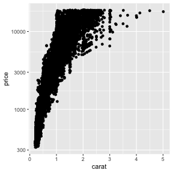
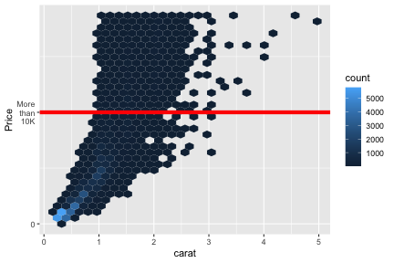
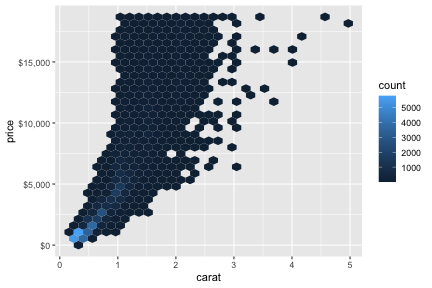
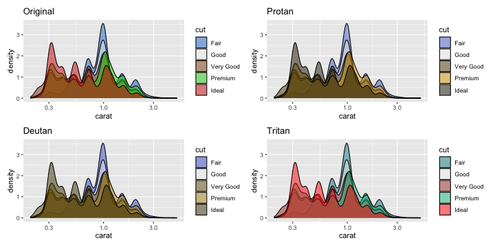

## Scales

* Scales control the mapping from **data** to aesthetics
* They usually come in the format like below:

<center>

</center>

::: {.cell layout-align="center"}

```{.r .cell-code}
ggplot(diamonds, aes(carat, price)) +
  geom_point() + 
  scale_y_log10()
```

::: {.cell-output-display}
{fig-align='center' width=384}
:::
:::

---

## Guide

* The scale creates a **guide**: an **axis** or **legend**

<center>

</center>

* So to modify these you generally use `scale_*` or other handy functions (e.g. `guides`, `labs`, `xlab`, `ylab`, and so on).

---

## Example plot

::: {.cell layout-align="center"}

```{.r .cell-code}
g <- ggplot(diamonds, aes(carat, price)) + geom_hex()
g
```

::: {.cell-output-display}
{fig-align='center' width=576}
:::
:::

---

## Modifying axis

::: {.cell layout-align="center"}

```{.r .cell-code}
g + 
  scale_y_continuous(name = "Price", 
                     breaks = c(0, 10000),
                     labels = c("0", "More\n than\n 10K")) + 
  geom_hline(yintercept = 10000, color = "red", size = 2)
```

::: {.cell-output-display}
{fig-align='center' width=576}
:::
:::

---

## Modifying labels


::: {.cell layout-align="center"}

```{.r .cell-code}
g + 
  scale_y_continuous(
    label = scales::dollar_format()
  )
```

::: {.cell-output-display}
{fig-align='center' width=576}
:::
:::

---

## Modifying legend scale

::: {.cell layout-align="center"}

```{.r .cell-code}
g + 
  scale_fill_continuous(
    breaks = c(0, 10, 100, 1000, 4000),
    trans = "log10"
  )
```

::: {.cell-output-display}
{fig-align='center' width=384}
:::
:::

---

## Removing legend

::: {.cell layout-align="center"}

```{.r .cell-code}
g + 
  scale_fill_continuous(
    guide = "none"
  )
```

::: {.cell-output-display}
{fig-align='center' width=384}
:::
:::

---

## Alternative control of guides

* There are generally other ways of modifying the scales
* Each user has a different mental mode, so you can use what suits you (and others in your team)

::: {.cell layout-align="center"}

```{.r .cell-code}
g + 
  ylab("Price") + # Changes the y axis label
  labs(x = "Carat", # Changes the x axis label
       fill = "Count") # Changes the legend name
```

::: {.cell-output-display}
{fig-align='center' width=384}
:::
:::
::: {.cell layout-align="center"}

```{.r .cell-code}
g + guides(fill = "none") # remove the legend
```

::: {.cell-output-display}
{fig-align='center' width=384}
:::
:::

---

## Color

* When using color in your plots, it's good to keep in mind that color can be viewed differently by people 

::: {.cell layout-align="center"}
::: {.cell-output-display}
{fig-align='center' width=960}
:::
:::
