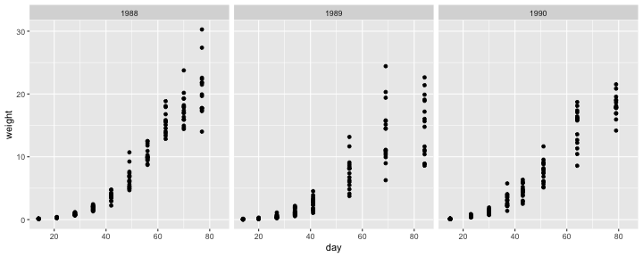
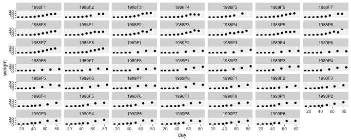
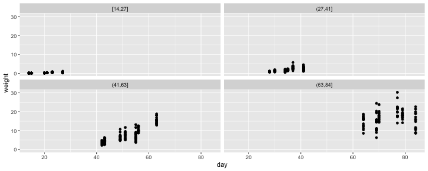
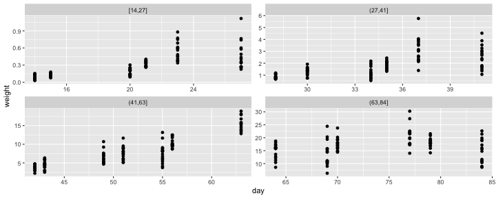
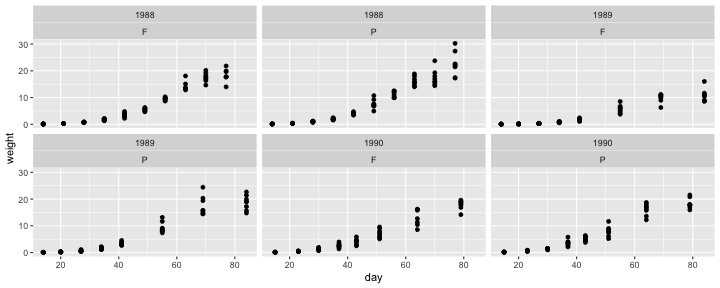
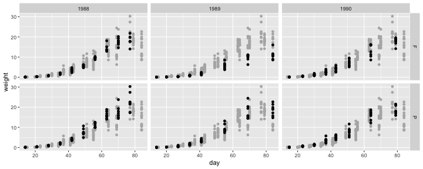

---

## Facets 

* Faceting in `ggplot2` refers to partitioning of the plot region to multiple panels each showing a different subset of the data.
* There are three types of faceting:

  * `facet_null()` (the default),
  * `facet_wrap()`, and
  * `facet_grid()`.

---

## Motivating data: growth of soybean

::: {.cell layout-align="center"}

```{.r .cell-code}
data(davidian.soybean, package = "agridat")
str(davidian.soybean)
```

::: {.cell-output-stdout}
```
'data.frame':	412 obs. of  5 variables:
 $ plot   : Factor w/ 48 levels "1988F1","1988F2",..: 1 1 1 1 1 1 1 1 1 1 ...
 $ variety: Factor w/ 2 levels "F","P": 1 1 1 1 1 1 1 1 1 1 ...
 $ year   : int  1988 1988 1988 1988 1988 1988 1988 1988 1988 1988 ...
 $ day    : int  14 21 28 35 42 49 56 63 70 77 ...
 $ weight : num  0.106 0.261 0.666 2.11 3.56 ...
```
:::
:::

* The data contains:
  * `plot`: the plot code
  * `variety`: the code (`F` = commercial and `P` = experimental) for which soybean variety
  * `year`: the year it was grown (1988-1990)
  * `day` days after planting
  * `weight` weight of soybean leaves

---

## `facet_wrap()`

* `facet_wrap()` divides the data into mutually exclusive subset based on the input variable and create subplots based on the data in the corresponding panel.

::: {.cell layout-align="center"}

```{.r .cell-code}
library(ggplot2)
ggplot(davidian.soybean, aes(day, weight)) + 
  geom_point() +
  facet_wrap(~year)
```

::: {.cell-output-display}
{fig-align='center' width=960}
:::
:::

---

## Wrapping many panels

* It "wraps" the panels into 2d if you have many panels

::: {.cell layout-align="center"}

```{.r .cell-code}
ggplot(davidian.soybean, aes(day, weight)) + 
  geom_point() +
  facet_wrap(~plot)
```

::: {.cell-output-display}
{fig-align='center' width=960}
:::
:::

---

## Wrapping by a continuous variable

* If you want to wrap the facet by a continuous variable, then you first need to discretize the continuous variable, e.g. using `cut()`, `cut_width()`, `cut_interval()` or `cut_number()`.

::: {.cell layout-align="center"}

```{.r .cell-code}
ggplot(davidian.soybean, aes(day, weight)) + 
  geom_point() +
  facet_wrap(~cut_number(day, 4))
```

::: {.cell-output-display}
{fig-align='center' width=960}
:::
:::

---

## Changing the scales for each panel

* By default the scales are shared across the panels but you can choose to have scales  built independently for each panel:

::: {.cell layout-align="center"}

```{.r .cell-code}
ggplot(davidian.soybean, aes(day, weight)) + 
  geom_point() +
  facet_wrap(~cut_number(day, 4), scales = "free")
```

::: {.cell-output-display}
{fig-align='center' width=960}
:::
:::


---

## Wrapping with more than one variables

* If you want to wrap the facet by more than one variable, you can combine the variables by using `+`:

::: {.cell layout-align="center"}

```{.r .cell-code}
ggplot(davidian.soybean, aes(day, weight)) + 
  geom_point() +
  facet_wrap(~ year + variety)
```

::: {.cell-output-display}
{fig-align='center' width=960}
:::
:::


---

## `facet_grid()`

* Alternatively, you can use `facet_grid()` to lay out the panels in a 2d grid:

::: {.cell layout-align="center"}

```{.r .cell-code}
ggplot(davidian.soybean, aes(day, weight)) + 
  geom_point() +
  facet_grid(variety ~ year)
```

::: {.cell-output-display}
{fig-align='center' width=960}
:::
:::

---

## Missing facet variables

* If a layer data is missing the faceting variable(s), then the layer will be shown across all panels based on all of the layer data

::: {.cell layout-align="center"}

```{.r .cell-code}
ggplot(davidian.soybean, aes(day, weight)) + 
  geom_point(data = dplyr::select(davidian.soybean, -c(variety, year)),
             color = "grey70") +
  geom_point() +
  facet_grid(variety ~ year)
```

::: {.cell-output-display}
{fig-align='center' width=960}
:::
:::
