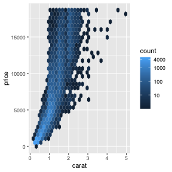
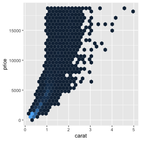
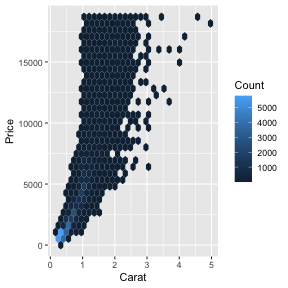

## Scales

-   Scales control the mapping from **data** to aesthetics
-   They usually come in the format like below:

    ggplot(diamonds, aes(carat, price)) +
      geom_point() + 
      scale_y_log10()

---

## Guide

-   The scale creates a **guide**: an **axis** or **legend**

-   So to modify these you generally use `scale_*` or other handy
    functions (e.g. `guides`, `labs`, `xlab`, `ylab`, and so on).

---

## Example plot

    g <- ggplot(diamonds, aes(carat, price)) + geom_hex()
    g

---

## Modifying axis

    g + 
      scale_y_continuous(name = "Price", 
                         breaks = c(0, 10000),
                         labels = c("0", "More\n than\n 10K")) + 
      geom_hline(yintercept = 10000, color = "red", size = 2)

---

## Modifying labels

    g + 
      scale_y_continuous(
        label = scales::dollar_format()
      )

---

## Modifying legend scale

    g + 
      scale_fill_continuous(
        breaks = c(0, 10, 100, 1000, 4000),
        trans = "log10"
      )

---

## Removing legend

    g + 
      scale_fill_continuous(
        guide = "none"
      )

---

## Alternative control of guides

-   There are generally other ways of modifying the scales
-   Each user has a different mental mode, so you can use what suits you
    (and others in your team)

<!-- -->

    g + 
      ylab("Price") + # Changes the y axis label
      labs(x = "Carat", # Changes the x axis label
           fill = "Count") # Changes the legend name

    g + guides(fill = "none") # remove the legend

---

## Color

-   When using color in your plots, it’s good to keep in mind that color
    can be viewed differently by people

<!-- -->

    ## Scale for 'fill' is already present. Adding another scale for 'fill', which will
    ## replace the existing scale.
    ## Scale for 'fill' is already present. Adding another scale for 'fill', which will
    ## replace the existing scale.
    ## Scale for 'fill' is already present. Adding another scale for 'fill', which will
    ## replace the existing scale.

