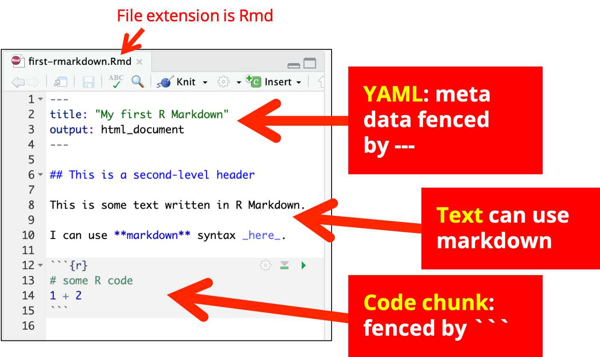
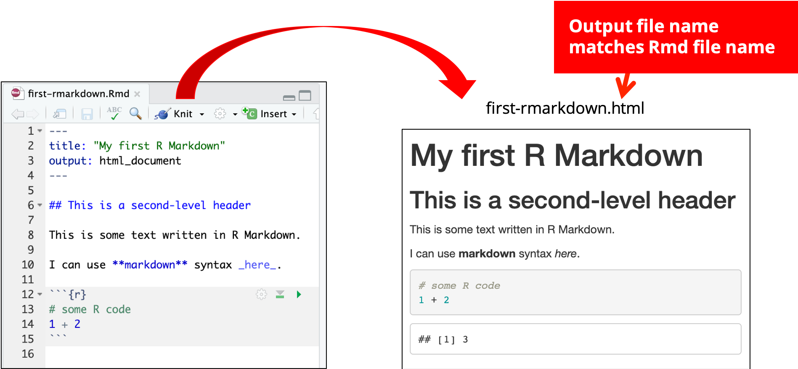

### Installing packages

-   `install.pacakges("rmarkdown)`: need to install this package to use
    R Markdown

-   `install.packages("tinytex")`: install `tinytex` package for pdf
    output. After installing `tinytex`, run `tinytex::install_tinytex()`
    to install `TinyTeX`.

Note: Once you finish installing packages, you are ready to start your
journey with R Markdown.

---

### Start your very first R Markdown

You should see `R Markdown` when you click on
{height="0.7em"}.

---

Note: Once you clicked on `R Markdown`, you should see this pop-up
window. You can put in the title for your R Markdown and state the
author. You can also change this later. There are three default formate
for R Markdown including html,pdf and word. You can also change the
output file later.

---

Note: Once you clicked on `OK`, it will automatically generate an Rmd (R
Markdown) file with example. You can read through this demonstration
with examples. You can click on `Knit` (the blue ball of yarn) and it
will generate an html output file.

---

### R Markdown Basics

---

### Knitting: from `.Rmd` to `.html`

---

### Knitting: from `.Rmd` to `.pdf`

---

### Behind the screen

`Knitr` covers `.Rmd` to `.md`. `rmarkdown` prepare the `.md` file and
use [Pandoc](https://pandoc.org) to convert `.md` to our destination
file output such as `.pdf` and `.html`.
