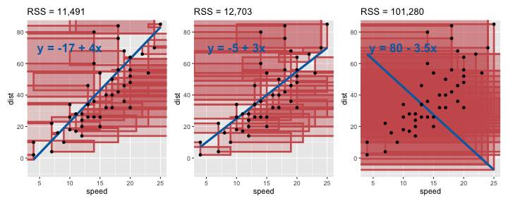

## Simple linear regression

-   Simple linear regression refers to fitting a straight line
    *y* = *β*0 + *β*1*x* to a set of bivariate
    data.

    ggplot(cars, aes(speed, dist)) +
      geom_point() + 
      geom_abline(intercept = -17, 
                  slope = 4, size = 1.5,
                  color = "indianred") + 
      geom_abline(intercept = -5, 
                  slope = 3, size = 1.5,
                  color = "cadetblue")  + 
      geom_abline(intercept = 80, 
                  slope = -3.5, size = 1.5,
                  color = "seagreen")

-   Three lines are shown in the plot:
    -   *y* =  − 17 + 4*x*
    -   *y* =  − 5 + 3*x*
    -   *y* = 80 − 3.5*x*
-   Which of these three lines do you think fits the best?

---

## Residuals

-   A strategy to find the best line of fit is generally based on
    residuals.
-   In simple linear regression, the **residuals** are the vertical
    distance of the observations from the fitted line.

---

## Least squares

*y* = *β*0 + *β*1*x*

-   **Method of least squares** to estimate the parameters,
    *β*0 (intercept) and *β*1 (slope).
-   Method of least squares estimate parameters such that it minimizes
    the residual sum of the squares (RSS).
-   **Residuals** = observed − fitted value.
-   **Fitted value** = the predicted response (*y*) value from the
    fitted model using predictors (*x*) from the data

-   Unless stated otherwise, simple linear regression uses the **method
    of least squares** to estimate the model parameters.
-   Method of least squares estimates the model parameters by finding
    parameters that minimise the sum of the squares of the residual.
-   More formally, residuals are the difference of observed value from
    the fitted value.
-   Fitted values are the predicted response value under the fitted
    model for the predictors in the data.

---

## Sum of the squares of the residuals

-   The sum of the red squares are the residual sum of squares (RSS) –
    the actual RSS can be seen on top of the plot
-   It doesn’t look like squares because the scale on the x- and y-axis
    differ
-   There is a closed-form solution to finding parameters that minimise
    the residual sum of the squares.
-   You can use calculus to find this or consult any standard first year
    statsitics text book.

---

## Linear regression in R

-   In R, you can fit a linear regression using the method of least
    squares using the `lm()` function.
-   The input for `lm` is a **two-sided formula** that symbolically
    represents the linear model.
-   For example, `y ~ 1 + x` corresponds to a linear model

$$\\color{#006dae}{y\_i} = \\beta\_0 \\cdot \\color{#006dae}{1} + \\beta\_1 \\cdot \\color{#006dae}{x\_i} + e\_i, \\qquad\\text{for } i = 1, ..., n.$$

-   The intercept term `1` is included by default.
-   So `lm(y ~ 1 + x)` is the same as `lm(y ~ x)` .

---

## Fitting the linear regression with R

-   To fit a linear regression, it’s best to parse the `data.frame` into
    the `data` argument.
-   The variables in the formula refers to the variables in the input
    data.

<!-- -->

    fit <- lm(dist ~  speed, data = cars)

-   To get the model parameter estimates, referred to also as
    **coefficients**, you can use `coef` function on the model object:

<!-- -->

    coef(fit)

    ## (Intercept)       speed 
    ##  -17.579095    3.932409

---

## Model summaries

    summary(fit)

    ## 
    ## Call:
    ## lm(formula = dist ~ speed, data = cars)
    ## 
    ## Residuals:
    ##     Min      1Q  Median      3Q     Max 
    ## -29.069  -9.525  -2.272   9.215  43.201 
    ## 
    ## Coefficients:
    ##             Estimate Std. Error t value Pr(>|t|)    
    ## (Intercept) -17.5791     6.7584  -2.601   0.0123 *  
    ## speed         3.9324     0.4155   9.464 1.49e-12 ***
    ## ---
    ## Signif. codes:  0 '***' 0.001 '**' 0.01 '*' 0.05 '.' 0.1 ' ' 1
    ## 
    ## Residual standard error: 15.38 on 48 degrees of freedom
    ## Multiple R-squared:  0.6511, Adjusted R-squared:  0.6438 
    ## F-statistic: 89.57 on 1 and 48 DF,  p-value: 1.49e-12

---

## Exracting model summary data

-   You can see sueful information from `summary(fit)` but it is not
    easy to extract it as a tidy data.

-   The package `broom` has handy functions to get the summary values
    out in a tidy format:

<!-- -->

    broom::tidy(fit)

    ## # A tibble: 2 × 5
    ##   term        estimate std.error statistic  p.value
    ##   <chr>          <dbl>     <dbl>     <dbl>    <dbl>
    ## 1 (Intercept)   -17.6      6.76      -2.60 1.23e- 2
    ## 2 speed           3.93     0.416      9.46 1.49e-12

    broom::glance(fit)

    ## # A tibble: 1 × 12
    ##   r.squared adj.r.squared sigma statistic  p.value    df logLik   AIC
    ##       <dbl>         <dbl> <dbl>     <dbl>    <dbl> <dbl>  <dbl> <dbl>
    ## 1     0.651         0.644  15.4      89.6 1.49e-12     1  -207.  419.
    ## # … with 4 more variables: BIC <dbl>, deviance <dbl>, df.residual <int>,
    ## #   nobs <int>

---

## Augment data with model information

-   You can also easily augment the data with model information,
    e.g. fitted values and residuals.

<!-- -->

    broom::augment(fit)

    ## # A tibble: 50 × 8
    ##     dist speed .fitted .resid   .hat .sigma  .cooksd .std.resid
    ##    <dbl> <dbl>   <dbl>  <dbl>  <dbl>  <dbl>    <dbl>      <dbl>
    ##  1     2     4   -1.85   3.85 0.115    15.5 0.00459       0.266
    ##  2    10     4   -1.85  11.8  0.115    15.4 0.0435        0.819
    ##  3     4     7    9.95  -5.95 0.0715   15.5 0.00620      -0.401
    ##  4    22     7    9.95  12.1  0.0715   15.4 0.0255        0.813
    ##  5    16     8   13.9    2.12 0.0600   15.5 0.000645      0.142
    ##  6    10     9   17.8   -7.81 0.0499   15.5 0.00713      -0.521
    ##  7    18    10   21.7   -3.74 0.0413   15.5 0.00133      -0.249
    ##  8    26    10   21.7    4.26 0.0413   15.5 0.00172       0.283
    ##  9    34    10   21.7   12.3  0.0413   15.4 0.0143        0.814
    ## 10    17    11   25.7   -8.68 0.0341   15.5 0.00582      -0.574
    ## # … with 40 more rows
