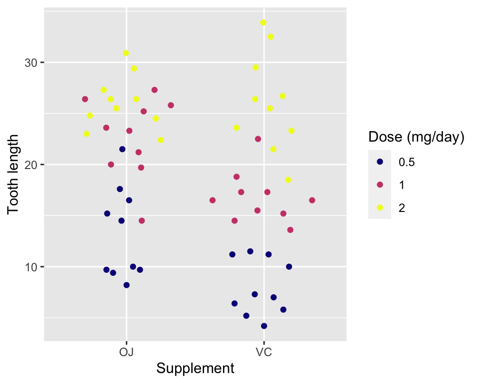

## Tooth growth data

-   We’ll now use the `ToothGrowth` data to illustrate a model with a
    categorical variable:

<!-- -->

    str(ToothGrowth)

    ## 'data.frame':    60 obs. of  3 variables:
    ##  $ len : num  4.2 11.5 7.3 5.8 6.4 10 11.2 11.2 5.2 7 ...
    ##  $ supp: Factor w/ 2 levels "OJ","VC": 2 2 2 2 2 2 2 2 2 2 ...
    ##  $ dose: num  0.5 0.5 0.5 0.5 0.5 0.5 0.5 0.5 0.5 0.5 ...

-   `ToothGrowth` contains observations on 60 guinea pigs with
    variables:
    -   `len`: the tooth length
    -   `supp`: supplement type (VC = vitamin C, OJ = orange juice)
    -   `dose`: dose of supplement in milligrams/days

---

## Fitting a categorical variable in `lm`: illustration

-   `supp` is a factor with two levels: “VC” and “OJ”
-   What model are we fitting below?

<!-- -->

    fit1s <- lm(len ~ 1 + as.numeric(supp=="VC") + as.numeric(supp=="OJ") , data = ToothGrowth)

$$\\color{#006dae}{y\_{ij}} = \\beta\_0\\cdot \\color{#006dae}{1} + \\beta\_1 \\color{#006dae}{x\_{1i}}+ \\beta\_2 \\color{#006dae}{x\_{2i}} + e\_{ij}, \\qquad \\text{for }i = 1, 2, j = 1, 2, 3$$
where:

-   *i* corresponds to the level of the supplementary variable,
-   *j* corresponds to the dose level,
-   $x\_{1i} = \\begin{cases}1\\quad\\text{if }i=1\\\\0\\quad\\text{if }i=2\\end{cases},$
-   $x\_{2i} = \\begin{cases}1\\quad\\text{if }i=2\\\\0\\quad\\text{if }i=1\\end{cases},$
    and
-   in this case the system is singular so the last term is dropped
    (same as *β*2 = 0).

---

## Fitting a categorical variable in `lm`: convenient approach

-   Instead of creating dummy variables, like *x*1*i* and
    *x*2*i*, for every level of a categorical variable, it is
    more convenient to use the categorical variable directly in the
    symbolic formula like below:

<!-- -->

    fit2s <- lm(len ~ supp, data = ToothGrowth)

-   Above model is the equivalent as `fit1s`:

<!-- -->

    coef(fit1s)

    ##              (Intercept) as.numeric(supp == "VC") 
    ##                 20.66333                 -3.70000 
    ## as.numeric(supp == "OJ") 
    ##                       NA

    coef(fit2s)

    ## (Intercept)      suppVC 
    ##    20.66333    -3.70000

-   By default `lm` uses the treatment constraint (`?contr.treatment`),
    i.e. first level of the categorical is omitted (same as constraining
    the corresponding coefficient to zero).

---

## Predicted values

$$\\widehat{\\texttt{len}} = 20.66 - 3.7 \\cdot \\texttt{supp}\_{\\texttt{VC}}$$

-   There are only two possible response values from this model:

<!-- -->

    predict(fit2s, data.frame(supp = c("OJ", "VC")))

    ##        1        2 
    ## 20.66333 16.96333

-   Is this a reasonable model?
