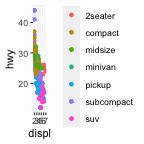

### Introduction to R Chunk

```` {.markdown}
```{r, this-is-an-r-chunk}
```
````

Here is an example for R chunk. An R chunk starts with three
```` ```{r} ```` and ends with ```` ``` ````. After `r,` is where you
can name the code chunk. Notice that the code chunk name must not
include breaks.

---

### `include`

```` {.markdown}
```{r, this-is-an-r-chunk,include = TRUE}
ggplot(mpg, aes(displ, hwy, colour = class)) + 
  geom_point()
```
````

``` {.r}
ggplot(mpg, aes(displ, hwy, colour = class)) + 
  geom_point()
```



Note: When you set `include = TRUE`, it will print out both code and
results. Alternatively, if you wish not to include the code and results
from this R chunk, set `include = FALSE`. R Markdown still runs the code
and you can use the results from this code chunk in other chunks.

---

### `echo`

```` {.markdown}
```{r, this-is-an-r-chunk,echo = FALSE}
ggplot(mpg, aes(displ, hwy, colour = class)) + 
  geom_point()
```
````


Note: When you set `echo = FALSE`, it will only print out the results
from this code chunk but prevents code from appearing in the finished
file. This is a useful way to embed figures.

---

### `eval`

If you only want to print out the code but not run the code, you can set
`eval = FALSE`. This is helpful when you are

---

### `message` and `warning`

```` {.markdown}
```{r, this-is-an-r-chunk,messge = FALSE, warning = FALSE}
ggplot(mpg, aes(displ, hwy, colour = class)) + 
  geom_point()
```
````

Note: When you are generating an assignment or report, you would not
want to include messages and warning to be printed out in the final
outputs. Set both `message = FALSE` and `warning = FALSE` will prevent
messages and warnings to be printed out.

---

### 
