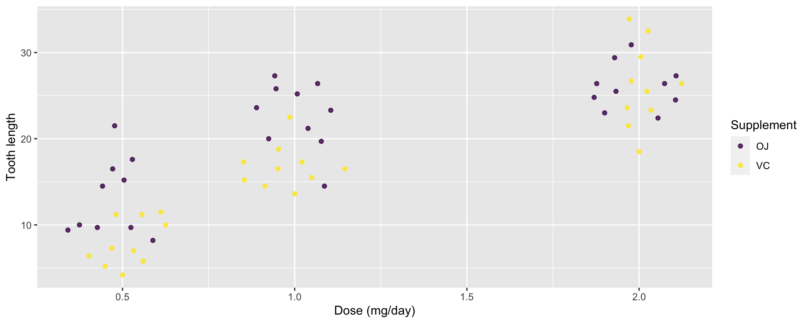
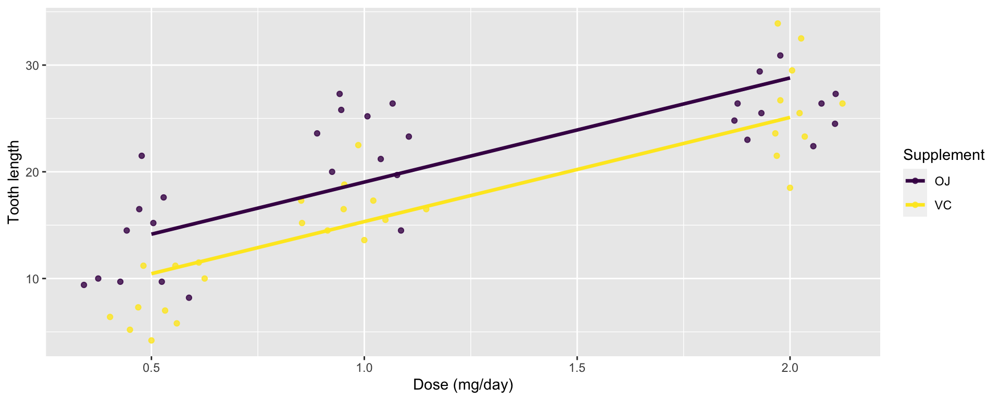
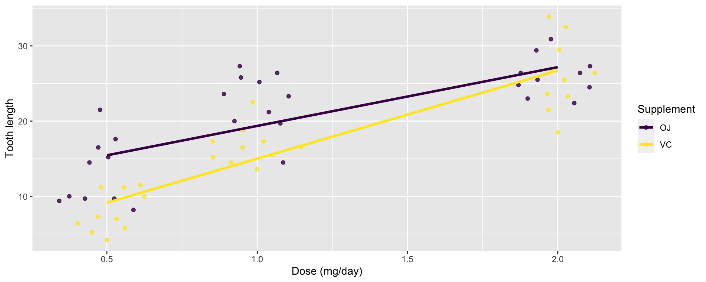
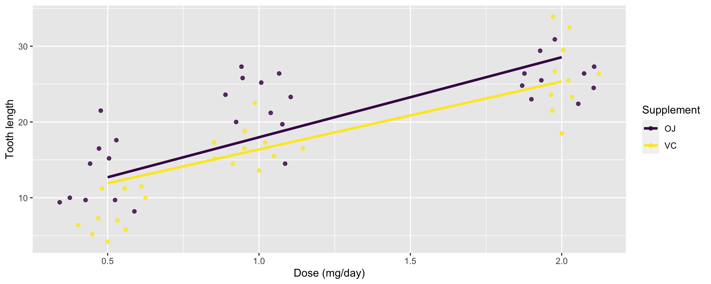
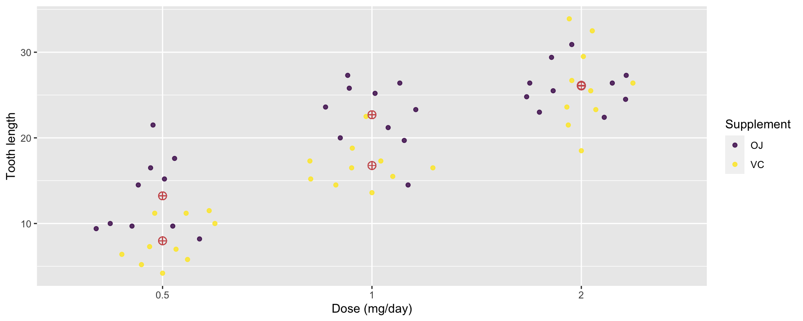
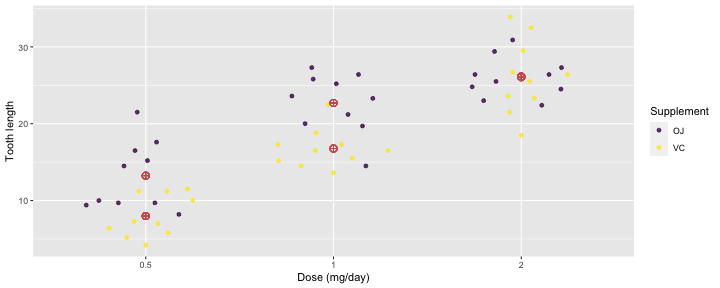
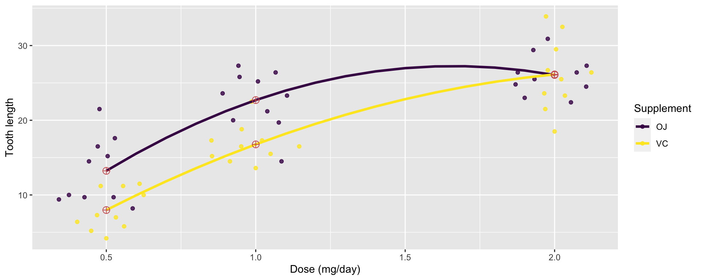

## Tooth growth data

-   We’ll again use the `ToothGrowth` data:

<!-- -->

    str(ToothGrowth)

    ## 'data.frame':    60 obs. of  3 variables:
    ##  $ len : num  4.2 11.5 7.3 5.8 6.4 10 11.2 11.2 5.2 7 ...
    ##  $ supp: Factor w/ 2 levels "OJ","VC": 2 2 2 2 2 2 2 2 2 2 ...
    ##  $ dose: num  0.5 0.5 0.5 0.5 0.5 0.5 0.5 0.5 0.5 0.5 ...

-   `ToothGrowth` contains observations on 60 guinea pigs with
    variables:
    -   `len`: the tooth length
    -   `supp`: supplement type (VC = vitamin C, OJ = orange juice)
    -   `dose`: dose of supplement in milligrams/days

-   We can see that tooth length appears to be determined by both the
    supplement and its dose level

---

## Proposed model 1

*y**i**j* = *μ* + *α**i* + *β**x**j* + *e**i**j*,   for *i* = 1, 2, *j* = 1, 2, 3

where:

-   *i* corresponds to the level of the supplementary variable,
-   *j* corresponds to the dose level.

<!-- -->

    fit1 <- lm(len ~ 1 + supp + dose, data = ToothGrowth)
    coef(fit1)

    ## (Intercept)      suppVC        dose 
    ##    9.272500   -3.700000    9.763571

-   The above model results in two parallel lines: the same slope,
    different intercepts for different supplement:

---

## Proposed model 2A

*y**i**j* = *μ* + *α**i* + *β**x**j* + *β**i**x**j* + *e**i**j*,   for *i* = 1, 2, *j* = 1, 2, 3

    fit2A <- lm(len ~ 1 + supp + dose + supp:dose, data = ToothGrowth)
    coef(fit2A)

    ## (Intercept)      suppVC        dose suppVC:dose 
    ##   11.550000   -8.255000    7.811429    3.904286

-   `:` is used to fit an interaction of two variables, i.e. `A:B` is an
    interaction of `A` and `B`.
-   `A*B` is used as a shorthand for `A + B + A:B` so `supp * dose` is
    equivalent to `supp + dose + supp:dose`.
-   The above model fits a linear model with different intercepts and
    slopes for the different supplement:

---

## Proposed model 2B

*y**i**j* = *μ* + *α**i* + *γ**i**x**j* + *e**i**j*,   for *i* = 1, 2, *j* = 1, 2, 3

    fit2B <- lm(len ~ 1 + supp + supp:dose, data = ToothGrowth)
    coef(fit2B)

    ## (Intercept)      suppVC suppOJ:dose suppVC:dose 
    ##   11.550000   -8.255000    7.811429   11.715714

-   This model is equivalent to the previous model where
    *γ**i* = *β* + *β**i*.

---

## Proposed model 3

*y**i**j* = *μ* + *ζ**i**x**j* + *e**i**j*,   for *i* = 1, 2, *j* = 1, 2, 3

    fit3 <- lm(len ~ 1 + supp:dose, data = ToothGrowth)
    coef(fit3)

    ## (Intercept) suppOJ:dose suppVC:dose 
    ##    7.422500   10.563095    8.964048

-   This model results in two lines with the same intercept but
    different slopes for each supplement type

---

## Proposed model 4A

*y**i**j* = *μ**i**j* + *e**i**j*,   for *i* = 1, 2, *j* = 1, 2, 3

    df <- ToothGrowth
    df$dosef <- factor(df$dose)
    fit4A <- lm(len ~ 0 + supp:dosef, data = df)
    coef(fit4A)

    ## suppOJ:dosef0.5 suppVC:dosef0.5   suppOJ:dosef1   suppVC:dosef1 
    ##           13.23            7.98           22.70           16.77 
    ##   suppOJ:dosef2   suppVC:dosef2 
    ##           26.06           26.14

---

## Proposed model 4B

*y**i**j* = *α**i* + *β**j* + (*α**β*)*i**j* + *e**i**j*,   for *i* = 1, 2, *j* = 1, 2, 3
where

-   *α**i* and *β**j* are **main effects** for
    `supp` and `dosef`, respectively,
-   (*α**β*)*i**j* are the **interaction effects** between
    `supp` and `dosef`,

This model is the same as the previous model where
*μ**i**j* = *α**i* + *β**j* + (*α**β*)*i**j*.

    fit4B <- lm(len ~ 0 + supp * dosef, data = df)
    coef(fit4B)

    ##        suppOJ        suppVC        dosef1        dosef2 suppVC:dosef1 
    ##         13.23          7.98          9.47         12.83         -0.68 
    ## suppVC:dosef2 
    ##          5.33

---

## Proposed model 4C

*y**i**j* = *β*0 + *α**i* + *β*1*i**x**j* + *β*2*i**x**j*2 + *e**i**j*,   for *i* = 1, 2, *j* = 1, 2, 3

    fit4C <- lm(len ~ supp * (1 + dose + I(dose^2)), data = ToothGrowth)
    coef(fit4C)

    ##      (Intercept)           suppVC             dose        I(dose^2) 
    ##        -1.433333        -2.113333        34.520000       -10.386667 
    ##      suppVC:dose suppVC:I(dose^2) 
    ##        -8.730000         4.913333

-   The above formula is the same as
    `len ~ supp * poly(dose, 2, raw = TRUE)`.
-   An equivalent model can be fitted with `len ~ supp * poly(dose, 2)`
    where orthogonal polynomials are used instead for the `dose`.
-   This model is also equivalent to `fit4C`, but the advantage of this
    approach is that you can predict for other dose levels.

