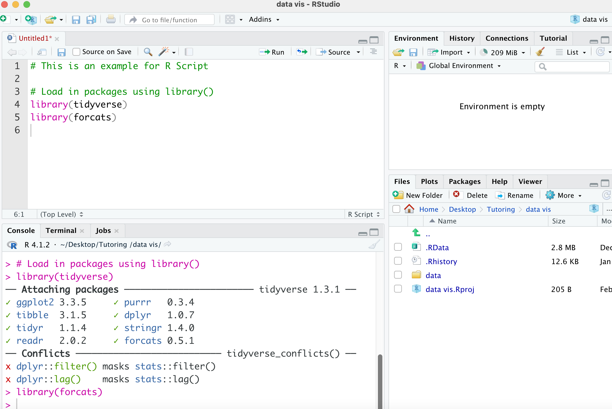
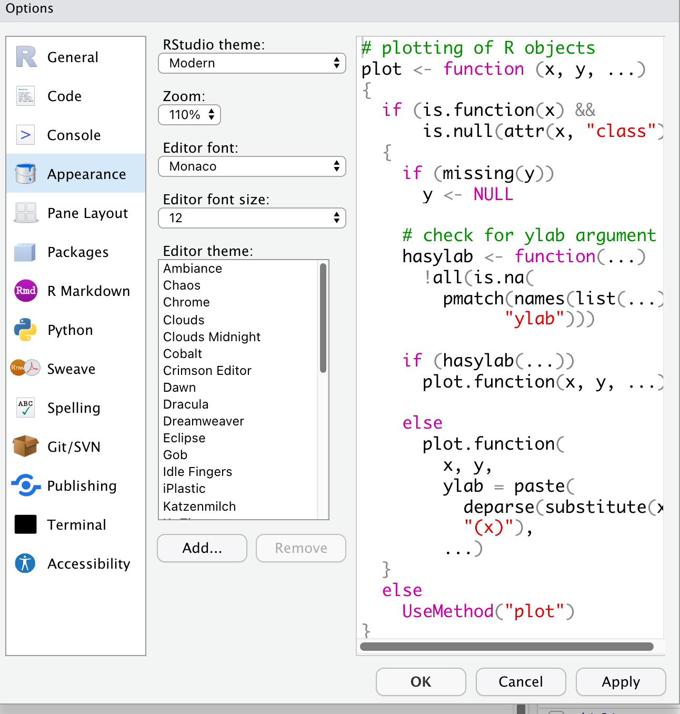

```{r setup, include = FALSE}
knitr::opts_chunk$set(fig.path = "images/")
library(icons)
```

## What does RStudo looks like? 

Once you open RStudio, you should see this interface. On the left-hand side, you have `Console` which is the place where commands written in the R language can be typed and executed immediately by the computer.::: [Introduction to R](https://cengel.github.io/R-intro/backgroud.html#what-is-r-what-is-rstudio)::: On the right-hand side, you have two windows. The one on the top is your `Global Environment` where it shows the variables and datasets in the environment. The window on the bottom right has a few different sessions including `Files`, `Plots`, `Packages`, `Help` and `Viewer`. 

```{r, echo=FALSE, out.width="50%"}
knitr::include_graphics("images/chapter1-02/RStudio_interface_1.png")
```

---

## Adding a new R Script 

You can run r code in the `Console` but once you close RStudio, you loss your code in `Console`. To make your work reproducible, you can write and store all your code in a `R Script`. 

```{r, echo=FALSE, out.width="50%"}
knitr::include_graphics("images/chapter1-02/RStudio_Add_script.png")
```

---

## R Script 

In an `R Script` you can write code and add comments. You can run each line by pressing `ctrl + enter/return`. After you run each line of the code, you can see the messages in your `Console`. 

```{r, echo=FALSE, out.width="50%"}

```

---

## R packages installation and loading 

* The previous example showed how to load in the packages using `library()`. However, before you can use `library()` to load the package you need to first have it **installed**.   

* Think about the package installation process as purchasing a book (package) `r icons::fontawesome("book", style = "solid")` and store it on a bookshelf (in the library folder) `r icons::fontawesome("warehouse", style = "solid")`.

* Loading the package using `library()` is like bring out the book (package) to your current working environment. 

* Therefore, before you could load in packages you need to make sure that you have that package installed.   
  
---

## R packages installation and loading 

To check what packages you already have, go to the `Packages` window on the bottom right. If you are not sure whether you have the packages or not, you could also type in the package name in the search bar to see if you have already downloaded that package or not. 

```{r, echo=FALSE, out.width="50%"}
knitr::include_graphics("images/chapter1-02/RStudio_package.png")
```


---

## R packages installation and loading 

There are two ways to install packages. 

* The first way is by clicking. Open the `Pacakges` window on the bottom right, click on `Install` `r icons::fontawesome("arrow-circle-down", style = "solid")`. You should see the pop-up below. You can type in the packages you want to install in and make sure that all the dependencies are also downloaded. Click `Install`, then you should have the package install in your local computer. 

```{r, echo=FALSE, out.width="50%"}
knitr::include_graphics("images/chapter1-02/RStudio_Install_pkg.png")
```
  
     
* Alternately, you can run `install.pakcages("")` with the package name inside `""`.


---

## Customised your RStudio - Changing Global Options 

* Customise your RStudio, go `Tools` `r icons::fontawesome("arrow-circle-right", style = "solid")` `Global Options..`

```{r, echo=FALSE, out.width="50%"}
knitr::include_graphics("images/chapter1-02/RStudio_tools.png")
```


---

## Customised your RStudio - Changing Global Options 

* If you are having difficulty downloading packages in your country, you could change where you download your packages. The default downloading mirror is `Global-RStudio` which is downloading packages from the CRAN RStudio Cloud.

* If you are not able to download package from this sources, go to `Global Options...` `r icons::fontawesome("arrow-circle-right", style = "solid")` `Packages` `r icons::fontawesome("arrow-circle-right", style = "solid")` `Primary CRAN repositor`. You can select the mirror that is physically close to you which might be easier for you to connect to. 


```{r, echo=FALSE, out.width="50%"}
knitr::include_graphics("images/chapter1-02/RStudio_mirror.png")
```

---

## Customised your RStudio - Changing Global Options 

* You can also change the appearance of your RStudio from the `Global Options...` `r icons::fontawesome("arrow-circle-right", style = "solid")` `Appearance`. 

```{r, echo=FALSE, out.width="50%"}

```
